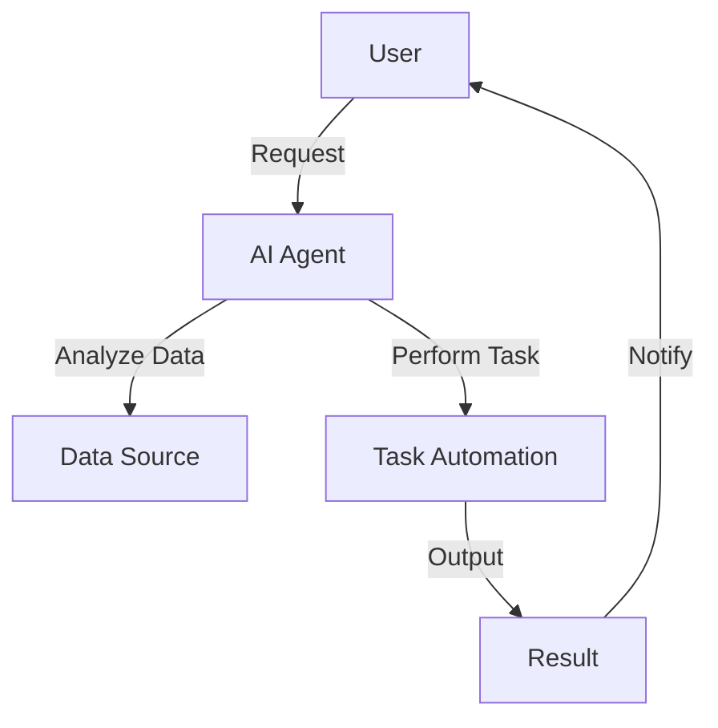

---

# Maximizing Productivity with AI Agents in 2026

In the fast-paced era of 2026, optimizing productivity has never been more crucial. With the rise of artificial intelligence, specifically AI agents, we stand at the forefront of a productivity revolution. These intelligent assistants are designed to enhance our efficiency, streamline workflows, and improve our overall work-life balance. But how exactly do AI agents contribute to productivity, and how can we harness their potential effectively? In this article, we’ll explore the various aspects of AI agents and how you can leverage them to maximize your productivity.

## What Are AI Agents?

AI agents are software programs that use artificial intelligence to perform specific tasks or make decisions on behalf of the user. They can analyze data, predict outcomes, and even learn from user interactions to become more effective over time. From virtual assistants like Siri and Alexa to more complex systems used in businesses, AI agents are designed to simplify our lives and enhance productivity.

### The Role of AI Agents in Productivity

AI agents can help in multiple areas, including:

1. **Task Automation**: Repetitive tasks can consume a significant amount of time. AI agents efficiently automate these processes, allowing you to focus on more strategic work.
   
2. **Data Analysis**: AI agents excel at analyzing large data sets quickly, providing insights that can inform decision-making.

3. **Personalized Recommendations**: Whether it’s suggesting the next best action in a project or recommending resources, AI agents can tailor their recommendations to individual needs.

4. **Collaboration Tools**: AI agents enhance teamwork by streamlining communication and project management.

### Practical Examples of AI Agents in Action

Let’s consider some practical examples where AI agents have revolutionized productivity:

#### 1. Virtual Assistants in Personal Productivity

Tools like Google Assistant and Apple's Siri are examples of AI agents that help manage schedules, set reminders, and even control smart home devices. For instance, you can ask your virtual assistant to schedule a meeting, and it will automatically check your calendar for free slots, send invites, and even suggest locations based on participants' preferences.

#### 2. AI-Powered Project Management

Platforms like Asana and Trello now integrate AI agents that can provide insights into project timelines, resource allocation, and team performance. For example, an AI agent can predict project delays based on historical data and suggest corrective measures, making it easier for managers to keep projects on track.

#### 3. Customer Support Automation

AI chatbots are transforming customer service by providing instant responses to common queries. Companies like Zendesk and Intercom utilize AI agents to handle customer interactions, thus freeing human agents to tackle more complex issues. This not only improves response times but also enhances customer satisfaction.

## Pros and Cons of Using AI Agents

While AI agents offer numerous benefits, they are not without their drawbacks. Here’s a breakdown of the pros and cons:

### Pros

- **Increased Efficiency**: AI agents automate repetitive tasks, allowing you to focus on high-priority work.
- **24/7 Availability**: Unlike human workers, AI agents can operate around the clock, ensuring tasks are handled even outside normal working hours.
- **Data-Driven Insights**: AI agents analyze data faster than humans, providing valuable insights to inform decisions.
- **Cost-Effective**: By automating tasks, businesses can reduce labor costs and improve ROI.

### Cons

- **Lack of Human Touch**: AI agents can sometimes lack the empathy and understanding that human interaction provides, which can be a drawback in certain situations.
- **Dependence on Technology**: Over-reliance on AI tools might result in reduced human skills and critical thinking.
- **Privacy Concerns**: The use of AI agents involves data collection, which raises privacy issues that need to be addressed.
- **Initial Setup Costs**: Implementing advanced AI systems can come with high upfront costs.

## Comparing Popular AI Agents for Productivity

When it comes to choosing the right AI agent for your needs, it's essential to compare the available options. Below is a comparison table featuring some of the leading AI productivity tools.

<table>
    <tr>
        <th>Tool</th>
        <th>Best For</th>
        <th>Key Features</th>
        <th>Pricing</th>
    </tr>
    <tr>
        <td>Google Assistant</td>
        <td>Personal Productivity</td>
        <td>Voice commands, calendar scheduling, smart home control</td>
        <td>Free</td>
    </tr>
    <tr>
        <td>Asana</td>
        <td>Project Management</td>
        <td>Task assignments, project timelines, AI insights</td>
        <td>Starts at $10.99/month</td>
    </tr>
    <tr>
        <td>Zendesk</td>
        <td>Customer Support</td>
        <td>Chatbot automation, analytics, multi-channel support</td>
        <td>Starts at $19/month</td>
    </tr>
    <tr>
        <td>Notion</td>
        <td>Note-taking and Organization</td>
        <td>Customizable templates, AI writing assistant</td>
        <td>Free/Paid plans available</td>
    </tr>
</table>

### Workflow Example of AI Agents Enhancing Productivity

To visualize how AI agents can enhance productivity, consider the following workflow:

In this diagram, the user interacts with the AI agent, which analyzes data and performs tasks automatically. The results are then communicated back to the user, showcasing a streamlined process that maximizes efficiency.

## Future Trends in AI Agents and Productivity

As we move further into 2026, the capabilities of AI agents will continue to expand. Here are some trends to watch for:

- **Increased Personalization**: AI agents will become even more adept at understanding individual preferences, leading to more tailored experiences.
- **Enhanced Collaboration**: Future AI agents will focus on improving collaboration among teams, integrating seamlessly with various tools and platforms.
- **Ethical AI**: As concerns over privacy and ethics grow, companies will invest in developing AI agents that prioritize user consent and data security.

## Conclusion: Embracing AI Agents for Enhanced Productivity

In conclusion, AI agents are transforming the way we approach productivity in 2026. From automating repetitive tasks to providing data-driven insights, their capabilities are vast and varied. While there are challenges to consider, the benefits of using AI agents far outweigh the drawbacks for most users and businesses. 

Are you ready to embrace AI agents to maximize your productivity? Start by evaluating your needs and exploring the tools listed above. The future of work is here, and it’s time to harness the power of AI to stay ahead!

### Call to Action

Interested in learning more about how AI tools can enhance your productivity? Subscribe to our newsletter for the latest updates, tips, and insights on AI technologies!