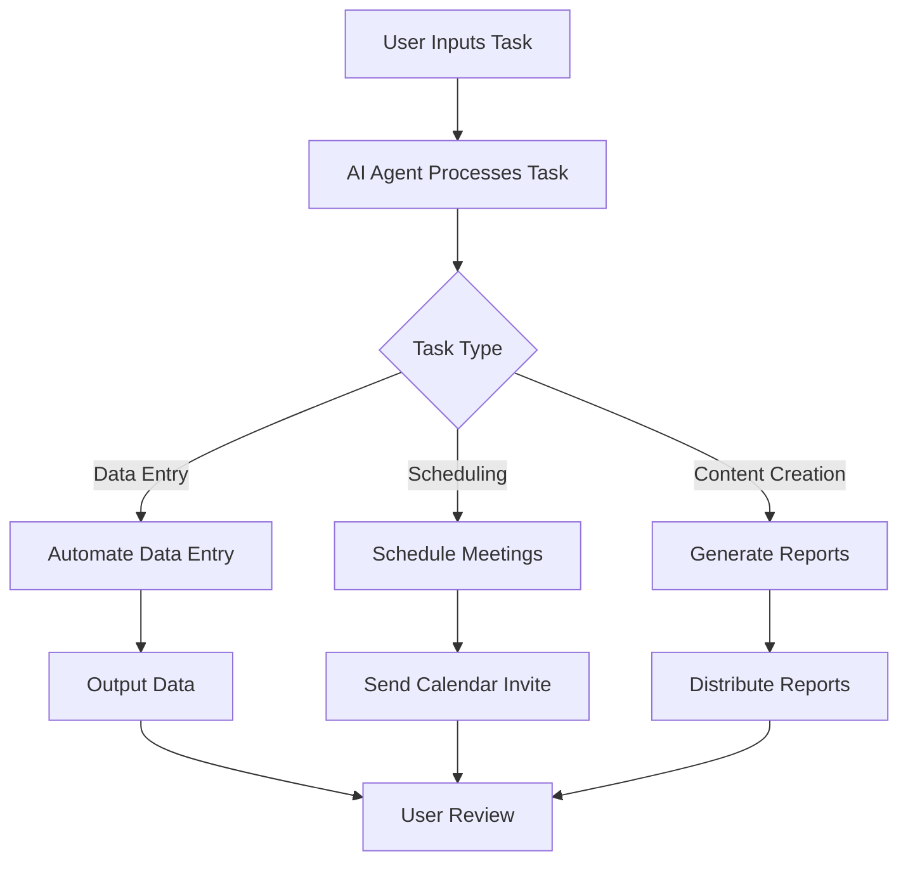

---

# Maximizing Productivity with AI Agents in 2026

In a world that's increasingly reliant on technology, AI agents are becoming essential tools for maximizing productivity in both personal and professional environments. By 2026, the capabilities of these intelligent systems have expanded significantly, allowing individuals and organizations to streamline tasks, enhance efficiency, and ultimately, get more done in less time. In this blog post, we’ll explore how AI agents are shaping productivity, their practical applications, and the potential pros and cons of incorporating them into your daily routines.

## What Are AI Agents?

AI agents are software programs designed to perform tasks or make decisions autonomously. They use machine learning algorithms and natural language processing to understand user needs, analyze data, and execute tasks without human intervention. Think of them as virtual assistants that can manage a wide range of activities—from scheduling meetings to analyzing vast datasets.

### The Rise of AI Agents in Productivity

As businesses and individuals look for ways to optimize their workflows, the demand for AI agents has skyrocketed. By 2026, we are witnessing a surge in the adoption of AI tools across different sectors, including finance, healthcare, education, and more. Here are some ways AI agents are changing the landscape of productivity:

1. **Task Automation**: AI agents can handle repetitive tasks such as data entry, email sorting, and report generation, freeing up valuable time for more strategic work.

2. **Personalized Recommendations**: These agents can analyze previous behaviors and preferences to provide tailored suggestions, whether that’s recommending the best time for a meeting or suggesting content for a marketing campaign.

3. **Enhanced Collaboration**: AI tools facilitate smoother communication between team members, automating reminders and follow-ups, ensuring everyone stays on the same page.

4. **Data Insights**: AI agents can sift through large volumes of data to identify trends and insights that can inform decision-making, leading to better outcomes.

5. **Time Management**: With the ability to prioritize tasks based on urgency and importance, AI agents can help users manage their time more effectively.

## Practical Use Cases of AI Agents

To truly understand the impact of AI agents on productivity, let’s explore some practical applications across various sectors.

### 1. Project Management

Consider a team of software developers working on a complex project. An AI agent can:

- Automate task assignments based on team member workloads.
- Send reminders for upcoming deadlines.
- Analyze project progress and suggest adjustments.

### 2. Customer Service

In the customer service realm, AI agents such as chatbots can:

- Respond to frequently asked questions, reducing the workload on human agents.
- Analyze customer interactions to provide insights into customer satisfaction.
- Offer 24/7 support, enhancing overall customer experience.

### 3. Marketing Automation

Marketers can leverage AI agents to:

- Analyze consumer behavior and adjust campaigns in real-time.
- Automate social media posting and email marketing, ensuring timely delivery.
- A/B test content variations to determine the most effective messaging.

### 4. Personal Productivity

On an individual level, AI agents can help with:

- Scheduling meetings by finding optimal times based on all participants' calendars.
- Managing to-do lists and prioritizing tasks based on deadlines and importance.
- Offering reminders for personal goals, such as fitness or learning new skills.

## Pros and Cons of Using AI Agents

While AI agents offer numerous benefits, it’s essential to weigh the pros and cons before integrating them into your workflow.

### Pros

- **Increased Efficiency**: By automating mundane tasks, AI agents allow you to focus on higher-value work.
- **Scalability**: AI agents can easily scale with your growing needs, adapting to larger workloads without compromising on performance.
- **Data-Driven Insights**: They provide actionable insights that can enhance decision-making processes.
- **Cost-Effective**: Reducing the need for additional human resources can lead to significant cost savings.

### Cons

- **Dependency**: Over-reliance on AI agents may reduce critical thinking and problem-solving skills among team members.
- **Job Displacement**: As AI agents take on routine tasks, there’s a potential risk of job displacement in certain sectors.
- **Privacy Concerns**: The use of AI agents often involves collecting and analyzing personal data, raising concerns about privacy and security.
- **Initial Costs**: Implementing AI technology can be expensive, posing a challenge for smaller businesses.

## Comparison of Popular AI Agents for Productivity

To help you choose the right AI agent for your needs, here’s a quick comparison of some popular tools available in 2026:

<table>
  <tr>
    <th>Tool</th>
    <th>Key Features</th>
    <th>Best For</th>
    <th>Pricing</th>
  </tr>
  <tr>
    <td>Zapier</td>
    <td>Task automation, integrations with over 2,000 apps</td>
    <td>Small businesses and freelancers</td>
    <td>Starting at $19.99/month</td>
  </tr>
  <tr>
    <td>[Notion AI](https://www.notion.so/product/ai?ref=AFFILIATE_ID)</td>
    <td>Document creation, project management, and collaboration</td>
    <td>Teams and project management</td>
    <td>Starting at $8/month/user</td>
  </tr>
  <tr>
    <td>Miro</td>
    <td>Visual collaboration, brainstorming, and planning tools</td>
    <td>Creative teams and agencies</td>
    <td>Starting at $12/month/user</td>
  </tr>
  <tr>
    <td>[Grammarly](https://www.grammarly.com/?ref=AFFILIATE_ID)</td>
    <td>Writing assistance, grammar checking, tone detection</td>
    <td>Content creators and marketers</td>
    <td>Starting at $12/month</td>
  </tr>
</table>

## The Future of AI Agents in Productivity

As we look ahead, the future of AI agents appears promising. With advancements in natural language processing and machine learning, we can expect AI agents to become even more intuitive and capable. As they evolve, they will not only handle tasks but also provide strategic insights that can redefine how we approach work.

### Workflow Diagram

To visualize the integration of AI agents in productivity, consider the following workflow diagram:

## Conclusion

AI agents are revolutionizing productivity as we know it. By 2026, these tools have become indispensable for anyone looking to enhance their efficiency, streamline tasks, and gain valuable insights. While there are pros and cons to consider, the potential benefits of integrating AI agents into your workflow are significant.

Are you ready to embrace the future of productivity? Start exploring AI agents today and unlock new levels of efficiency in your personal and professional life. If you have any questions or need guidance on selecting the right AI tool for your needs, feel free to leave a comment below or reach out to us at AI Tools Lab!

## 関連記事

- [Boost Productivity with AI Agents: 2026 Strategies](/posts/boost-productivity-with-ai-agents-2026-strategies/)
- [Boosting Productivity with AI Agents in 2026](/posts/boosting-productivity-with-ai-agents-in-2026/)
- [Boosting Team Productivity with AI Agents in 2026](/posts/boosting-team-productivity-with-ai-agents-in-2026/)
