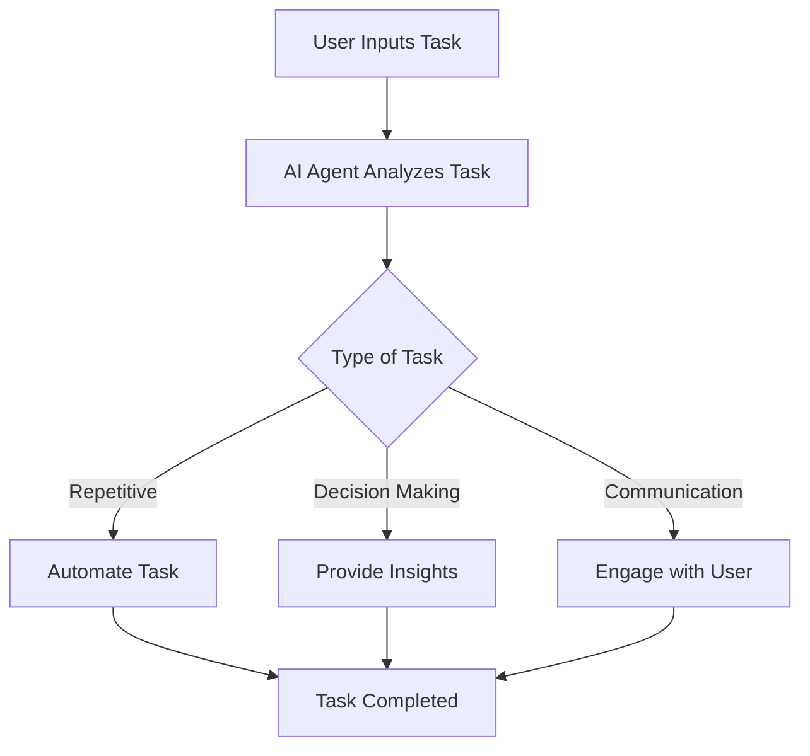

---

# Maximizing Productivity with AI Agents in 2026

In the fast-paced world of 2026, AI agents are revolutionizing how we approach productivity. These intelligent assistants are not just a futuristic concept; they are now integral to our daily operations, helping individuals and businesses streamline their tasks, enhance decision-making, and boost overall efficiency. In this article, we'll explore the various types of AI agents, their practical applications, and how you can leverage them to maximize your productivity.

## Understanding AI Agents

AI agents are software programs designed to perform tasks autonomously or semi-autonomously. They leverage machine learning, natural language processing, and other advanced technologies to understand user intent, gather data, and execute tasks with minimal human intervention. 

### Types of AI Agents

1. **Virtual Assistants**: Tools like Siri, Google Assistant, and Alexa fall into this category. They help with scheduling, reminders, and answering queries.
  
2. **Chatbots**: Often used in customer service, chatbots can handle inquiries, provide support, and even suggest products based on user preferences.
  
3. **Automation Bots**: These agents automate repetitive tasks such as data entry, email sorting, and report generation, freeing up time for more strategic work.

4. **Decision Support Systems**: These AI agents analyze data and provide recommendations, helping users make informed decisions faster.

## How AI Agents Enhance Productivity

### 1. Time Management

One of the most significant advantages of AI agents is their ability to manage time efficiently. Virtual assistants can schedule meetings, set reminders, and prioritize tasks based on deadlines and importance. For example, imagine having an AI agent that analyzes your work habits and suggests the best times for you to focus on critical tasks. 

### 2. Automating Repetitive Tasks

AI agents excel at automating mundane tasks. For instance, a marketing team can use automation bots to handle social media posts, email campaigns, and performance reports. By eliminating these repetitive tasks, team members can focus on creative strategies and high-level planning.

### 3. Enhanced Decision-Making

AI agents are equipped with the capability to analyze vast amounts of data quickly. For example, a financial analyst can utilize a decision support system that evaluates market trends and suggests investment opportunities. This not only speeds up the decision-making process but also increases the chances of making informed choices.

### 4. Improved Communication

AI agents can help streamline communication processes. For instance, chatbots can manage customer inquiries 24/7, providing instant responses and freeing up human agents for more complex issues. This ensures that customers receive timely information while improving the overall efficiency of the team.

## Use Cases of AI Agents in 2026

### Case Study 1: AI in Project Management

Consider a project management tool like Monday.com, which integrates AI agents to assist teams in tracking progress, managing deadlines, and allocating resources. The AI can analyze project data to suggest optimal timelines and resource allocations, enhancing team productivity.

### Case Study 2: AI in Customer Support

Companies like Zendesk and Freshdesk employ AI-powered chatbots to handle customer queries. These bots can learn from past interactions and improve their responses over time, leading to higher customer satisfaction and reduced workload for support staff.

### Case Study 3: AI in Content Creation

Tools like [Jasper](https://www.jasper.ai/?ref=AFFILIATE_ID) and [Copy.ai](https://www.copy.ai/?ref=AFFILIATE_ID) utilize AI agents to generate content based on user input. Marketers and content creators can use these tools to draft blog posts, social media content, and marketing copy quickly, allowing them to focus on strategy and creativity.

## Pros and Cons of Using AI Agents

### Pros

- **Increased Efficiency**: AI agents can handle tasks faster than humans, significantly improving productivity.
- **Cost-Effective**: Reducing the need for manual labor can lead to cost savings for businesses, allowing them to invest in other areas.
- **Scalability**: AI agents can easily scale to accommodate growing workloads without the need for additional human resources.
- **Data-Driven Insights**: AI agents provide actionable insights based on data analysis, leading to better decision-making.

### Cons

- **Dependence on Technology**: Over-reliance on AI agents may lead to skill degradation among employees.
- **Data Privacy Concerns**: The use of AI agents often involves handling sensitive data, raising concerns about data security and privacy.
- **Initial Costs**: Implementing AI solutions can require a significant upfront investment, which may deter some businesses.
- **Limited Understanding**: While AI agents are getting smarter, they may still struggle with nuanced human communication and complex tasks.

## The Future of AI Agents and Productivity

As we advance further into 2026, the capabilities of AI agents will continue to evolve. Emerging technologies like quantum computing and more sophisticated machine learning algorithms will empower these agents to handle even more complex tasks. 

### A Workflow Diagram of AI Agent Integration

To visualize how AI agents can integrate into your daily workflow, here’s a simple diagram:

## Conclusion

In 2026, AI agents have become indispensable tools for enhancing productivity. By automating mundane tasks, improving time management, and providing data-driven insights, these intelligent assistants empower individuals and businesses to focus on what truly matters: innovation and strategic growth.

### Call to Action

Are you ready to harness the power of AI agents for your productivity? Explore the latest AI tools available today and start transforming your workflows for a more efficient tomorrow! Don’t wait to elevate your productivity; dive into the world of AI agents now!

---

By understanding the capabilities and potential of AI agents, you can position yourself and your organization for success in this rapidly evolving landscape. Start your journey toward enhanced productivity today!

## 関連記事

- [Boost Productivity with AI Agents: 2026 Strategies](/posts/boost-productivity-with-ai-agents-2026-strategies/)
- [Boosting Productivity with AI Agents in 2026](/posts/boosting-productivity-with-ai-agents-in-2026/)
- [Boosting Team Productivity with AI Agents in 2026](/posts/boosting-team-productivity-with-ai-agents-in-2026/)
