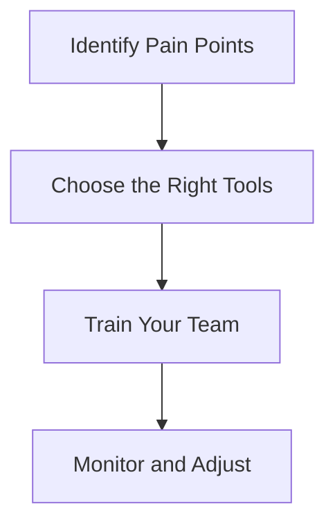

---

# Maximizing Productivity with AI Tools for Remote Teams

The rise of remote work has brought significant changes to how teams collaborate, communicate, and achieve their goals. With the challenges of distance and time zone differences, productivity can sometimes take a hit. Fortunately, AI productivity tools for remote teams are stepping in to bridge this gap, offering innovative solutions that can enhance efficiency and streamline operations.

In this blog post, we will explore various AI tools that can empower your remote team, discuss their pros and cons, and provide practical use cases to illustrate how they can be integrated into your workflow.

## The Importance of AI in Remote Work

Artificial intelligence is revolutionizing the way we work. By automating mundane tasks, providing data-driven insights, and enhancing communication, AI tools can help remote teams focus on what truly matters: collaboration, creativity, and productivity.

### Why Choose AI Tools for Remote Teams?

1. **Automation**: AI can take over repetitive tasks, freeing up team members to focus on more strategic activities.
2. **Data Analysis**: AI tools can analyze data and provide actionable insights, helping teams make informed decisions quickly.
3. **Improved Communication**: AI-driven tools can facilitate better communication and collaboration, no matter where team members are located.
4. **Personalization**: AI can tailor experiences and workflows to individual team members, enhancing overall productivity.

## Top AI Productivity Tools for Remote Teams

Let’s take a closer look at some of the most effective AI productivity tools available for remote teams, their features, and how they can be utilized in your organization.

### 1. Slack with AI Features

Slack is well-known as a communication platform, but with AI capabilities, it goes beyond just messaging.

**Use Cases**: 
- Automating reminders for project deadlines.
- Summarizing conversations and tagging relevant team members.

**Pros**:
- Easy integration with other tools.
- Customizable notifications to reduce distractions.

**Cons**:
- Can become overwhelming with too many channels.
- The free version has limited features.

### 2. Trello with Butler AI

Trello is a project management tool that uses Butler AI to automate card and board tasks.

**Use Cases**:
- Automatically moving cards between columns based on deadlines.
- Triggering actions based on certain keywords in comments.

**Pros**:
- Visual management of tasks.
- Easy to use and set up automation.

**Cons**:
- Limited functionality in the free version.
- Not ideal for complex project management.

### 3. Notion with AI Enhancements

Notion combines notes, tasks, and databases into one tool, and its AI enhancements improve productivity.

**Use Cases**:
- Generating task lists from meeting notes.
- Offering suggested templates based on user needs.

**Pros**:
- Highly customizable workspace.
- All-in-one solution for documentation and project tracking.

**Cons**:
- Steeper learning curve than simpler tools.
- May require more setup time.

### 4. Zoom with AI Transcription

Zoom’s AI transcription feature allows teams to focus on discussions while the software captures everything.

**Use Cases**:
- Creating meeting minutes automatically.
- Highlighting action items from calls.

**Pros**:
- Saves time on note-taking.
- Provides accurate transcripts for reference.

**Cons**:
- AI may misinterpret certain jargon or accents.
- Requires a subscription for transcription features.

### 5. ClickUp with Smart Suggestions

ClickUp is a powerful project management platform that uses AI to suggest task priorities.

**Use Cases**:
- Automatically recommending deadlines based on team workload.
- Suggesting task assignments based on team member performance.

**Pros**:
- Comprehensive features for project management.
- Flexible to suit various workflows.

**Cons**:
- Can be overwhelming due to its many features.
- May require a learning curve for new users.

### Comparison of AI Productivity Tools for Remote Teams

Here’s a quick comparison table of the tools discussed:

<table>
    <tr>
        <th>Tool</th>
        <th>Key Features</th>
        <th>Pros</th>
        <th>Cons</th>
    </tr>
    <tr>
        <td>Slack</td>
        <td>Messaging, integrations, AI reminders</td>
        <td>Customizable, integrates well</td>
        <td>Overwhelming channels</td>
    </tr>
    <tr>
        <td>Trello</td>
        <td>Project management, automation</td>
        <td>Visual task management</td>
        <td>Limited free features</td>
    </tr>
    <tr>
        <td>Notion</td>
        <td>Notes, tasks, databases</td>
        <td>Customizable workspace</td>
        <td>Steeper learning curve</td>
    </tr>
    <tr>
        <td>Zoom</td>
        <td>Video calls, AI transcription</td>
        <td>Saves time</td>
        <td>Transcription errors</td>
    </tr>
    <tr>
        <td>ClickUp</td>
        <td>Task management, smart suggestions</td>
        <td>Comprehensive features</td>
        <td>Overwhelming for beginners</td>
    </tr>
</table>

## Integrating AI Tools into Your Workflow

Integrating these AI productivity tools into your remote team’s workflow can be as simple as following a few key steps:

1. **Identify Pain Points**: Assess your team's current workflow and identify areas where productivity is lacking.
2. **Choose the Right Tools**: Based on your needs, select AI tools that can alleviate these pain points.
3. **Train Your Team**: Provide training on how to use these tools effectively, ensuring that everyone is on the same page.
4. **Monitor and Adjust**: Continuously assess the effectiveness of the tools and make adjustments as needed.

## Conclusion: Enhance Your Remote Team’s Productivity

AI productivity tools are more than just a trend; they are essential for modern remote teams looking to maximize their efficiency. By automating tasks, enhancing communication, and providing valuable insights, these tools can help your team work smarter, not harder.

As you explore the landscape of AI productivity tools, remember to weigh the pros and cons of each option to find the best fit for your team. Don’t hesitate to experiment with different tools to discover what works best in your unique context.

Ready to boost your remote team’s productivity? Start integrating AI tools today and watch your team's efficiency soar! For more insights on AI tools and productivity, subscribe to our newsletter and stay updated on the latest trends and tips.

## 関連記事

- [AI Agents: The Future of Personal Assistants in 2026](/posts/ai-agents-the-future-of-personal-assistants-in-2026/)
- [AI Automation: A Game Changer for Small Businesses](/posts/ai-automation-a-game-changer-for-small-businesses/)
- [AI Automation: Revolutionizing Business Operations in 2026](/posts/ai-automation-revolutionizing-business-operations-in-2026/)
