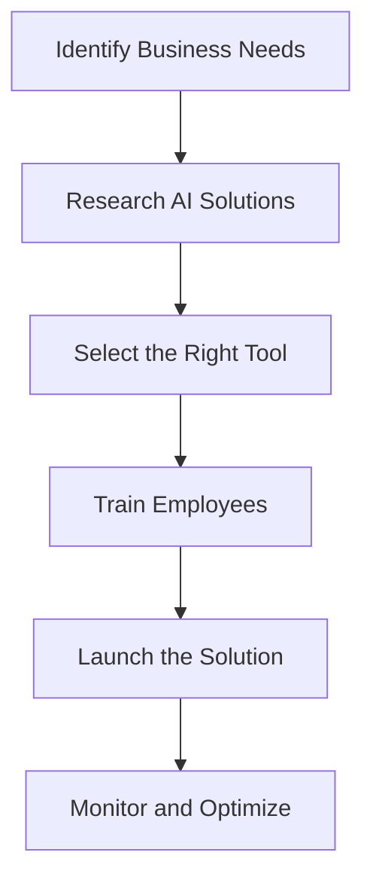

---

## Maximizing ROI with AI Automation Solutions for Businesses

In today’s fast-paced digital world, businesses are constantly looking for ways to improve efficiency, reduce costs, and maximize return on investment (ROI). One powerful avenue to achieve these goals is through the implementation of AI automation solutions. These tools not only enhance productivity but also free up valuable time for employees to focus on strategic initiatives. In this blog post, we will explore various AI automation solutions, their benefits, practical use cases, and how they can help your business maximize ROI.

### Understanding AI Automation Solutions

AI automation solutions leverage artificial intelligence to perform tasks that typically require human intervention. These tasks can range from simple repetitive actions to complex processes involving data analysis and decision-making. By automating these tasks, businesses can streamline operations, reduce errors, and improve overall efficiency.

### The Benefits of AI Automation Solutions

1. **Cost-Effectiveness**: Automating routine tasks reduces labor costs and minimizes the risk of human error, leading to significant savings.
2. **Increased Productivity**: Employees can focus on higher-value tasks while AI handles time-consuming processes.
3. **Enhanced Accuracy**: AI systems can process vast amounts of data with high precision, reducing the likelihood of mistakes.
4. **Scalability**: AI solutions can easily scale operations without the need for substantial additional resources.
5. **Improved Customer Experience**: Automation can enhance customer interactions through personalized and timely responses.

### Practical Use Cases for AI Automation Solutions

AI automation solutions can be applied across various industries and functions. Here are several practical examples:

#### 1. Customer Support

Using AI chatbots can significantly enhance customer service operations. For instance, companies like Zendesk and Drift provide AI-powered chatbots that can handle common customer inquiries 24/7. This allows human agents to focus on more complex issues, improving customer satisfaction.

#### 2. Marketing Automation

Platforms like HubSpot and Marketo use AI to automate marketing tasks, including lead scoring, email marketing campaigns, and social media management. By analyzing customer behavior, these tools can send personalized messages at optimal times, increasing engagement and conversion rates.

#### 3. Human Resources

AI solutions can streamline the recruitment process by screening resumes, scheduling interviews, and even conducting initial interviews. Tools like HireVue use AI to analyze candidates' responses and body language, helping companies identify the best talent efficiently.

#### 4. Financial Management

AI can automate financial reporting, budgeting, and forecasting. Solutions like QuickBooks and Xero integrate AI to provide real-time insights into financial performance, enabling better decision-making.

### Comparing Popular AI Automation Solutions

When considering AI automation solutions for your business, it’s essential to evaluate your options thoroughly. Below is a comparison table of some of the leading tools available in the market today:

<table>
  <tr>
    <th>Tool</th>
    <th>Best For</th>
    <th>Key Features</th>
    <th>Pricing</th>
  </tr>
  <tr>
    <td>Zapier</td>
    <td>Workflow Automation</td>
    <td>Integrates with thousands of apps, easy-to-use interface, multi-step workflows</td>
    <td>Starts at $19.99/month</td>
  </tr>
  <tr>
    <td>UiPath</td>
    <td>Robotic Process Automation</td>
    <td>Drag-and-drop interface, extensive integrations, supports complex automation</td>
    <td>Custom pricing</td>
  </tr>
  <tr>
    <td>HubSpot</td>
    <td>Marketing Automation</td>
    <td>Email automation, lead tracking, analytics dashboard</td>
    <td>Starts at $50/month</td>
  </tr>
  <tr>
    <td>Salesforce Einstein</td>
    <td>Sales and CRM</td>
    <td>Predictive analytics, automated lead scoring, personalized recommendations</td>
    <td>Custom pricing</td>
  </tr>
</table>

### Workflow of Implementing AI Automation Solutions

To effectively implement AI automation solutions, businesses should follow a structured workflow. Below is a diagram illustrating the essential steps involved in the implementation process:

### Pros and Cons of AI Automation Solutions

While AI automation solutions offer numerous benefits, it’s essential to consider their potential drawbacks as well.

#### Pros:
- **Efficiency Gains**: Automating repetitive tasks leads to faster project completion.
- **Data-Driven Insights**: AI systems can analyze large datasets and provide actionable insights.
- **Reduced Operational Costs**: Lower labor costs associated with automation.

#### Cons:
- **Initial Investment**: The cost of implementing AI solutions can be high.
- **Change Management**: Employees may resist transitions to automated systems.
- **Dependence on Technology**: Over-reliance on AI may lead to vulnerabilities if systems fail.

### Conclusion: Embrace AI Automation Solutions for Future Success

As businesses strive to remain competitive, embracing AI automation solutions is not just an option; it’s a necessity. The potential for maximizing ROI through increased efficiency, reduced costs, and improved customer experiences is immense. 

Are you ready to take the leap and integrate AI automation solutions into your business strategy? Start by assessing your specific needs and exploring the various tools that can help you achieve your goals. The future of work is here, and it’s time to harness the power of AI to drive your business forward.

**Call to Action**: For more insights and expert tips on leveraging AI tools to enhance productivity and maximize ROI, subscribe to our newsletter and stay ahead in the ever-evolving business landscape!

## 関連記事

- [Automating Business Processes with AI: A Step-by-Step Playbook](/posts/automating-business-processes-with-ai-a-complete-guide/)
- [7 AI Automation Strategies to Supercharge Business Efficiency](/posts/boosting-business-efficiency-with-ai-automation-strategies/)
- [AI Tools That Actually Save Money: ROI-Focused Reviews](/posts/enhancing-business-efficiency-with-ai-tools-in-2026/)
