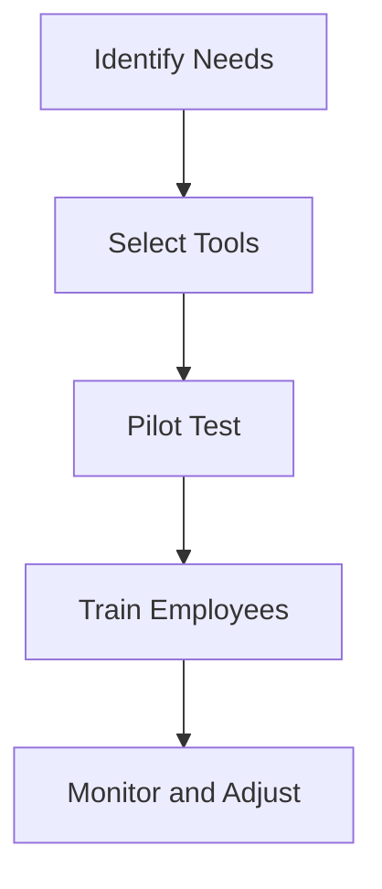

---

## Maximizing ROI with AI-Driven Business Solutions

In today’s fast-paced digital landscape, businesses are constantly seeking innovative ways to enhance their productivity, streamline operations, and ultimately maximize return on investment (ROI). One of the most effective strategies to achieve this is by integrating AI-driven business solutions into your operations. But how exactly can AI solutions transform your business? Let’s explore the myriad ways these technologies can offer substantial ROI and uncover some of the best tools available.

### Understanding AI Business Solutions

AI business solutions refer to the various applications of artificial intelligence that help organizations automate processes, analyze data, and improve decision-making. From chatbots that enhance customer service to predictive analytics that inform strategic planning, the potential of AI is virtually limitless.

### Why Invest in AI Solutions?

Investing in AI can yield significant benefits, including:

- **Increased Efficiency**: Automating repetitive tasks allows employees to focus on more strategic activities.
- **Enhanced Decision Making**: AI analyzes vast amounts of data quickly, providing insights that lead to better business decisions.
- **Cost Savings**: By streamlining operations and reducing human error, companies can lower costs significantly.
- **Improved Customer Experience**: AI tools can offer personalized experiences that enhance customer satisfaction and loyalty.

### Practical Examples of AI Business Solutions

Let’s dive into some practical applications of AI in business environments:

#### 1. Customer Relationship Management (CRM) Tools

AI-powered CRM tools like **Salesforce Einstein** and **HubSpot** utilize machine learning to enhance customer interactions. These platforms analyze customer data to provide insights, predict customer behavior, and automate workflows.

##### Use Case: Predictive Lead Scoring
Imagine a sales team using predictive lead scoring to identify which leads are most likely to convert. By targeting these leads, businesses can prioritize their efforts and resources, leading to increased sales and higher ROI.

#### 2. Virtual Assistants

Tools like **x.ai** and **Clara** can automate scheduling meetings and managing calendars. These virtual assistants learn from user interactions to improve efficiency over time.

##### Use Case: Time Management
A busy executive can delegate the task of scheduling meetings to a virtual assistant, freeing up valuable time for strategic thinking and decision-making.

#### 3. Data Analytics

AI-driven analytics tools such as **Tableau** and **Google Analytics** can process large datasets to reveal trends and patterns that inform business strategy.

##### Use Case: Market Analysis
A retail company can use AI analytics to analyze consumer purchasing trends, allowing them to optimize inventory and marketing strategies based on real-time data.

### Comparison of Top AI Business Solutions

When considering AI business solutions, it's essential to evaluate the options available. Below is a comparison of some leading tools in the market:

<table>
  <tr>
    <th>Tool</th>
    <th>Primary Features</th>
    <th>Pros</th>
    <th>Cons</th>
  </tr>
  <tr>
    <td>Salesforce Einstein</td>
    <td>Predictive analytics, automation, AI-driven insights</td>
    <td>Highly customizable, robust ecosystem</td>
    <td>Can be costly for small businesses</td>
  </tr>
  <tr>
    <td>HubSpot</td>
    <td>CRM, marketing automation, analytics</td>
    <td>User-friendly interface, great for inbound marketing</td>
    <td>Limited customization compared to competitors</td>
  </tr>
  <tr>
    <td>Tableau</td>
    <td>Data visualization, analytics, collaboration tools</td>
    <td>Powerful data analysis capabilities, intuitive design</td>
    <td>Steep learning curve for new users</td>
  </tr>
  <tr>
    <td>x.ai</td>
    <td>Meeting scheduling, calendar management</td>
    <td>Saves time, easy integration with calendars</td>
    <td>Limited functionality beyond scheduling</td>
  </tr>
</table>

### The Workflow of Implementing AI Business Solutions

To effectively integrate AI into your business, consider the following steps:

1. **Identify Needs**: Assess which areas of your business can benefit from AI.
2. **Select Tools**: Choose the appropriate AI tools based on your needs.
3. **Pilot Test**: Implement a pilot program to evaluate the effectiveness of the selected tools.
4. **Train Employees**: Provide training for your team to ensure they can effectively use the new technologies.
5. **Monitor and Adjust**: Continuously monitor the performance of the AI solutions and make adjustments as necessary.

### Pros and Cons of AI Business Solutions

While AI business solutions offer numerous advantages, they are not without challenges. Here's a breakdown of the pros and cons:

#### Pros

- **Automation of Routine Tasks**: Reduces the burden on employees.
- **Enhanced Accuracy**: AI minimizes human error in data processing.
- **Scalability**: AI solutions can grow with your business, adapting to changing needs.

#### Cons

- **Initial Investment**: The cost of implementing AI can be high, particularly for small businesses.
- **Complexity**: Integrating AI solutions can require significant technical expertise.
- **Data Privacy Concerns**: Businesses must ensure compliance with data protection regulations.

### Conclusion: Embrace the Future with AI Business Solutions

The potential of AI business solutions to maximize ROI is clear. By automating processes, enhancing decision-making, and improving customer experiences, businesses can not only survive but thrive in today’s competitive landscape. 

Are you ready to take the plunge into the world of AI? Start by evaluating your business needs and exploring the tools mentioned in this article. The future of your business may well depend on it!

### Call to Action

Don’t wait any longer to harness the power of AI for your business. Download our free guide on the best AI tools for your industry and discover how to implement them effectively. Visit [AI Tools Lab](https://aitoolslab.com) to get started today!

## 関連記事

- [AI Agents: The Future of Personal Assistants in 2026](/posts/ai-agents-the-future-of-personal-assistants-in-2026/)
- [AI Automation: A Game Changer for Small Businesses](/posts/ai-automation-a-game-changer-for-small-businesses/)
- [AI Automation: The Key to Enhanced Business Efficiency](/posts/ai-automation-the-key-to-enhanced-business-efficiency/)
