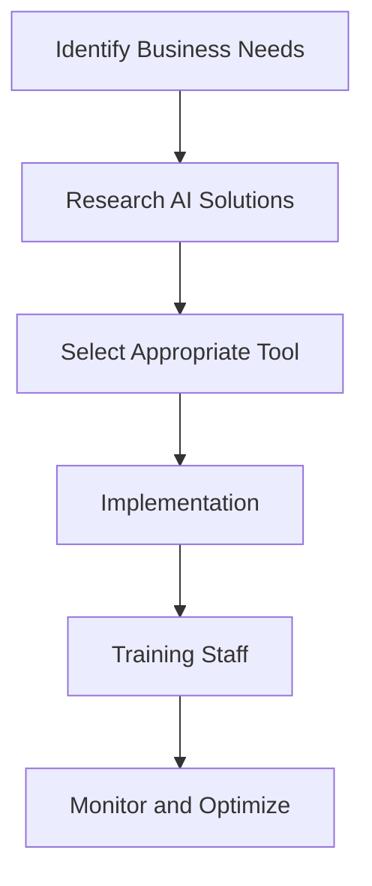

---

# Maximizing ROI with AI-Powered Business Solutions in 2026

As we step into 2026, the landscape of business operations is rapidly evolving, largely due to the integration of AI business solutions. These innovative tools not only streamline processes but also enhance decision-making capabilities, driving substantial ROI for organizations across various sectors. In this article, we’ll explore how AI can maximize your business's return on investment, highlight some of the leading AI solutions available, and provide practical examples of their application.

## Understanding AI Business Solutions

AI business solutions encompass a wide range of technologies that leverage artificial intelligence to improve business processes. These solutions include machine learning, natural language processing, chatbots, predictive analytics, and more. By automating routine tasks and offering data-driven insights, AI tools enable businesses to operate more efficiently and effectively.

### Why Choose AI Business Solutions?

Investing in AI business solutions can lead to significant benefits, including:

- **Increased Efficiency**: Automate repetitive tasks and reduce manual effort.
- **Enhanced Decision-Making**: Utilize data analytics for informed business choices.
- **Cost Reduction**: Cut operational costs by streamlining workflows.
- **Improved Customer Experience**: Personalize interactions and respond faster to inquiries.

## Key AI Business Solutions to Consider

Let’s dive into some notable AI tools that can help maximize your ROI in 2026. We will explore their features, pros, and cons, as well as practical use cases.

### 1. Salesforce Einstein

**Overview**: Salesforce Einstein integrates AI into the Salesforce platform, providing insights on customer behavior and sales predictions.

**Pros**:
- Seamless integration with existing Salesforce tools.
- Powerful predictive analytics capabilities.
- Customization options for specific business needs.

**Cons**:
- Can be expensive for small businesses.
- Requires a learning curve for new users.

**Use Case**: A retail company used Salesforce Einstein to analyze customer purchase patterns, leading to personalized marketing campaigns that increased sales by 20%.

### 2. Microsoft Azure AI

**Overview**: Microsoft Azure AI offers a suite of services, including machine learning, cognitive services, and data analytics.

**Pros**:
- Scalable cloud-based solution.
- Robust support for developers.
- Versatile applications in various industries.

**Cons**:
- Complexity can be overwhelming for non-technical users.
- Pricing can escalate with extensive usage.

**Use Case**: A healthcare provider implemented Microsoft Azure AI to analyze patient data, resulting in improved patient care and a 30% reduction in operational costs.

### 3. IBM Watson

**Overview**: IBM Watson provides AI-powered analytics and natural language processing tools, enabling businesses to derive insights from data.

**Pros**:
- Strong capabilities in natural language processing.
- Extensive resources and support for businesses.
- Powerful machine learning models.

**Cons**:
- Implementation can be time-consuming.
- Requires skilled personnel to manage effectively.

**Use Case**: A financial services firm used IBM Watson to analyze market data, leading to more informed investment decisions and a 15% increase in portfolio returns.

### 4. HubSpot

**Overview**: HubSpot offers an AI-driven CRM platform that enhances marketing, sales, and customer service functions.

**Pros**:
- User-friendly interface.
- Comprehensive marketing automation tools.
- Strong community and support resources.

**Cons**:
- Limited customization compared to competitors.
- Advanced features can be costly.

**Use Case**: A startup utilized HubSpot's AI capabilities to streamline their lead nurturing process, resulting in a 25% growth in customer conversion rates.

### 5. Google Cloud AI

**Overview**: Google Cloud AI provides machine learning and data analytics tools for businesses looking to leverage AI for operational insights.

**Pros**:
- Powerful machine learning capabilities.
- Integration with other Google services.
- Competitive pricing for small to medium businesses.

**Cons**:
- Requires technical knowledge to fully utilize.
- Limited support for non-Google products.

**Use Case**: A logistics company adopted Google Cloud AI for predictive maintenance of their fleet, reducing downtime by 40% and saving on repair costs.

### Comparison of AI Business Solutions

Here's a handy comparison table that summarizes the key features, pros, and cons of the AI business solutions discussed:

<table>
  <tr>
    <th>Tool</th>
    <th>Key Features</th>
    <th>Pros</th>
    <th>Cons</th>
  </tr>
  <tr>
    <td>Salesforce Einstein</td>
    <td>Predictive analytics, customer insights</td>
    <td>Seamless integration, powerful analytics</td>
    <td>Expensive, learning curve</td>
  </tr>
  <tr>
    <td>Microsoft Azure AI</td>
    <td>Machine learning, cognitive services</td>
    <td>Scalable, versatile applications</td>
    <td>Complex, pricing can escalate</td>
  </tr>
  <tr>
    <td>IBM Watson</td>
    <td>Natural language processing, analytics</td>
    <td>Strong NLP, extensive support</td>
    <td>Time-consuming implementation, requires skilled personnel</td>
  </tr>
  <tr>
    <td>HubSpot</td>
    <td>Marketing automation, CRM</td>
    <td>User-friendly, comprehensive tools</td>
    <td>Limited customization, advanced features costly</td>
  </tr>
  <tr>
    <td>Google Cloud AI</td>
    <td>Machine learning, data analytics</td>
    <td>Powerful capabilities, competitive pricing</td>
    <td>Requires technical knowledge, limited support for non-Google products</td>
  </tr>
</table>

## Workflow of Implementing AI Solutions

To help visualize the process of integrating AI business solutions, here’s a simple workflow diagram:

## Best Practices for Maximizing ROI with AI

1. **Set Clear Objectives**: Define what you aim to achieve with AI tools, whether it's increasing sales, reducing costs, or improving customer satisfaction.

2. **Invest in Training**: Equip your team with the necessary skills to leverage AI tools effectively. Continuous learning is key to maximizing ROI.

3. **Analyze and Adapt**: Regularly review the performance of your AI solutions. Use analytics to understand their impact and make adjustments as needed.

4. **Focus on Customer Experience**: Utilize AI to personalize interactions and improve service delivery, which can lead to increased customer loyalty and retention.

5. **Collaborate Across Departments**: Encourage different departments to work together when implementing AI solutions to ensure a holistic approach to using technology.

## Conclusion

Investing in AI business solutions is no longer a luxury but a necessity for businesses looking to thrive in 2026 and beyond. By leveraging these innovative tools, organizations can maximize ROI, streamline operations, and enhance customer experiences. Whether you opt for Salesforce Einstein, Microsoft Azure AI, IBM Watson, HubSpot, or Google Cloud AI, the key lies in understanding your business needs and selecting the right solution accordingly.

Are you ready to transform your business with AI? Start exploring the various AI business solutions today and unlock the potential for higher returns on your investments!

---

For more insights on AI tools and productivity, subscribe to our newsletter or check out our latest articles in the AI Tools Lab. Your journey towards a smarter business starts here!

## 関連記事

- [Maximizing ROI with AI-Driven Business Solutions](/posts/maximizing-roi-with-ai-driven-business-solutions/)
- [AI Agents: The Future of Personal Assistants in 2026](/posts/ai-agents-the-future-of-personal-assistants-in-2026/)
- [AI Automation: A Game Changer for Small Businesses](/posts/ai-automation-a-game-changer-for-small-businesses/)
