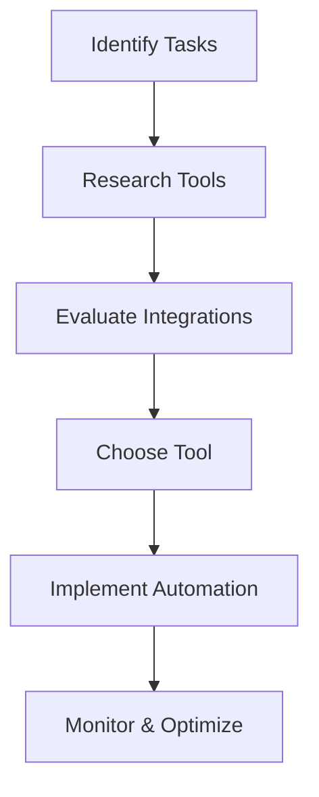

---

# Revolutionize Your Workflow with AI Automation Tools

In today's fast-paced digital landscape, businesses and individuals alike are constantly seeking ways to streamline their processes and enhance productivity. Enter AI automation tools—game-changers that allow you to automate mundane tasks and focus on what truly matters. But what exactly are these tools, and how can they transform your workflow? Let’s dive in!

## What Are AI Automation Tools?

AI automation tools leverage artificial intelligence to perform tasks that would typically require human intervention. From scheduling meetings to managing emails, these tools can significantly reduce manual workload and improve efficiency. With capabilities ranging from natural language processing to machine learning, AI tools can learn from data, adapt to your needs, and execute tasks faster and more accurately than ever before.

## Why You Need AI Automation Tools

### Increased Efficiency

Imagine spending less time on repetitive tasks like data entry or report generation. AI automation tools can handle these tasks, freeing you to focus on strategic decision-making and creative problem-solving.

### Cost Savings

Automating tasks means you can utilize your team more effectively. Instead of hiring additional staff for routine tasks, you can invest in AI tools that do the job at a fraction of the cost.

### Enhanced Accuracy

AI tools minimize human error. For example, when processing large datasets, an AI can ensure that information is consistent and accurate, reducing the risk of costly mistakes.

### Scalability

As your business grows, so do your tasks. AI automation tools can easily scale with your operations, adapting to new processes without the need for extensive retraining.

## Popular AI Automation Tools and Their Use Cases

Let’s explore some of the leading AI automation tools available today. Each tool has its unique features and capabilities designed to enhance productivity.

### 1. Zapier

**Overview**: Zapier connects your favorite apps and automates workflows between them.

**Use Case**: Automate social media posting by linking content creation tools with your social accounts.

**Pros**:
- Supports over 2,000 applications.
- User-friendly interface.
- Customizable workflows.

**Cons**:
- Limited functionality in the free version.
- Some users report delays in task execution.

### 2. UiPath

**Overview**: UiPath offers robotic process automation (RPA) solutions designed for enterprise-level tasks.

**Use Case**: Automate invoice processing by extracting data from emails and entering it into your accounting software.

**Pros**:
- Advanced automation capabilities.
- Strong community support and resources.
- Excellent for complex workflows.

**Cons**:
- Steeper learning curve for beginners.
- Higher costs compared to other tools.

### 3. Integromat (now Make)

**Overview**: Integromat allows you to connect apps and automate workflows using a visual interface.

**Use Case**: Automatically sync customer data between your CRM and email marketing software.

**Pros**:
- Visual workflow builder is intuitive.
- Supports many integrations.
- Offers advanced features for tech-savvy users.

**Cons**:
- May overwhelm users who prefer simplicity.
- Limited customer support options.

### 4. Microsoft Power Automate

**Overview**: This tool integrates seamlessly with Microsoft products, allowing for easy automation of tasks.

**Use Case**: Automate data collection from forms into Excel spreadsheets.

**Pros**:
- Great for users already in the Microsoft ecosystem.
- Extensive template library.
- Integrates with a wide range of third-party applications.

**Cons**:
- Can be less intuitive for non-Microsoft users.
- Pricing can become high for small businesses.

### 5. Automate.io

**Overview**: Automate.io is a simple tool for connecting applications and automating tasks.

**Use Case**: Trigger notifications in Slack whenever a new lead is added to your CRM.

**Pros**:
- Easy to set up with a drag-and-drop interface.
- Affordable pricing plans.
- Good selection of integrations.

**Cons**:
- Limited to 300 actions in the free plan.
- Some integrations may be buggy.

### Comparison Table

<table>
  <tr>
    <th>Tool</th>
    <th>Best For</th>
    <th>Key Features</th>
    <th>Pricing</th>
  </tr>
  <tr>
    <td>Zapier</td>
    <td>Small to medium businesses</td>
    <td>App connections, customizable workflows</td>
    <td>Free tier available; paid plans start at $19.99/month</td>
  </tr>
  <tr>
    <td>UiPath</td>
    <td>Enterprise automation</td>
    <td>RPA, complex workflows</td>
    <td>Custom pricing based on needs</td>
  </tr>
  <tr>
    <td>Integromat</td>
    <td>Visual automation</td>
    <td>Visual builder, advanced features</td>
    <td>Free tier; paid plans start at $9/month</td>
  </tr>
  <tr>
    <td>Microsoft Power Automate</td>
    <td>Microsoft users</td>
    <td>Microsoft integration, templates</td>
    <td>Free with Microsoft 365; plans start at $15/month</td>
  </tr>
  <tr>
    <td>Automate.io</td>
    <td>Simple automation</td>
    <td>Drag-and-drop interface, affordable</td>
    <td>Free tier; paid plans start at $9/month</td>
  </tr>
</table>

## How to Choose the Right AI Automation Tool

When selecting the right AI automation tool for your needs, consider the following factors:

### Identify Your Needs

What specific tasks do you want to automate? Are you looking for a simple solution, or do you need something that can handle more complex workflows?

### Evaluate Integration Capabilities

Ensure the tool you choose integrates with the applications you currently use. A seamless connection will save you time and effort.

### Consider Scalability

Think about your future needs. Will the tool you choose grow with your business? Opt for a solution that can adapt to changing demands.

### Check Pricing Plans

Review the pricing structures of different tools. Make sure you understand what features are included in each plan to find the best value for your budget.

## Conclusion

AI automation tools are revolutionizing the way we work, making processes more efficient and allowing for greater focus on high-value tasks. Whether you're a small business owner or part of a large enterprise, these tools can drastically improve your productivity and workflow. 

Start your journey towards automation today! Explore the tools mentioned above, assess your needs, and take the first step in transforming your workflow. Don't let repetitive tasks hold you back—embrace the power of AI automation and watch your productivity soar!

### Call to Action

Ready to revolutionize your workflow? Sign up for a free trial of one of the AI automation tools we discussed and experience the transformation for yourself! Visit our website for more resources and insights on AI tools that can enhance your productivity.