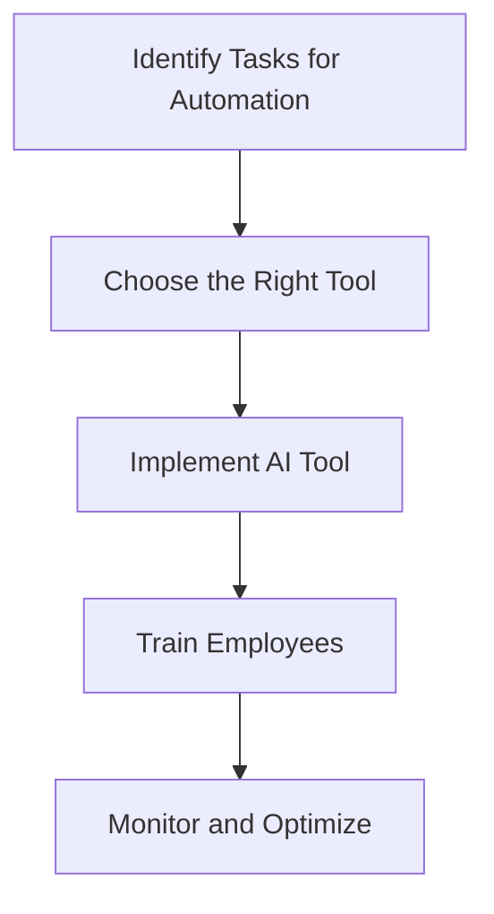

---

# Revolutionizing Business Efficiency with AI Automation

In today's fast-paced business landscape, the need for efficiency and productivity has never been more critical. Companies are constantly seeking innovative ways to streamline operations, reduce costs, and enhance customer experiences. One of the most transformative developments in recent years has been the rise of AI automation. This groundbreaking technology is revolutionizing how businesses operate, enabling them to achieve unprecedented levels of efficiency. In this article, we'll explore the benefits of AI automation for businesses, practical use cases, and some of the best tools available to harness its power.

## What is AI Automation?

AI automation refers to the use of artificial intelligence technologies to automate repetitive tasks and processes that traditionally require human intervention. This can range from simple data entry tasks to complex decision-making processes. By integrating AI into business operations, organizations can not only save time and money but also enhance accuracy and efficiency.

### The Importance of AI Automation in Business

1. **Increased Efficiency**: Automating mundane tasks allows employees to focus on high-value activities, ultimately boosting productivity.
2. **Cost Reduction**: By minimizing manual labor, businesses can significantly reduce operational costs.
3. **Enhanced Decision-Making**: AI tools can analyze vast amounts of data, providing insights that inform better business decisions.
4. **Improved Customer Experience**: Automation enables faster response times and personalized interactions, enhancing customer satisfaction.

## Practical Use Cases of AI Automation

### 1. Customer Support Automation

AI chatbots and virtual assistants are becoming essential in customer service. These tools can handle inquiries, provide information, and resolve issues 24/7. For instance, companies like Zendesk have integrated AI to automate ticketing systems, ensuring that customers receive timely responses without requiring constant human oversight.

### 2. Marketing Automation

AI tools such as HubSpot and Mailchimp leverage automation to optimize marketing campaigns. They can segment audiences, personalize content, and analyze engagement data to improve conversion rates. For example, an e-commerce company can use AI to send tailored email campaigns based on user behavior, significantly increasing sales.

### 3. Human Resources Automation

AI automation can streamline HR processes like recruitment and onboarding. Tools like BambooHR and Workday automate resume screening, candidate tracking, and employee onboarding, freeing HR teams to engage in more strategic initiatives. Automating these processes not only saves time but also reduces the risk of human error.

### 4. Financial Automation

In finance, AI tools like Xero and QuickBooks automate bookkeeping tasks, invoicing, and expense tracking. These tools can generate financial reports with minimal human input, allowing business owners to focus on strategic financial planning rather than mundane data entry.

### 5. Supply Chain Automation

AI automation can optimize supply chain management by predicting demand, managing inventory levels, and enhancing logistics. Tools like SAP Integrated Business Planning use AI to forecast demand patterns, enabling businesses to make informed decisions about inventory and production schedules.

## Pros and Cons of AI Automation

While the benefits of AI automation are significant, it’s essential to consider potential drawbacks as well.

### Pros:
- **Time-Saving**: Automating repetitive tasks allows employees to focus on more strategic work.
- **Cost-Effective**: Reduces the need for extensive manual labor, leading to lower operational costs.
- **Accuracy**: Minimizes human error in data entry and analysis.
- **Scalability**: Easily adapts to business growth without a proportional increase in costs.

### Cons:
- **Initial Investment**: Implementing AI tools can require a significant upfront cost.
- **Job Displacement**: Automation can lead to concerns about job losses due to reduced need for human labor.
- **Complexity**: Integrating AI tools into existing systems can be challenging and may require specialized knowledge.
- **Dependence on Technology**: Over-reliance on automation can result in a lack of human touch in customer service.

## Top AI Automation Tools for Businesses

To truly harness the power of AI automation, businesses need the right tools. Below is a comparison of some of the leading AI automation tools available today:

<table>
  <tr>
    <th>Tool</th>
    <th>Best For</th>
    <th>Key Features</th>
    <th>Pricing</th>
  </tr>
  <tr>
    <td>Zapier</td>
    <td>Workflow Automation</td>
    <td>Integrates with thousands of apps, no coding required</td>
    <td>Starts at $19.99/month</td>
  </tr>
  <tr>
    <td>UiPath</td>
    <td>Robotic Process Automation</td>
    <td>Drag-and-drop interface, supports complex workflows</td>
    <td>Starts at $420/month</td>
  </tr>
  <tr>
    <td>HubSpot</td>
    <td>Marketing Automation</td>
    <td>Email marketing, analytics, CRM integration</td>
    <td>Free plan available; paid plans start at $50/month</td>
  </tr>
  <tr>
    <td>Freshdesk</td>
    <td>Customer Support Automation</td>
    <td>AI-powered chatbots, ticketing system, multi-channel support</td>
    <td>Free plan available; paid plans start at $15/month</td>
  </tr>
  <tr>
    <td>Xero</td>
    <td>Financial Automation</td>
    <td>Automated bookkeeping, invoicing, reporting</td>
    <td>Starts at $12/month</td>
  </tr>
</table>

## Workflow of AI Automation Implementation

To ensure a successful AI automation implementation, businesses should follow a structured workflow. Here’s a simple representation of the process:

This diagram illustrates the critical steps involved in integrating AI automation into your business processes. Start by identifying tasks that can be automated, choose a suitable tool, implement it, train your staff, and continuously monitor to optimize performance.

## Conclusion: Embrace AI Automation for Business Success

As we’ve seen, AI automation offers a myriad of benefits that can significantly enhance business efficiency. From improving customer support to streamlining financial processes, the right tools can transform how your organization operates. However, it’s essential to weigh the pros and cons carefully before diving in.

Are you ready to take your business efficiency to the next level? Explore the various AI automation tools available and start your journey toward a more productive and cost-effective operation today. Don’t get left behind in this digital transformation – the future of business is automated!

### Call to Action

If you found this article helpful, consider subscribing to our newsletter for more insights on AI tools and productivity. Also, feel free to share your thoughts or experiences with AI automation in the comments below!

## 関連記事

- [AI Automation: Revolutionizing Business Operations in 2026](/posts/ai-automation-revolutionizing-business-operations-in-2026/)
- [Automating Business Processes with AI in 2026](/posts/automating-business-processes-with-ai-in-2026/)
- [Harnessing AI Automation for Business Growth in 2026](/posts/harnessing-ai-automation-for-business-growth-in-2026/)
