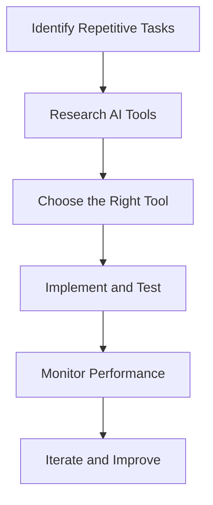

---

## Revolutionizing Business with AI Automation Strategies

In today’s fast-paced digital landscape, businesses are continually looking for innovative ways to optimize operations and enhance productivity. Enter *AI automation strategies*, a game-changer that can streamline processes, reduce costs, and free up valuable time for your team. In this blog post, we will explore how AI automation can revolutionize your business, practical use cases, and the tools that can help you implement these strategies effectively.

### What is AI Automation?

AI automation refers to the use of artificial intelligence technologies to automate repetitive tasks, allowing businesses to operate more efficiently. This can include everything from chatbots that handle customer inquiries to machine learning algorithms that analyze data for better decision-making. By incorporating AI automation into your business strategy, you can significantly improve operational efficiency and drive better outcomes.

### Why Should Your Business Embrace AI Automation?

1. **Increased Efficiency**: AI can perform tasks faster and more accurately than humans, minimizing errors and freeing up employees to focus on more strategic initiatives.
2. **Cost Savings**: By automating routine tasks, businesses can reduce labor costs and improve resource allocation.
3. **Enhanced Customer Experience**: AI-driven tools can provide personalized experiences for customers, leading to improved satisfaction and loyalty.
4. **Data-Driven Insights**: AI can analyze vast amounts of data to uncover trends and insights that can inform business decisions.

### Practical Use Cases of AI Automation in Business

#### 1. Customer Service Automation

One of the most visible applications of AI automation is in customer service. Chatbots and virtual assistants can handle a large volume of inquiries, offering 24/7 support without the need for human intervention. For instance, companies like Sephora use chatbots to provide personalized product recommendations based on user preferences.

#### 2. Marketing Automation

AI tools can automate various marketing tasks such as email campaigns, social media posting, and ad targeting. For example, HubSpot uses AI to segment audiences and send personalized email content at optimal times, resulting in higher engagement rates.

#### 3. Workflow Automation

AI can streamline internal processes by automating workflows. Tools like Zapier allow businesses to connect different applications and automate repetitive tasks, such as transferring data from one platform to another, reducing the potential for human error.

#### 4. Financial Operations

In finance, AI algorithms can automate invoice processing, expense management, and even fraud detection. For example, tools like Xero and QuickBooks use AI to analyze transaction patterns and flag suspicious activities, saving businesses time and money.

### Considerations When Implementing AI Automation

While the benefits of AI automation are compelling, there are also challenges to consider:

- **Initial Costs**: Implementing AI solutions can require a significant upfront investment.
- **Integration with Existing Systems**: Businesses may face hurdles when integrating AI tools with their current technologies.
- **Data Privacy**: Companies must ensure they comply with data protection regulations when using AI to handle customer information.

### Comparison of AI Automation Tools

Choosing the right AI automation tools is crucial for success. Here’s a comparison of some popular AI automation tools to help you make an informed decision:

<table>
  <tr>
    <th>Tool</th>
    <th>Best For</th>
    <th>Key Features</th>
    <th>Pricing</th>
  </tr>
  <tr>
    <td>Zapier</td>
    <td>Workflow Automation</td>
    <td>Connects apps, automates tasks</td>
    <td>Starts at $19.99/month</td>
  </tr>
  <tr>
    <td>HubSpot</td>
    <td>Marketing Automation</td>
    <td>Email marketing, lead scoring</td>
    <td>Free & Paid plans available</td>
  </tr>
  <tr>
    <td>Xero</td>
    <td>Financial Automation</td>
    <td>Invoice processing, expense management</td>
    <td>Starts at $11/month</td>
  </tr>
  <tr>
    <td>Intercom</td>
    <td>Customer Support</td>
    <td>Live chat, bots, targeted messaging</td>
    <td>Starts at $39/month</td>
  </tr>
</table>

### Mapping Out Your AI Automation Strategy

To successfully implement AI automation in your business, it's essential to have a clear strategy. Here’s a simple workflow to guide you through the process:

### Conclusion

The landscape of business is evolving, and AI automation is at the forefront of this transformation. From enhancing customer service to streamlining financial operations, the applications are vast and varied. However, careful consideration and a well-defined strategy are crucial for successful implementation.

Are you ready to revolutionize your business with AI automation strategies? Start exploring the tools mentioned in this article and take the first steps towards transforming your operations today!

### Call to Action

Don’t wait for the future to come to you—take charge of it! Begin your journey into AI automation by experimenting with the tools listed above. Subscribe to our newsletter for more insights and tips on leveraging technology to boost your business productivity!

## 関連記事

- [Automating Business Processes with AI in 2026](/posts/automating-business-processes-with-ai-in-2026/)
- [How AI Automation is Transforming Business Operations](/posts/how-ai-automation-is-transforming-business-operations/)
- [AI Agents: The Future of Personal Assistants in 2026](/posts/ai-agents-the-future-of-personal-assistants-in-2026/)
