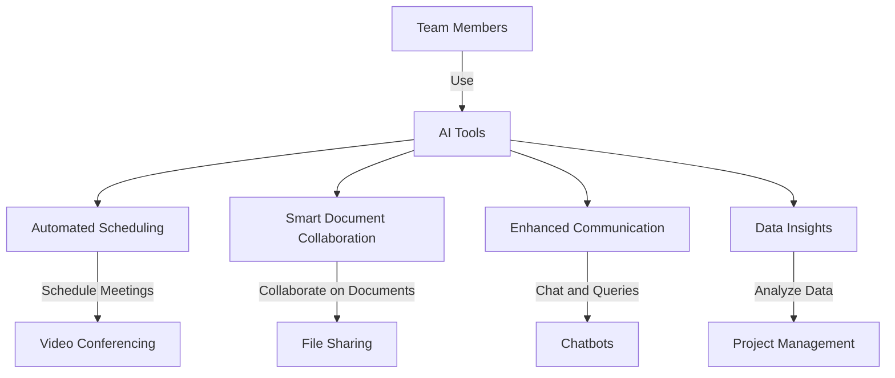

---

# Revolutionizing Team Collaboration with AI Tools

In today's fast-paced digital landscape, effective team collaboration is essential for success. With remote work becoming the norm and teams spread across different geographies, the challenge of maintaining seamless communication and collaboration has only intensified. Fortunately, AI tools collaboration is here to revolutionize the way teams interact, share ideas, and drive projects forward. In this blog post, we will explore various AI tools that enhance collaboration, their benefits and drawbacks, and practical use cases to help you choose the best solutions for your team.

## The Need for AI Tools in Team Collaboration

As teams grow and become more distributed, traditional collaboration tools often fall short. Emails can become overwhelming, chat apps can drown conversations in noise, and project management tools can lead to confusion. This is where AI comes into play—offering intelligent solutions that streamline communication, automate routine tasks, and provide insights that empower teams to work more effectively.

### How AI Tools Enhance Collaboration

AI tools bring a variety of features that can significantly improve collaboration among team members. Here are some core functionalities:

- **Automated Scheduling:** AI-driven tools can analyze team members’ calendars to find the best meeting times, reducing the back-and-forth that often plagues scheduling.
- **Smart Document Collaboration:** AI tools can help teams work on documents simultaneously while offering suggestions for improvements, ensuring everyone is on the same page.
- **Enhanced Communication:** AI chatbots can answer common questions, allowing team members to focus on more complex tasks instead of repetitive inquiries.
- **Data Insights:** AI can analyze team performance and project progress, providing insights that help in making informed decisions.

## Top AI Tools for Collaboration

Let’s dive into some of the top AI tools that are transforming team collaboration, comparing their features, pros, and cons.

### 1. Microsoft Teams

Microsoft Teams integrates seamlessly with Office 365, providing a robust platform for communication, file sharing, and project management.

**Pros:**
- Comprehensive integration with Microsoft Office tools
- Excellent video conferencing capabilities
- Customizable apps and bots for enhanced functionality

**Cons:**
- Can be overwhelming with too many features
- Performance issues in larger organizations

### 2. Slack

Slack is a popular messaging tool that uses AI to enhance communication and streamline workflows through integrations and automation.

**Pros:**
- User-friendly interface
- Extensive app integrations
- Powerful search capabilities

**Cons:**
- Can lead to notification fatigue
- Limited video conferencing features

### 3. Trello

Trello is a visual project management tool that leverages AI to automate tasks and streamline project tracking.

**Pros:**
- Intuitive Kanban-style interface
- Power-ups for added functionality
- Easy collaboration with team members

**Cons:**
- Limited features in the free version
- May not be suitable for complex projects

### Comparison Table of AI Collaboration Tools

<table>
  <tr>
    <th>Feature</th>
    <th>Microsoft Teams</th>
    <th>Slack</th>
    <th>Trello</th>
  </tr>
  <tr>
    <td>Video Conferencing</td>
    <td>✔️</td>
    <td>Limited</td>
    <td>No</td>
  </tr>
  <tr>
    <td>File Sharing</td>
    <td>✔️</td>
    <td>✔️</td>
    <td>✔️</td>
  </tr>
  <tr>
    <td>Automation</td>
    <td>✔️</td>
    <td>✔️</td>
    <td>✔️</td>
  </tr>
  <tr>
    <td>Project Management</td>
    <td>✔️</td>
    <td>No</td>
    <td>✔️</td>
  </tr>
  <tr>
    <td>Integrations</td>
    <td>✔️</td>
    <td>✔️</td>
    <td>✔️</td>
  </tr>
</table>

### 4. Asana

Asana is a project management tool that leverages AI to help teams prioritize tasks and manage workflows efficiently.

**Pros:**
- Intuitive interface
- Excellent task tracking features
- Customizable workflows

**Cons:**
- Can be expensive for larger teams
- Learning curve for new users

### 5. Notion

Notion is an all-in-one workspace that allows teams to write, plan, and collaborate all in one place, enhanced with AI features for smart suggestions.

**Pros:**
- Highly customizable
- Great for documentation and note-taking
- Integrates well with other tools

**Cons:**
- Performance can lag with large databases
- Requires time to set up effectively

## Workflow of AI Tools Collaboration

To illustrate how these tools can work together, here’s a simple workflow for team collaboration using AI tools. 

## Real-World Use Cases of AI Tools Collaboration

### Case Study 1: Remote Tech Startup

A remote tech startup leveraged Microsoft Teams and Asana to coordinate their projects. With AI-driven task assignments and automated scheduling, they were able to reduce meeting times by 30% and increase project delivery speed by 20%.

### Case Study 2: Marketing Agency

A marketing agency utilized Slack and Trello for their campaign management. The integration of AI bots in Slack helped answer common queries, allowing team members to focus on creative tasks. This led to a 25% increase in campaign output.

## Conclusion

As the workplace continues to evolve, embracing AI tools for collaboration is no longer a luxury but a necessity. These tools not only enhance productivity but also foster a culture of collaboration and innovation. By carefully selecting the right AI tools that fit your team’s needs, you can transform the way your organization collaborates.

### Call to Action

Ready to supercharge your team's collaboration? Explore these AI tools and find the perfect solution to meet your team's unique needs. Don't wait—start collaborating smarter today!

## 関連記事

- [Future of Work: AI Tools That Enhance Team Collaboration](/posts/future-of-work-ai-tools-that-enhance-team-collaboration/)
- [AI Agents: The Future of Personal Assistants in 2026](/posts/ai-agents-the-future-of-personal-assistants-in-2026/)
- [AI Tools for Small Businesses: Increase Your ROI](/posts/ai-tools-for-small-businesses-increase-your-roi/)
