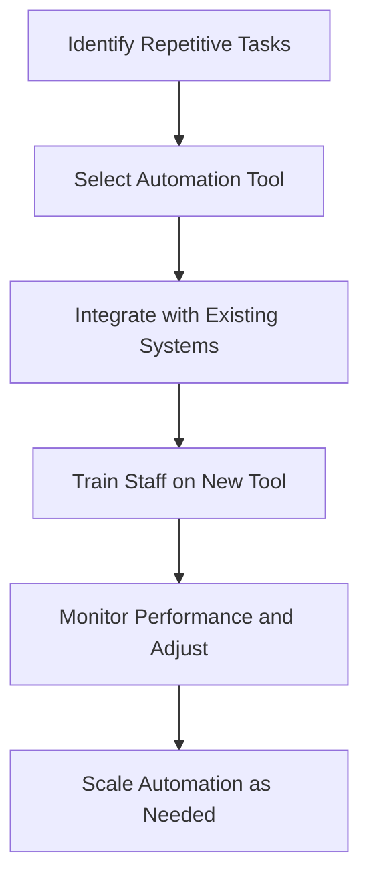

---

## Scaling Your Business with AI-Powered Automation Tools

In today's fast-paced business landscape, efficiency is key to staying competitive. Enter AI-powered automation tools—game-changers that can help you scale your operations, reduce costs, and improve productivity. Whether you're a small startup or an established enterprise, integrating these tools into your workflow can significantly enhance your bottom line. In this article, we'll explore the benefits of AI-powered automation, practical applications, and some of the best tools available to help you scale your business effectively.

### What is AI-Powered Automation?

AI-powered automation refers to the use of artificial intelligence technologies to perform tasks that would typically require human intervention. This can include everything from automating customer service queries to managing supply chains and even analyzing data for insights. By leveraging AI, businesses can streamline their operations, minimize human error, and focus their resources on strategic growth initiatives.

### Why Choose AI-Powered Automation?

The advantages of adopting AI-powered automation tools are numerous:

1. **Increased Efficiency**: Automating repetitive tasks allows employees to focus on higher-value activities.
2. **Cost Savings**: Reducing manual processes lowers labor costs and minimizes errors.
3. **Scalability**: Automation can easily scale with your business, accommodating growth without a proportional increase in resources.
4. **Data Insights**: AI tools can analyze vast amounts of data to provide actionable insights, helping you make informed decisions.

### Practical Examples of AI-Powered Automation

To illustrate the power of AI-powered automation, let's take a look at a few practical examples:

#### 1. Customer Support Automation

**Use Case**: A retail business implements a chatbot to handle customer inquiries. 

- **Before Automation**: Customers often experienced long wait times for responses, leading to frustration and lost sales.
- **After Automation**: The chatbot answers FAQs and assists with order tracking 24/7, allowing human agents to focus on complex issues.

#### 2. Marketing Campaign Management

**Use Case**: An e-commerce company uses AI to analyze customer behavior and automate targeted marketing campaigns.

- **Before Automation**: Marketing efforts relied on manual segmentation and generic messaging.
- **After Automation**: AI-driven insights allow for personalized email campaigns based on customer preferences, resulting in higher engagement rates.

#### 3. Inventory Management

**Use Case**: A manufacturing company employs AI to manage inventory levels and predict supply needs.

- **Before Automation**: Manual tracking led to overstocking or stockouts, affecting sales.
- **After Automation**: AI predicts inventory requirements based on historical data and trends, optimizing stock levels.

### Top AI-Powered Automation Tools

With the growing demand for AI-powered automation, numerous tools have emerged in the market. Below, we compare some of the top options available:

<table>
  <tr>
    <th>Tool</th>
    <th>Features</th>
    <th>Best For</th>
    <th>Pros</th>
    <th>Cons</th>
  </tr>
  <tr>
    <td>Zapier</td>
    <td>Connects over 2,000 apps for workflow automation</td>
    <td>Small to medium businesses</td>
    <td>Easy to use, extensive integrations</td>
    <td>Can get expensive with advanced features</td>
  </tr>
  <tr>
    <td>UiPath</td>
    <td>Robotic process automation for repetitive tasks</td>
    <td>Large enterprises</td>
    <td>Highly scalable, robust features</td>
    <td>Steeper learning curve</td>
  </tr>
  <tr>
    <td>Integromat (Make)</td>
    <td>Visual automation tool with complex scenarios</td>
    <td>Tech-savvy users</td>
    <td>Powerful and flexible</td>
    <td>Interface can be overwhelming</td>
  </tr>
  <tr>
    <td>HubSpot</td>
    <td>Marketing, sales, and customer service automation</td>
    <td>Marketing teams</td>
    <td>All-in-one platform, user-friendly</td>
    <td>Pricing can be high for advanced tools</td>
  </tr>
</table>

### Choosing the Right AI-Powered Automation Tool

When selecting an AI-powered automation tool, consider the following factors:

- **Business Size**: Some tools are better suited for small businesses, while others cater to large enterprises.
- **Budget**: Evaluate the cost of tools against your budget and the potential ROI.
- **Ease of Use**: Look for tools that offer a user-friendly interface and good customer support.
- **Integration**: Ensure the tool integrates well with your existing systems.

### Workflow of Integrating AI-Powered Automation

To help visualize the integration process of AI-powered automation tools, here’s a simple workflow diagram:

### Conclusion

AI-powered automation tools are not just a trend; they represent a fundamental shift in how businesses operate. By automating repetitive tasks, you can free up valuable resources, improve accuracy, and ultimately drive growth. Whether you're looking to enhance customer support, streamline marketing efforts, or manage inventory, there's an AI tool that can help.

Are you ready to take your business to the next level with AI-powered automation? Start by exploring the tools mentioned above and choose one that fits your needs. Don't wait—embrace the future of business operations today!

### Call to Action

If you found this article helpful, share it with your network and let us know your thoughts in the comments below! For more insights on AI tools and productivity strategies, subscribe to our newsletter for the latest updates and tips. Let's scale your business together!