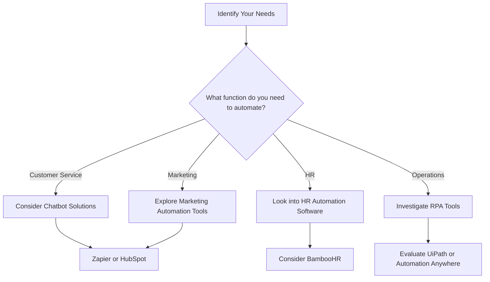

In today’s fast-paced business environment, efficiency is key to staying competitive. Enter AI automation, a transformative technology that optimizes workflows, reduces manual tasks, and enhances productivity. By integrating AI automation into your business operations, you can save time, cut costs, and focus on what truly matters: growing your business. This article explores the benefits of AI automation, practical use cases, and the best tools available to help you streamline your operations.

## What is AI Automation?

AI automation refers to the use of artificial intelligence to automate routine tasks and processes in a business. This involves leveraging machine learning, natural language processing, and robotics to enhance operational efficiency. From data entry to customer service, AI automation can perform tasks with precision and speed, freeing employees to concentrate on higher-value work.

## Benefits of AI Automation in Business Operations

### 1. Increased Efficiency

One of the most significant advantages of AI automation is its ability to streamline processes. By automating repetitive tasks, businesses can significantly reduce the time required to complete them. For instance, AI-powered chatbots can handle customer inquiries 24/7, leading to faster response times and improved customer satisfaction.

### 2. Cost Reduction

Automating routine tasks reduces the need for manual intervention, which can lead to a substantial decrease in labor costs. For example, companies can automate invoice processing, minimizing the time spent on manual entry and reducing the likelihood of errors.

### 3. Enhanced Accuracy

AI systems can process data with a high level of accuracy, reducing human error. This is particularly beneficial in industries like finance and healthcare, where precision is critical. For example, AI tools can analyze vast amounts of data to identify trends and anomalies, providing valuable insights for decision-making.

### 4. Improved Decision-Making

With AI automation, businesses can gather and analyze data more effectively, leading to informed decision-making. For instance, AI tools can generate reports on sales trends, helping managers make strategic choices based on real-time data.

## Practical Use Cases of AI Automation

### Customer Service

AI chatbots are revolutionizing customer service by providing instant responses to inquiries. Businesses like Hootsuite and Sephora utilize chatbots to handle common questions, allowing human representatives to focus on more complex issues. 

### Marketing Automation

AI tools like HubSpot and Marketo automate email marketing campaigns, segmenting audiences and personalizing messages based on user behavior. This not only saves time but also increases engagement and conversion rates.

### Human Resources

AI-driven tools can streamline HR processes, such as resume screening and employee onboarding. For example, platforms like BambooHR use AI to analyze job applications, helping HR teams identify top candidates more efficiently.

### Supply Chain Management

AI can optimize inventory management and demand forecasting. Walmart employs AI-driven analytics to manage its supply chain, ensuring products are in stock when customers need them while minimizing excess inventory.

## Top AI Automation Tools for Businesses

Here’s a comparison of some leading AI automation tools, showcasing their features, pros, and cons.

<table>
  <tr>
    <th>Tool</th>
    <th>Features</th>
    <th>Pros</th>
    <th>Cons</th>
  </tr>
  <tr>
    <td>Zapier</td>
    <td>Integrates apps, automates workflows</td>
    <td>Easy to use, vast app integrations</td>
    <td>Limited free plan, can be expensive</td>
  </tr>
  <tr>
    <td>UiPath</td>
    <td>Robotic Process Automation (RPA)</td>
    <td>Scalable, strong enterprise features</td>
    <td>Steep learning curve, high initial costs</td>
  </tr>
  <tr>
    <td>Automation Anywhere</td>
    <td>RPA, AI-powered insights</td>
    <td>Flexible, user-friendly interface</td>
    <td>Support can be slow, pricing complexity</td>
  </tr>
  <tr>
    <td>HubSpot</td>
    <td>Marketing automation, CRM</td>
    <td>All-in-one platform, user-friendly</td>
    <td>Can be costly for premium features</td>
  </tr>
</table>

## Choosing the Right AI Automation Tool

Selecting the right AI automation tool for your business can be challenging, given the multitude of options available. Here’s a simple decision tree to guide your choice based on your specific needs:

## Conclusion

AI automation is more than just a buzzword; it’s a crucial aspect of modern business operations. By embracing AI tools, companies can streamline processes, reduce costs, and improve overall productivity. Whether you’re automating customer service, marketing campaigns, or HR processes, there’s an AI solution that can fit your needs.

If you're ready to take your business operations to the next level with AI automation, start exploring the tools mentioned in this article. Harness the power of AI and watch your business thrive!

### Call to Action

Are you ready to implement AI automation in your business? Start by assessing your operational needs and exploring the tools that can help you optimize your processes. Visit AI Tools Lab for more insights on AI tools and how they can transform your productivity!

## 関連記事

- [AI for Business Operations: A Decision-Maker's Guide](/posts/ai-for-business-streamlining-operations-with-intelligent-tools/)
- [Automating Business Processes with AI: A Step-by-Step Playbook](/posts/automating-business-processes-with-ai-a-complete-guide/)
- [7 AI Automation Strategies to Supercharge Business Efficiency](/posts/boosting-business-efficiency-with-ai-automation-strategies/)
