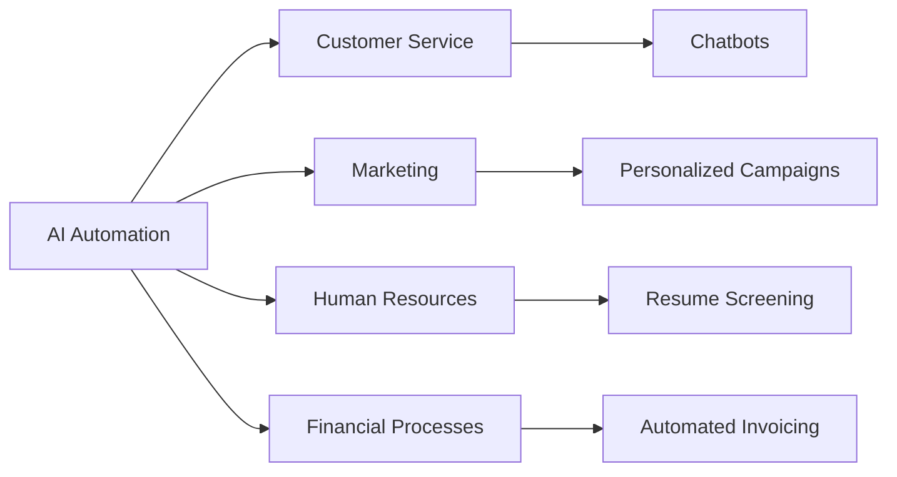

---

# Streamlining Business Processes with AI Automation

In the ever-evolving landscape of business, efficiency is key. Organizations are constantly on the lookout for innovative solutions that can help them streamline their processes, reduce costs, and improve productivity. Enter AI automation for business. This powerful technology not only enhances operational efficiency but also empowers teams to focus on strategic initiatives rather than mundane tasks. In this article, we’ll explore how AI automation can transform your business processes, share practical examples, and offer insight into the best tools available in the market.

## Understanding AI Automation for Business

AI automation refers to the use of artificial intelligence technologies to automate repetitive tasks, analyze data, and enhance decision-making. This can include everything from automating customer service inquiries to managing complex data processes. The primary goal of AI automation is to reduce the time and effort involved in routine tasks, enabling businesses to allocate resources more effectively.

### Why Invest in AI Automation?

Investing in AI automation can yield significant benefits for businesses, including:

- **Increased Efficiency**: Automating repetitive tasks frees up valuable time for employees to focus on higher-value work.
- **Cost Reduction**: By reducing the need for manual intervention, businesses can save on labor costs and minimize human error.
- **Enhanced Decision-Making**: AI systems can analyze vast amounts of data quickly, providing insights that help businesses make informed decisions.
- **Improved Customer Experience**: Automation can enhance customer interactions by providing quick and accurate responses to inquiries.

## Practical Use Cases of AI Automation

Let's take a look at some practical examples of AI automation in various business processes.

### 1. Customer Service Automation

AI chatbots and virtual assistants are revolutionizing customer service. By handling routine inquiries and providing 24/7 support, these tools can significantly enhance customer satisfaction. For instance:

- **Example**: A retail company implements an AI chatbot on its website that answers common questions about order status, returns, and product information. This reduces the workload on customer service representatives and allows them to focus on more complex issues.

### 2. Automated Marketing Campaigns

AI can help businesses optimize their marketing efforts by automating campaign management. This includes:

- **Example**: An e-commerce platform uses AI tools to analyze customer behavior and send personalized email marketing campaigns. The result is higher engagement and conversion rates.

### 3. Human Resources Automation

AI tools are transforming HR processes by streamlining recruitment and employee management tasks. For example:

- **Example**: A company utilizes an AI-powered recruiting tool that screens resumes and ranks candidates based on their fit for the position, allowing HR teams to focus on interviewing the best candidates.

### 4. Financial Process Automation

AI can help organizations automate invoicing, expense tracking, and financial reporting. This not only saves time but also reduces the risk of errors. 

- **Example**: A small business uses an AI tool to automate its bookkeeping processes, allowing it to generate financial reports in real-time without manual data entry.

## Top AI Automation Tools for Business

Choosing the right AI automation tools can be challenging given the plethora of options available. To help you make an informed decision, here’s a comparison of some leading AI automation tools:

<table>
  <tr>
    <th>Tool</th>
    <th>Best For</th>
    <th>Key Features</th>
    <th>Pricing</th>
  </tr>
  <tr>
    <td>Zapier</td>
    <td>Workflow Automation</td>
    <td>Integrates with 3,000+ apps, easy-to-use interface</td>
    <td>Starts at $19.99/month</td>
  </tr>
  <tr>
    <td>UiPath</td>
    <td>Robotic Process Automation</td>
    <td>Advanced automation capabilities, customizable workflows</td>
    <td>Contact for pricing</td>
  </tr>
  <tr>
    <td>HubSpot</td>
    <td>Marketing Automation</td>
    <td>Personalized email campaigns, lead management</td>
    <td>Starts at $45/month</td>
  </tr>
  <tr>
    <td>[ChatGPT](https://chat.openai.com/?ref=AFFILIATE_ID)</td>
    <td>Customer Support</td>
    <td>Natural language processing, versatile applications</td>
    <td>Free tier available; paid plans start at $20/month</td>
  </tr>
</table>

### Pros and Cons of AI Automation Tools

#### Pros
- **Increased Efficiency**: Automating routine tasks can save time and energy.
- **Enhanced Accuracy**: Reduces human error, especially in data processing.
- **Scalability**: Many AI tools can grow with your business, offering more features as needed.

#### Cons
- **Initial Investment**: Some AI tools can be expensive to implement.
- **Learning Curve**: Employees may need training to effectively use new software.
- **Dependence on Technology**: Over-reliance on automation can lead to challenges if systems fail.

## The Future of AI Automation in Business

As AI technology continues to advance, the potential for automation in business is limitless. From predictive analytics that forecast trends to smart assistants that help with project management, the future looks bright for organizations willing to embrace AI automation.

### Getting Started with AI Automation

If you're considering implementing AI automation in your business, here are a few steps to get started:

1. **Identify Pain Points**: Assess your current processes and identify tasks that are repetitive and time-consuming.
2. **Research Tools**: Look for AI tools that align with your business needs and budget.
3. **Start Small**: Implement automation in one area of your business before scaling up.
4. **Measure Results**: Track the impact of automation on your efficiency and productivity.

## Conclusion

In a world where efficiency is paramount, AI automation for business offers a pathway to streamline operations and enhance productivity. By adopting the right tools and strategies, you can free up valuable resources and enable your teams to focus on what truly matters—driving innovation and growth. 

Are you ready to take the plunge into AI automation? Start exploring the tools mentioned above, and see how they can transform your business processes today!

**Call to Action:** Don't wait! Dive into the world of AI automation and start streamlining your business processes now. Visit our recommended tools or contact us for personalized guidance!

## 関連記事

- [Unlocking Business Efficiency Through AI Automation](/posts/unlocking-business-efficiency-through-ai-automation/)
- [AI Agents: The Future of Personal Assistants in 2026](/posts/ai-agents-the-future-of-personal-assistants-in-2026/)
- [AI Automation: A Game Changer for Small Businesses](/posts/ai-automation-a-game-changer-for-small-businesses/)
