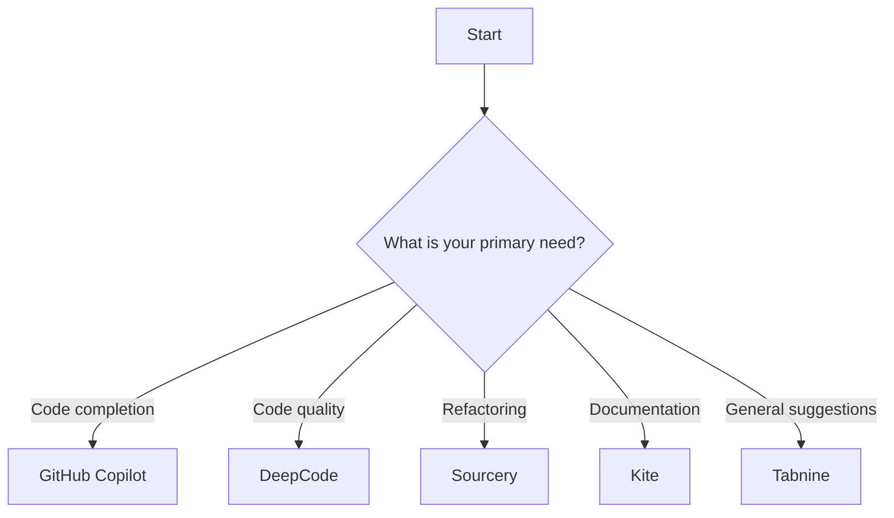

---

# The Best AI Coding Tools to Boost Developer Efficiency

In the fast-paced world of software development, efficiency is key. With the advent of artificial intelligence (AI), developers now have access to a range of tools designed to streamline coding processes, automate repetitive tasks, and enhance overall productivity. In this post, we’ll explore the best AI coding tools available today, examining their features, pros and cons, and real-life use cases that demonstrate their potential to transform your development workflow.

## Why Use AI Coding Tools?

The integration of AI into coding practices is not just a trend; it’s a necessity in today’s competitive landscape. Here are a few compelling reasons why developers should consider using AI coding tools:

1. **Increased Productivity**: Automate mundane tasks, allowing developers to focus on more complex problems.
2. **Error Reduction**: AI tools can help catch bugs and provide solutions before code is deployed.
3. **Learning and Growth**: Many AI coding tools offer suggestions and best practices, facilitating continuous learning.
4. **Collaboration**: AI tools can enhance team collaboration by providing shared insights and coding standards.

## Key Features to Look For

When selecting AI coding tools, consider the following features:

- **Code Suggestions and Autocompletion**: Tools that predict and suggest code snippets can save you significant time.
- **Debugging Assistance**: Features that help identify and fix bugs quickly can enhance code quality.
- **Integration with IDEs**: Compatibility with popular Integrated Development Environments (IDEs) is crucial for seamless workflow.
- **Learning Resources**: Some tools offer tutorials and documentation to help developers improve their skills.

## Top AI Coding Tools

Let’s dive into some of the best AI coding tools that are making waves in the developer community.

### 1. GitHub Copilot

**Overview**: Developed by GitHub in collaboration with OpenAI, [Copilot](https://github.com/features/copilot?ref=AFFILIATE_ID) is an AI-powered code completion tool that suggests entire lines or blocks of code as you type.

**Pros**:
- Intuitive autocompletion.
- Supports multiple programming languages.
- Learns from your coding style.

**Cons**:
- May produce incorrect or insecure code.
- Requires an internet connection to function.

**Use Case**: A developer working on a web application can use [GitHub Copilot](https://github.com/features/copilot?ref=AFFILIATE_ID) to quickly generate boilerplate code, reducing the time spent on repetitive tasks.

### 2. Tabnine

**Overview**: [Tabnine](https://www.tabnine.com/?ref=AFFILIATE_ID) is an AI-driven autocompletion tool that uses deep learning to provide intelligent code suggestions.

**Pros**:
- Works offline with local models.
- Supports a wide range of languages and frameworks.
- Integrates with popular IDEs.

**Cons**:
- The free version has limited features.
- May require fine-tuning to fit specific coding styles.

**Use Case**: A team of developers working on a large project can use Tabnine to ensure consistency in code style and improve collaboration.

### 3. DeepCode

**Overview**: DeepCode analyzes your code in real-time to provide feedback and suggestions, focusing on code quality and security.

**Pros**:
- Real-time feedback on code changes.
- Identifies security vulnerabilities.
- Integrates with GitHub and Bitbucket.

**Cons**:
- May generate false positives.
- Limited support for less popular languages.

**Use Case**: A startup can use DeepCode to ensure their application is secure and adheres to best coding practices before launch.

### 4. Kite

**Overview**: Kite is an AI-powered coding assistant that offers code completions and documentation lookup.

**Pros**:
- Supports Python, Java, and several other languages.
- Provides documentation for libraries in-line.
- Works offline.

**Cons**:
- Limited to specific programming languages.
- Some features require a paid subscription.

**Use Case**: A data scientist can use Kite to quickly find and implement functions from libraries like Pandas and NumPy without leaving the coding environment.

### 5. Sourcery

**Overview**: Sourcery is an AI-powered refactoring tool specifically designed for Python developers, helping to improve code quality and maintainability.

**Pros**:
- Automates code refactoring.
- Provides suggestions for improving code quality.
- Integrates seamlessly with IDEs.

**Cons**:
- Limited to Python.
- The suggestions may not always align with personal coding style.

**Use Case**: A Python developer working on a complex algorithm can use Sourcery to refactor their code, making it cleaner and more efficient.

### Comparison Table of AI Coding Tools

<table>
  <tr>
    <th>Tool</th>
    <th>Supported Languages</th>
    <th>Key Features</th>
    <th>Pros</th>
    <th>Cons</th>
  </tr>
  <tr>
    <td>GitHub Copilot</td>
    <td>Multiple</td>
    <td>Code suggestions, learning</td>
    <td>Intuitive, learns style</td>
    <td>Internet required</td>
  </tr>
  <tr>
    <td>Tabnine</td>
    <td>Multiple</td>
    <td>Deep learning suggestions</td>
    <td>Works offline, broad support</td>
    <td>Free version limited</td>
  </tr>
  <tr>
    <td>DeepCode</td>
    <td>Multiple</td>
    <td>Real-time analysis</td>
    <td>Security focus, integrations</td>
    <td>False positives possible</td>
  </tr>
  <tr>
    <td>Kite</td>
    <td>Python, Java</td>
    <td>In-line documentation</td>
    <td>Offline mode, fast access</td>
    <td>Language limited</td>
  </tr>
  <tr>
    <td>Sourcery</td>
    <td>Python</td>
    <td>Code refactoring</td>
    <td>Automates improvements</td>
    <td>Style mismatches</td>
  </tr>
</table>

### Visualizing the Workflow with AI Coding Tools

To better understand how to integrate AI coding tools into your workflow, here’s a simple decision tree that depicts the process of selecting the right tool based on your needs:

## Conclusion

The rise of AI coding tools has revolutionized the way developers approach coding and software development. Whether you are looking for code suggestions, debugging assistance, or tools to enhance collaboration, there is an AI tool that can meet your needs. 

As you explore these options, consider what features are most important to you and how these tools can fit into your existing workflow. By integrating the right AI coding tools, you can significantly boost your efficiency, improve code quality, and ultimately contribute more effectively to your projects.

### Call to Action

Ready to take your coding efficiency to the next level? Try out one of these AI coding tools today and experience the difference it can make in your development process. Share your thoughts and experiences in the comments below, and let’s continue the conversation about the future of coding with AI!

## 関連記事

- [Top 10 AI Coding Tools Every Developer Should Know in 2026](/posts/top-10-ai-coding-tools-to-boost-developer-productivity/)
- [AI Coding Tools Compared: GitHub Copilot vs. Cursor vs. Cody](/posts/top-ai-coding-tools-for-developers-in-2026/)
- [AI Pair Programming: How Coding Assistants Are Replacing Rubber Ducks](/posts/ai-coding-tools-revolutionizing-software-development/)
