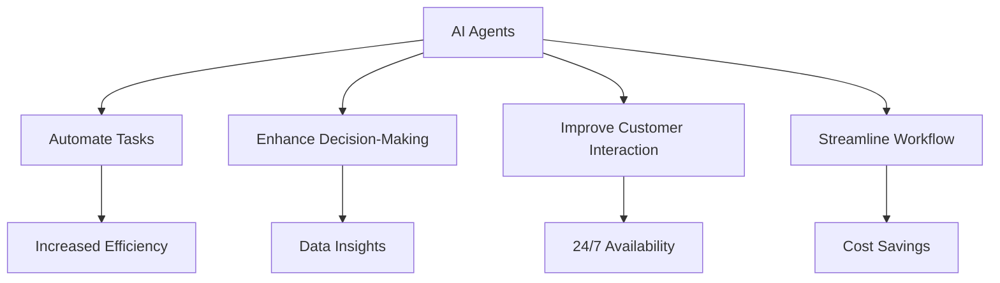

---

# The Future of AI Agents: Enhancing Workplace Productivity

In the ever-evolving landscape of technology, AI agents are emerging as powerful allies in the quest for enhanced workplace productivity. As organizations strive to streamline operations, reduce costs, and improve employee satisfaction, these intelligent systems are stepping in to automate mundane tasks, analyze vast data sets, and facilitate better decision-making processes. But what exactly are AI agents, and how can they revolutionize your work environment? Let’s dive deep into the world of AI agents and explore their potential in boosting productivity.

## What Are AI Agents?

AI agents are software programs that use artificial intelligence to perform specific tasks autonomously or semi-autonomously. They can be designed for various functions, from customer service chatbots to sophisticated data analysis tools. The key characteristic of AI agents is their ability to learn from interactions and improve over time, which makes them incredibly valuable in a workplace setting.

### Types of AI Agents

1. **Virtual Assistants**: Tools like Siri and Alexa that help manage schedules, set reminders, and answer queries.
2. **Chatbots**: Automated customer service agents that handle inquiries and support tasks.
3. **Data Analysis Tools**: Programs that analyze data trends to provide insights and recommendations.
4. **Robotic Process Automation (RPA)**: Software that automates repetitive tasks within organizations.

## The Role of AI Agents in Enhancing Productivity

### Automating Routine Tasks

One of the most immediate benefits of integrating AI agents into the workplace is their ability to automate routine tasks. This frees up employees to focus on more strategic and creative work. For instance, an AI-powered scheduling assistant can handle meeting requests, manage calendars, and reduce the time spent on back-and-forth communication.

**Example:** Companies using tools like x.ai or Clara can save hours each week that would otherwise be spent coordinating meetings.

### Enhancing Decision-Making

AI agents can analyze large datasets much faster than humans, providing insights that help businesses make informed decisions. They can identify trends, forecast outcomes, and even suggest optimal strategies based on historical data.

**Example:** Retail giants like Walmart use AI to predict consumer behavior and adjust their inventory accordingly, ensuring they meet customer demand without overstocking.

### Improving Customer Interaction

AI agents can enhance customer service by providing instant responses to inquiries, resolving issues, and even personalizing communication based on customer data. This not only improves customer satisfaction but also allows human agents to focus on more complex queries.

**Example:** Companies like Zendesk and Intercom utilize AI chatbots to handle basic customer inquiries, allowing human agents to spend time on more challenging customer issues.

### Streamlining Workflow Processes

Many businesses are adopting AI agents to streamline workflows by integrating different tools and platforms. For example, AI agents can automatically move data between applications, reducing the need for manual data entry and decreasing the likelihood of human error.

**Example:** Tools like Zapier or Integromat can connect various apps and automate workflows, leading to smoother operations.

## Pros and Cons of AI Agents

### Pros

- **Increased Efficiency**: AI agents can perform tasks faster than humans, leading to quicker turnaround times.
- **Cost Savings**: By automating tasks, businesses can reduce labor costs and allocate resources more effectively.
- **24/7 Availability**: AI agents can operate around the clock, providing support and assistance at any time.
- **Data Insights**: They can analyze data and generate actionable insights that drive business growth.

### Cons

- **Implementation Cost**: Integrating AI agents into existing systems can require a significant upfront investment.
- **Job Displacement**: There’s a concern that automation may lead to job losses in certain sectors.
- **Reliability**: While AI can be highly effective, it isn’t infallible and may occasionally produce incorrect results.
- **Data Privacy Concerns**: The use of AI raises questions about data security and privacy, particularly when dealing with sensitive information.

## Popular AI Agents for Enhancing Productivity

As the market for AI tools continues to grow, several key players are leading the charge in enhancing workplace productivity. Here’s a comparison of some popular AI agent tools:

<table>
  <tr>
    <th>Tool</th>
    <th>Type</th>
    <th>Key Features</th>
    <th>Best For</th>
  </tr>
  <tr>
    <td>Zapier</td>
    <td>Workflow Automation</td>
    <td>Connects apps, automates workflows, no coding required</td>
    <td>Businesses looking to streamline tasks</td>
  </tr>
  <tr>
    <td>Intercom</td>
    <td>Customer Support Chatbot</td>
    <td>Live chat, chatbots, messaging, customer engagement</td>
    <td>Enhancing customer service</td>
  </tr>
  <tr>
    <td>Clara</td>
    <td>Virtual Assistant</td>
    <td>Meeting scheduling, email management, human-like interaction</td>
    <td>Busy professionals needing scheduling help</td>
  </tr>
  <tr>
    <td>IBM Watson</td>
    <td>Data Analysis</td>
    <td>AI-driven insights, natural language processing</td>
    <td>Data-driven companies</td>
  </tr>
</table>

## Future Trends in AI Agents

The future of AI agents is bright, with advancements in machine learning and natural language processing paving the way for even more sophisticated applications. Here are some trends to watch for:

1. **Enhanced Personalization**: AI agents will become increasingly adept at personalizing user experiences, from marketing to customer service.
2. **Integration with Augmented Reality (AR)**: Expect to see AI agents working alongside AR technologies to create immersive user experiences.
3. **Greater Interoperability**: AI agents will likely become more integrated across different systems, making it easier for businesses to manage workflows and data.
4. **Focus on Ethical AI**: As concerns about data privacy grow, there will be a stronger emphasis on creating ethical AI solutions that respect user privacy and data security.

## Conclusion: Embrace AI Agents for Enhanced Productivity

As we move further into the digital age, the role of AI agents in enhancing workplace productivity cannot be understated. By automating routine tasks, improving decision-making, and streamlining workflows, these intelligent systems are redefining how we work.

If you haven't yet explored how AI agents can benefit your organization, now is the time to dive in. Evaluate your processes, identify areas where automation could save time, and consider integrating AI agents that align with your business needs.

Ready to revolutionize your workplace productivity with AI agents? Start exploring the tools mentioned above, and take the first step towards a more efficient future today!

## 関連記事

- [Boosting Productivity with AI Agents in 2026](/posts/boosting-productivity-with-ai-agents-in-2026/)
- [Enhancing Productivity with AI Agents in 2026](/posts/enhancing-productivity-with-ai-agents-in-2026/)
- [Harnessing AI Agents for Enhanced Workplace Productivity](/posts/harnessing-ai-agents-for-enhanced-workplace-productivity/)
