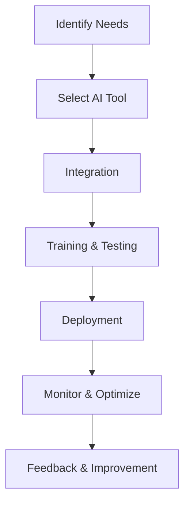

---

# The Future of AI Agents in Business Operations

In today's fast-paced business environment, the demand for efficiency, accuracy, and innovation is higher than ever. Enter AI agents—intelligent systems that are reshaping the way businesses operate. From automating mundane tasks to enhancing decision-making processes, AI agents are becoming indispensable in various sectors. In this article, we will explore the future of AI agents in business operations, examining their benefits, challenges, and the exciting possibilities they bring.

## What Are AI Agents?

Before diving into the future, it's essential to understand what AI agents are. Simply put, AI agents are software applications that utilize artificial intelligence to perform tasks autonomously. They can analyze data, learn from it, and even interact with humans, making them vital tools for businesses looking to streamline operations.

### Types of AI Agents

AI agents can be classified into several categories based on their functionality:

- **Virtual Assistants**: Tools like Siri, Google Assistant, and Amazon Alexa, which help users manage daily tasks.
- **Chatbots**: Automated systems that engage with customers, providing support and information.
- **Predictive Analytics Tools**: Applications that analyze data trends to forecast future outcomes.
- **Robotic Process Automation (RPA)**: Software that automates repetitive tasks, allowing human employees to focus on more strategic activities.

## The Role of AI Agents in Business Operations

As businesses continue to embrace digital transformation, AI agents play a crucial role in enhancing operational efficiency. Here are some practical examples and use cases of how AI agents are currently being utilized in business operations:

### 1. Customer Support Enhancement

AI agents, particularly chatbots, have revolutionized customer service. Companies like Zendesk and Intercom use AI agents to handle routine inquiries, significantly reducing response times and improving customer satisfaction. 

**Use Case**: An e-commerce platform implements a chatbot to assist customers with order tracking, returns, and FAQs. This not only frees up human agents to deal with more complex issues but also ensures that customers receive immediate responses.

### 2. Data Analysis and Reporting

AI agents equipped with predictive analytics capabilities can analyze vast amounts of data quickly and accurately. By identifying patterns and trends, they help businesses make informed decisions.

**Use Case**: A financial services firm uses an AI agent to analyze market data and generate reports. This allows analysts to focus on strategic decision-making rather than manual data entry and report generation.

### 3. Human Resource Management

AI agents can streamline HR processes, from recruitment to employee onboarding. Tools like Workday and BambooHR use AI to match candidates with job openings based on skills and experience.

**Use Case**: A tech company uses an AI-powered recruitment tool to sift through resumes, automatically identifying the best candidates. This reduces time-to-hire and improves the quality of new hires.

### 4. Marketing Automation

In the marketing realm, AI agents can analyze customer behavior and tailor campaigns accordingly. Platforms like HubSpot leverage AI to optimize email marketing and social media strategies.

**Use Case**: A retail brand uses AI to analyze customer purchase history and browsing behavior, enabling personalized marketing campaigns that increase engagement and conversion rates.

## Benefits of Implementing AI Agents in Business Operations

The advantages of incorporating AI agents into business operations are substantial:

### Increased Efficiency

AI agents can perform tasks 24/7 without fatigue, significantly increasing productivity. For example, chatbots can handle thousands of customer inquiries simultaneously.

### Cost Reduction

By automating repetitive tasks, businesses can reduce labor costs and allocate resources more effectively. A manufacturing company that uses AI for inventory management can minimize waste and optimize supply chains.

### Enhanced Decision-Making

AI agents provide data-driven insights, allowing businesses to make informed decisions quickly. This agility is crucial in industries like finance, where market conditions can change rapidly.

### Improved Customer Experience

With AI agents handling routine queries, customers receive faster responses and more personalized experiences. This leads to higher customer retention rates and increased brand loyalty.

## Challenges of AI Agents in Business Operations

Despite their numerous benefits, the deployment of AI agents comes with challenges:

### Data Privacy Concerns

As AI agents handle sensitive data, businesses must ensure compliance with data protection regulations. Failing to do so can lead to legal repercussions and a loss of customer trust.

### Integration Issues

Integrating AI agents into existing systems can be complex and costly. Businesses may face compatibility issues, requiring significant investments in infrastructure.

### Dependence on Technology

Over-reliance on AI agents can lead to a skills gap in the workforce. Companies must strike a balance between automation and human input.

## Future Trends in AI Agents for Business Operations

As technology evolves, so too will AI agents. Here are some trends to watch for in the coming years:

### 1. Increased Personalization

AI agents will become even more adept at understanding customer preferences, enabling hyper-personalized experiences that drive engagement.

### 2. Natural Language Processing (NLP)

Advancements in NLP will allow AI agents to understand human language better, making interactions more seamless and intuitive.

### 3. Greater Collaboration with Humans

The future will likely see AI agents working alongside humans in a collaborative capacity, enhancing productivity rather than replacing jobs.

### 4. Enhanced Security Measures

As AI agents become more prevalent, businesses will invest in advanced security measures to protect sensitive data and maintain customer trust.

## Comparison of Popular AI Tools for Business Operations

When considering AI agents for business operations, various tools stand out. Here’s a comparison of some popular AI solutions:

<table>
  <tr>
    <th>Tool</th>
    <th>Type</th>
    <th>Key Features</th>
    <th>Pros</th>
    <th>Cons</th>
  </tr>
  <tr>
    <td>Intercom</td>
    <td>Chatbot</td>
    <td>Live chat, automated messaging</td>
    <td>Easy integration, user-friendly</td>
    <td>Can be costly for small businesses</td>
  </tr>
  <tr>
    <td>HubSpot</td>
    <td>Marketing Automation</td>
    <td>Email marketing, CRM</td>
    <td>Comprehensive tools, great analytics</td>
    <td>Steep learning curve</td>
  </tr>
  <tr>
    <td>Workday</td>
    <td>HR Management</td>
    <td>Recruiting, payroll</td>
    <td>Robust features, scalable</td>
    <td>High pricing</td>
  </tr>
  <tr>
    <td>IBM Watson</td>
    <td>Data Analysis</td>
    <td>Predictive analytics, NLP</td>
    <td>Powerful analytics capabilities</td>
    <td>Complex setup</td>
  </tr>
</table>

## Workflow of Implementing AI Agents in Business Operations

To effectively integrate AI agents into your business operations, follow this workflow:

## Conclusion

The future of AI agents in business operations is bright, with the potential for increased efficiency, improved decision-making, and enhanced customer experiences. While challenges exist, the benefits far outweigh them for companies willing to adapt. As we continue to embrace these intelligent tools, businesses that leverage AI agents will undoubtedly gain a competitive edge.

Are you ready to transform your business operations with AI agents? Explore the various tools available and start your journey towards a more efficient future today!

--- 

### Call to Action

For more insights on AI tools and productivity enhancements, subscribe to our newsletter and stay updated with the latest trends and tips to optimize your business operations!

## 関連記事

- [AI Agents: The Future of Personal Assistants in 2026](/posts/ai-agents-the-future-of-personal-assistants-in-2026/)
- [AI Automation: A Game Changer for Small Businesses](/posts/ai-automation-a-game-changer-for-small-businesses/)
- [AI Automation: Revolutionizing Business Operations in 2026](/posts/ai-automation-revolutionizing-business-operations-in-2026/)
