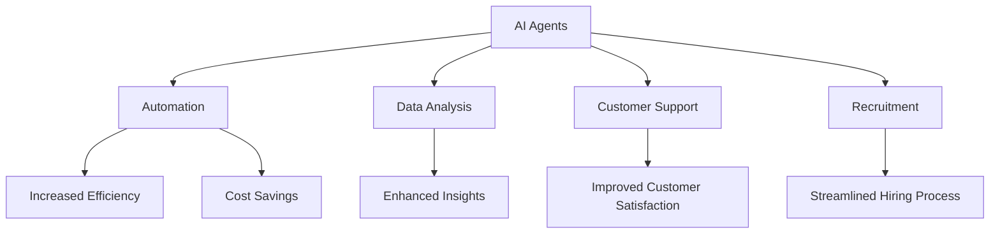

The Future of AI Agents in Workplace Efficiency

In today’s fast-paced business environment, the quest for productivity and efficiency has never been more critical. Enter AI agents – intelligent software programs designed to assist, automate, and enhance various tasks within the workplace. As organizations increasingly adopt AI technologies, understanding how these agents can transform workplace efficiency is essential for staying competitive. In this article, we’ll explore the implications of AI agents in the workplace, their capabilities, and practical use cases that can help your organization thrive.

### What are AI Agents?

AI agents are software applications powered by artificial intelligence that can perform tasks, make decisions, and interact with users or other systems autonomously. Unlike traditional software that requires explicit instructions, AI agents can learn from their environment, adapt to changing conditions, and improve their performance over time. This capacity for self-learning enables AI agents to streamline processes, reduce manual effort, and ultimately enhance productivity.

### How AI Agents Enhance Workplace Efficiency

AI agents are transforming the way businesses operate by offering several advantages:

1. **Automation of Repetitive Tasks**: AI agents can take over mundane tasks such as data entry, email sorting, and report generation. This frees up human employees to focus on more strategic activities.

2. **Enhanced Decision-Making**: AI agents analyze vast amounts of data quickly, providing insights that can help teams make informed decisions faster.

3. **24/7 Availability**: Unlike human employees, AI agents can operate round-the-clock without breaks, ensuring that business processes remain uninterrupted.

4. **Personalized Employee Experience**: AI agents can tailor their interactions based on individual preferences, providing a more engaging and productive work environment.

5. **Cost Savings**: By automating tasks and increasing efficiency, businesses can significantly reduce operational costs.

### Use Cases of AI Agents in the Workplace

To illustrate the potential of AI agents in improving workplace efficiency, let’s delve into a few practical use cases:

#### 1. AI-Powered Virtual Assistants

Virtual assistants like Siri, Google Assistant, and Microsoft Cortana are becoming commonplace in the workplace. These AI agents can schedule meetings, set reminders, and send emails on behalf of employees. For instance, an executive can verbally instruct their virtual assistant to arrange a meeting with a client and share the agenda, while the assistant automatically handles the necessary logistics.

#### 2. Customer Support and Chatbots

AI agents are revolutionizing customer support through chatbots that can engage with customers, answer queries, and resolve issues without human intervention. Companies like Zendesk and Intercom use AI agents to manage customer inquiries, allowing support staff to focus on more complex cases. For example, a retail business can deploy a chatbot to handle routine questions about shipping, freeing up human agents to address more intricate customer needs.

#### 3. Data Analysis and Reporting

AI agents can sift through massive datasets to extract valuable insights. Tools like Tableau and IBM Watson Analytics leverage AI to automate data analysis, enabling teams to generate reports with minimal effort. For example, a marketing team can use AI agents to analyze customer behavior data, identifying trends that inform future campaigns.

#### 4. Recruitment and Onboarding

Hiring processes can be lengthy and cumbersome. AI agents streamline recruitment by automating resume screening, scheduling interviews, and even conducting initial assessments. Platforms like HireVue utilize AI to analyze candidate responses, helping HR teams identify the best fits for open positions efficiently. This reduces time-to-hire and enhances the overall candidate experience.

### Pros and Cons of AI Agents in the Workplace

As with any technology, AI agents come with their own set of advantages and challenges. Let's take a closer look:

| **Pros**                                   | **Cons**                                 |
|--------------------------------------------|------------------------------------------|
| Increased efficiency and productivity      | Potential job displacement                |
| Enhanced decision-making capabilities      | Dependence on technology                 |
| Cost savings through automation            | Data privacy and security concerns       |
| 24/7 operational availability              | Initial setup and integration costs      |
| Tailored employee experiences              | Requires ongoing training and updates    |

### The Future of AI Agents in the Workplace

As AI technology continues to evolve, the capabilities of AI agents will expand, leading to even greater opportunities for workplace efficiency. Here are some trends to watch:

- **Integration with Other Technologies**: AI agents will increasingly integrate with other tools, such as project management software and CRM systems, creating a more cohesive workflow.

- **Natural Language Processing (NLP)**: Improvements in NLP will allow AI agents to understand and respond to human language more effectively, enhancing their usability.

- **Increased Personalization**: Future AI agents will be able to analyze user behavior more deeply, offering personalized recommendations and support tailored to individual needs.

- **Collaboration Tools**: AI agents will increasingly support collaborative efforts, helping teams work together more effectively, regardless of location.

### Conclusion

The rise of AI agents in the workplace is not just a trend; it's a movement toward a more efficient and productive business environment. By automating repetitive tasks, enhancing decision-making, and providing personalized experiences, AI agents can help organizations thrive in an increasingly competitive landscape. 

As you consider the integration of AI agents into your own workplace, it’s crucial to evaluate the right tools for your needs, keeping in mind both the potential benefits and challenges they present. 

Ready to embrace the future of workplace efficiency with AI agents? Start exploring the available tools today and transform the way your team works!

## 関連記事

- [The Future of AI Agents in Enhancing Workplace Efficiency](/posts/the-future-of-ai-agents-in-enhancing-workplace-efficiency/)
- [AI Agents: The Future of Personal Assistants in 2026](/posts/ai-agents-the-future-of-personal-assistants-in-2026/)
- [AI Automation: A Game Changer for Small Businesses](/posts/ai-automation-a-game-changer-for-small-businesses/)
