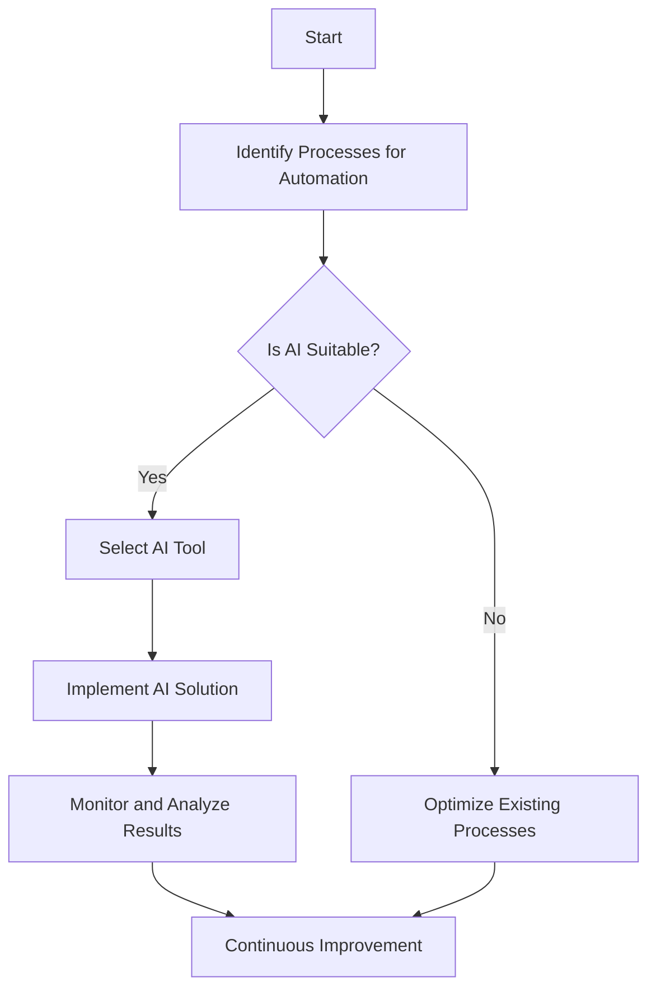

---

# The Future of AI Automation in Business Operations

In today’s fast-paced business environment, organizations are constantly searching for ways to enhance efficiency and reduce operational costs. Enter AI automation, a transformative technology that is reshaping the landscape of business operations. From streamlining workflows to enhancing decision-making and improving customer experiences, AI automation is becoming an indispensable tool for modern enterprises. In this article, we’ll explore the future of AI automation in business operations, its benefits, challenges, and practical applications.

## What is AI Automation?

AI automation refers to the use of artificial intelligence technologies to automate repetitive tasks, enhance decision-making processes, and improve overall efficiency within business operations. By utilizing machine learning, natural language processing, and robotic process automation, businesses can minimize human intervention in mundane tasks, allowing employees to focus on more strategic initiatives.

### Why AI Automation is Essential for Businesses

The integration of AI automation into business operations is not just a trend; it’s becoming essential for survival in a competitive landscape. Here are some reasons why businesses should consider embracing AI automation:

- **Increased Efficiency**: Automating routine tasks reduces the time taken to complete them, leading to increased productivity.
- **Cost Reduction**: By minimizing human error and operational inefficiencies, businesses can significantly reduce costs.
- **Enhanced Decision-Making**: AI can analyze vast amounts of data quickly, providing insights that help in making informed decisions.
- **Improved Customer Experience**: Automation tools can manage customer inquiries 24/7, ensuring timely responses and enhanced satisfaction.

## Practical Use Cases of AI Automation in Business Operations

AI automation can be applied across various business functions. Here are some compelling use cases:

### 1. Customer Support Automation

Chatbots powered by AI can handle a wide range of customer inquiries, from answering FAQs to processing orders. For instance, a retail company can deploy a chatbot on its website to assist customers, reducing the need for human agents and ensuring 24/7 support.

### 2. Marketing Automation

AI can analyze customer behavior and preferences to deliver personalized marketing campaigns. Tools like HubSpot and Marketo use AI algorithms to segment audiences and automate email marketing, leading to better engagement and conversion rates.

### 3. Financial Operations

AI automation tools can manage invoicing, expense tracking, and financial reporting. For example, a finance department can use platforms like QuickBooks and Xero, which leverage AI to automate data entry and generate financial insights.

### 4. Human Resources

AI can streamline recruitment processes by parsing resumes and identifying the best candidates. Platforms like Workday and BambooHR utilize AI to enhance HR operations, reducing the time spent on manual tasks.

## Pros and Cons of AI Automation in Business Operations

While the benefits of AI automation are significant, it’s essential to consider the potential downsides as well.

### Pros:
- **Increased Productivity**: Employees can focus on high-value tasks, leading to innovation and growth.
- **Cost Savings**: Automating processes can lead to substantial cost reductions over time.
- **Scalability**: AI solutions can easily scale with business growth, accommodating increased workloads without the need for proportional increases in human resources.
- **Data-Driven Insights**: Enhanced data analysis capabilities lead to better decision-making.

### Cons:
- **Initial Investment**: Implementing AI solutions can require significant upfront investment.
- **Job Displacement**: Automation may lead to job losses in certain sectors, causing workforce concerns.
- **Complexity**: Integrating AI systems with existing technologies can be challenging.
- **Dependence on Data**: AI’s effectiveness is heavily dependent on the quality and quantity of data available.

## The Future of AI Automation in Business Operations

The future of AI automation in business operations looks promising as advancements in technology continue to evolve. Here are some trends we can anticipate:

### 1. Enhanced Integration

AI tools will become more integrated with existing software systems, allowing for seamless operations across various departments. This will lead to a more unified approach to business management.

### 2. Increased Personalization

As AI continues to evolve, businesses will leverage it to provide more personalized experiences for customers, driving loyalty and satisfaction.

### 3. Greater Adoption of AI Ethics

As AI becomes more prevalent, businesses will need to focus on ethical considerations, ensuring transparency and fairness in AI decision-making processes.

### 4. Remote Work Enablement

The rise of remote work has accelerated the need for AI automation in managing workflows, communication, and project management. Tools that facilitate collaboration will be in high demand.

### 5. Advanced Predictive Analytics

Future AI systems will offer more robust predictive analytics capabilities, enabling businesses to forecast trends, optimize supply chains, and make proactive decisions.

## Comparison of Popular AI Automation Tools

To help you choose the right AI automation tool for your business, here’s a comparison of some of the leading platforms:

<table>
  <tr>
    <th>Tool</th>
    <th>Functionality</th>
    <th>Best For</th>
    <th>Pricing</th>
  </tr>
  <tr>
    <td>Zapier</td>
    <td>Workflow automation between apps</td>
    <td>Small to medium businesses</td>
    <td>Starts at $19.99/month</td>
  </tr>
  <tr>
    <td>UiPath</td>
    <td>Robotic Process Automation</td>
    <td>Large enterprises</td>
    <td>Custom pricing</td>
  </tr>
  <tr>
    <td>[ChatGPT](https://chat.openai.com/?ref=AFFILIATE_ID)</td>
    <td>Conversational AI for customer support</td>
    <td>Customer service teams</td>
    <td>Free tier available; paid plans start at $20/month</td>
  </tr>
  <tr>
    <td>HubSpot</td>
    <td>Marketing automation</td>
    <td>Marketing teams</td>
    <td>Free tier available; paid plans start at $45/month</td>
  </tr>
</table>

## Conclusion: Embrace AI Automation for a Competitive Edge

The future of AI automation in business operations is bright, and organizations that embrace this technology will likely gain a competitive edge. While there are challenges to overcome, the benefits of increased efficiency, cost savings, and enhanced decision-making are undeniable.

Are you ready to take your business operations to the next level with AI automation? Explore the tools mentioned in this article and start your journey towards a more efficient and productive future today!

By understanding the transformative potential of AI automation and its implications for your business, you can make informed decisions that drive your organization forward. Don't wait—take action now and be part of the future!

## 関連記事

- [AI Automation: Revolutionizing Business Operations in 2026](/posts/ai-automation-revolutionizing-business-operations-in-2026/)
- [Automating Business Processes with AI in 2026](/posts/automating-business-processes-with-ai-in-2026/)
- [Harnessing AI Automation for Business Growth in 2026](/posts/harnessing-ai-automation-for-business-growth-in-2026/)
