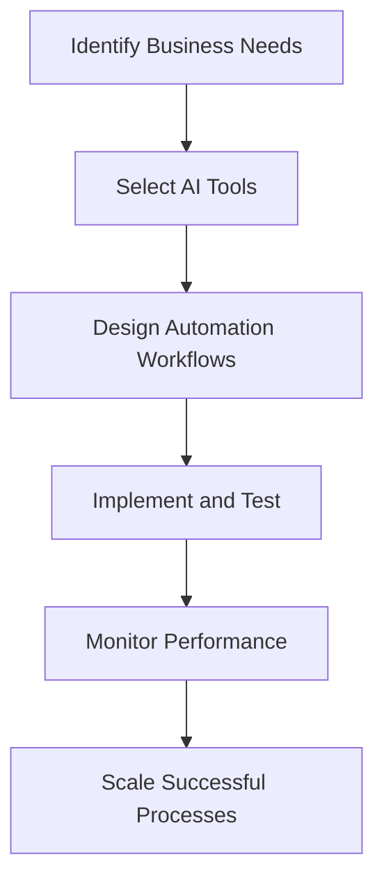

---

# The Future of AI Automation in Businesses: Trends for 2026

As we approach the mid-2020s, the landscape of AI automation in businesses is evolving at an unprecedented pace. Companies across various sectors are beginning to realize that the integration of AI tools is no longer just an option; it’s a necessity for staying competitive. In this blog post, we’ll explore the top AI automation trends that are expected to dominate by 2026 and how these advancements can revolutionize business operations.

## Understanding AI Automation

Before delving into specific trends, it’s essential to understand what AI automation entails. AI automation refers to the use of artificial intelligence technologies to automate tasks that traditionally require human intervention. This can range from simple data entry to complex decision-making processes. By implementing AI automation, businesses can enhance productivity, reduce errors, and optimize resource allocation.

## Trend 1: Hyper-Automation

Hyper-automation is a concept that involves using advanced technologies like AI, machine learning (ML), and robotic process automation (RPA) to automate as many business processes as possible. This trend is gaining traction as organizations aim to streamline operations and improve efficiency.

### Practical Example:
Imagine a financial institution that uses hyper-automation to handle customer inquiries. Instead of routing calls to human agents, AI-driven chatbots can manage simple queries, while more complex cases are escalated to human representatives. This results in reduced wait times and increased customer satisfaction.

### Pros:
- Significantly reduces operational costs.
- Improves speed and accuracy in task execution.
- Frees up human resources for more strategic roles.

### Cons:
- Requires substantial upfront investment in technology.
- May lead to job displacement for certain roles.

## Trend 2: AI-Driven Decision Making

By 2026, data-driven decision-making powered by AI is expected to become the norm. Businesses will leverage AI algorithms to analyze vast amounts of data, identify trends, and make informed decisions in real-time.

### Practical Example:
Retailers can use AI to analyze customer behavior and predict purchasing patterns. By understanding which products are likely to be in demand, they can optimize inventory management and reduce waste.

### Pros:
- Enhances accuracy in forecasting and decision-making.
- Enables personalized customer experiences based on data insights.
- Reduces reliance on intuition-based decision-making.

### Cons:
- Data privacy concerns may arise.
- Potential over-reliance on AI could lead to less human intuition in decision-making.

## Trend 3: AI-Powered Customer Service

Customer service is undergoing a transformation with the integration of AI. By 2026, businesses will increasingly adopt AI-powered tools to enhance customer interactions.

### Practical Example:
Consider a travel agency using AI to provide personalized travel recommendations. By analyzing a customer’s past preferences and behavior, the AI can suggest tailored travel packages, making the booking process smoother and more enjoyable.

### Pros:
- Offers 24/7 customer support.
- Provides instant responses to customer inquiries.
- Increases customer engagement through personalized experiences.

### Cons:
- May struggle with complex queries that require empathy and understanding.
- Could lead to frustration if customers prefer human interaction.

## Trend 4: AI for Supply Chain Optimization

The supply chain is critical to business success, and AI is set to revolutionize this area. By 2026, businesses will utilize AI tools to optimize inventory levels, forecast demand, and streamline logistics.

### Practical Example:
A manufacturing company can implement AI to predict machine failures before they occur. By analyzing data from sensors, the AI can forecast maintenance needs, reducing downtime and maximizing productivity.

### Pros:
- Improves efficiency and reduces operational costs.
- Enhances visibility across the supply chain.
- Enables proactive decision-making.

### Cons:
- Implementation can be complex and time-consuming.
- Dependence on data quality for accurate predictions.

## Trend 5: AI Ethics and Governance

As AI becomes more integrated into business operations, ethical considerations and governance will take center stage. By 2026, businesses will need to establish guidelines to ensure responsible AI use.

### Practical Example:
A healthcare provider implementing AI for patient diagnosis must adhere to ethical guidelines to safeguard patient data. This includes ensuring that AI algorithms do not perpetuate biases present in historical data.

### Pros:
- Promotes trust and accountability in AI applications.
- Reduces the risk of legal issues related to AI use.
- Enhances corporate reputation and customer loyalty.

### Cons:
- Establishing guidelines can be resource-intensive.
- Balancing innovation with ethics can be challenging.

## Comparison of AI Automation Tools

To give you a clearer picture of the available AI automation tools, here’s a comparison table of three popular options that businesses are beginning to adopt:

<table>
  <tr>
    <th>Tool</th>
    <th>Features</th>
    <th>Best For</th>
    <th>Cost</th>
  </tr>
  <tr>
    <td>UiPath</td>
    <td>Robotic Process Automation, AI integration, extensive analytics</td>
    <td>Businesses looking to automate repetitive tasks</td>
    <td>Starting at $1,500/month</td>
  </tr>
  <tr>
    <td>Zapier</td>
    <td>Task automation across apps, easy setup, customizable workflows</td>
    <td>Small to medium businesses needing automation between apps</td>
    <td>Starting at $19/month</td>
  </tr>
  <tr>
    <td>Blue Prism</td>
    <td>AI integration, scalability, enhanced security features</td>
    <td>Large enterprises requiring robust automation</td>
    <td>Custom pricing based on needs</td>
  </tr>
</table>

## Workflow for AI Automation Implementation

To visualize the process of implementing AI automation in a business, consider the following workflow:

## Conclusion

The future of AI automation in businesses is not just a trend; it’s a fundamental shift in how organizations operate. By embracing these AI automation trends, businesses can enhance efficiency, improve decision-making, and create better customer experiences. However, it is essential to remain cognizant of the ethical implications and challenges that come with such advancements.

Are you ready to leverage AI automation to future-proof your business? Start exploring the available tools and strategies today, and position your organization for success in 2026 and beyond!

---

*For more insights on AI tools and productivity, subscribe to our newsletter and stay updated on the latest trends and innovations in the AI landscape!*