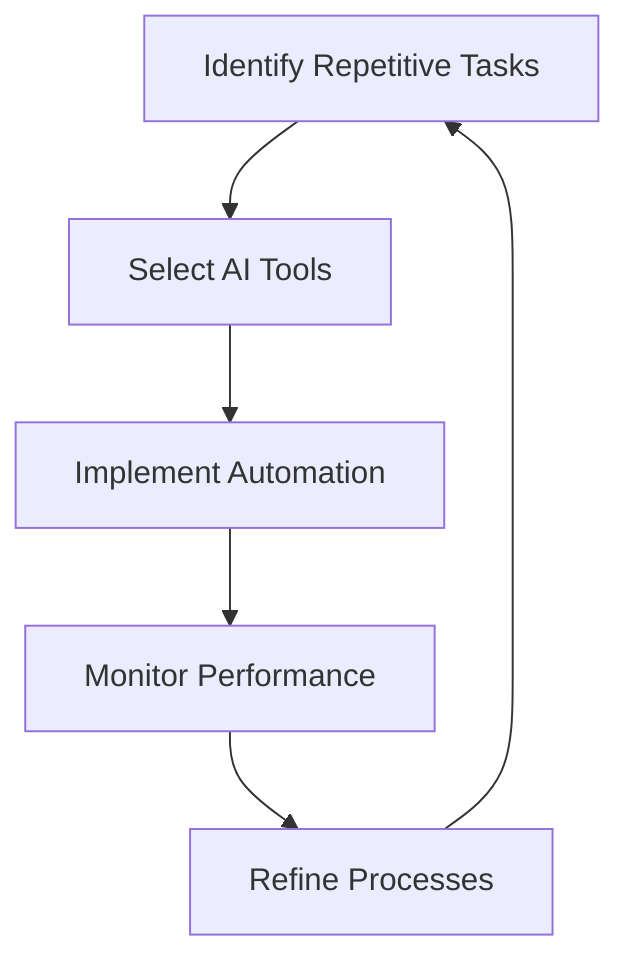

---

### The Future of AI Automation in Everyday Business Tasks

In today's fast-paced business environment, efficiency is more crucial than ever. Companies are constantly on the lookout for ways to streamline operations, reduce costs, and enhance productivity. Enter AI automation – a game-changing force that is revolutionizing how businesses operate. From automating repetitive tasks to optimizing complex processes, AI is reshaping the future of work and making everyday business tasks simpler and smarter.

#### What is AI Automation?

AI automation refers to the use of artificial intelligence technologies to automate tasks that traditionally require human intervention. This can range from simple tasks, like data entry, to more complex functions, such as analyzing vast datasets for insights. By leveraging machine learning, natural language processing, and other AI advancements, businesses can improve accuracy, speed, and efficiency in their operations.

#### Why AI Automation is Essential for Businesses

1. **Increased Efficiency**: By automating routine tasks, employees can focus on strategic initiatives that drive business growth. For instance, using AI tools for customer support can reduce response times and improve customer satisfaction.

2. **Cost Reduction**: Automating repetitive tasks can significantly lower operational costs. Companies can save on labor costs and reduce human error, leading to fewer costly mistakes.

3. **Enhanced Decision-Making**: AI tools can analyze data faster and more accurately than humans, providing businesses with actionable insights that can inform better decision-making. For example, predictive analytics can help a retail business optimize inventory levels based on consumer behavior.

4. **Improved Scalability**: As a business grows, so do its operational needs. AI automation enables businesses to scale their processes without a proportional increase in resources, ensuring sustainability in growth.

#### Practical Examples of AI Automation in Business Tasks

Let's dive into some practical examples of how AI automation can be applied across different business tasks:

- **Customer Service**: AI chatbots can handle common inquiries, allowing human agents to focus on more complex issues. Tools like Drift and Intercom can provide instant responses to customer questions, improving engagement and satisfaction.

- **Human Resources**: AI tools can streamline the recruitment process by automating resume screening and scheduling interviews. Platforms like HireVue use AI to assess candidates through video interviews, helping HR teams make faster and more informed hiring decisions.

- **Marketing**: AI-driven marketing platforms can analyze consumer data and automate personalized marketing campaigns. Tools like HubSpot and Marketo can segment audiences and deliver targeted content, increasing conversion rates.

- **Finance**: AI automation can enhance financial forecasting and budgeting. Tools like IBM Planning Analytics use machine learning to analyze historical data and predict future trends, aiding financial decision-making.

#### Key AI Automation Tools for Business Tasks

Now that we understand the significance of AI automation, let's look at some leading tools that facilitate this transformation. Below is a comparison table highlighting some of the best AI automation tools available:

<table>
  <tr>
    <th>Tool</th>
    <th>Best For</th>
    <th>Key Features</th>
    <th>Pros</th>
    <th>Cons</th>
  </tr>
  <tr>
    <td>Zapier</td>
    <td>Workflow Automation</td>
    <td>Connects over 2,000 apps, automates repetitive tasks</td>
    <td>Easy to use, no coding required</td>
    <td>Limited to app integrations available</td>
  </tr>
  <tr>
    <td>UiPath</td>
    <td>Robotic Process Automation</td>
    <td>Automates complex workflows, scalable solutions</td>
    <td>Highly customizable, extensive community support</td>
    <td>Steeper learning curve, costlier</td>
  </tr>
  <tr>
    <td>[ChatGPT](https://chat.openai.com/?ref=AFFILIATE_ID)</td>
    <td>Customer Engagement</td>
    <td>Conversational AI, natural language understanding</td>
    <td>Highly interactive, versatile use cases</td>
    <td>May require fine-tuning for specific tasks</td>
  </tr>
  <tr>
    <td>Salesforce Einstein</td>
    <td>Sales and Marketing Insights</td>
    <td>AI analytics, customer insights, predictive modeling</td>
    <td>Deep integration with Salesforce ecosystem</td>
    <td>Requires Salesforce, can be expensive</td>
  </tr>
</table>

#### Pros and Cons of AI Automation

While AI automation can significantly enhance business operations, it’s essential to recognize both its advantages and limitations.

##### Pros:
- **Time-Saving**: Automates mundane tasks, freeing up time for employees.
- **Accuracy**: Reduces human error in data processing and decision-making.
- **24/7 Availability**: AI systems can operate around the clock without fatigue.
- **Data-Driven Insights**: Provides actionable insights based on data analysis.

##### Cons:
- **Initial Investment**: Implementing AI tools can require a significant upfront investment.
- **Job Displacement**: Automation may lead to job losses in certain sectors.
- **Complexity**: Some AI systems can be complicated to set up and manage.
- **Dependence on Data Quality**: The effectiveness of AI tools relies on the quality of the data they process.

#### The Future of AI Automation in Business

As we look ahead, the potential for AI automation in business tasks is enormous. With continuous advancements in technology, AI will become even more integrated into everyday operations. Companies that embrace these changes will not only improve their efficiency but also enhance their competitive edge.

### Conclusion

AI automation is not just a trend; it’s a necessity for businesses that want to thrive in the modern world. By leveraging AI tools, companies can streamline their operations, enhance productivity, and drive growth. Whether you’re in customer service, HR, marketing, or finance, there’s an AI solution out there that can help you automate tasks and improve your business outcomes.

Are you ready to take the leap into AI automation? Start exploring the tools mentioned in this article and see how they can transform your business. Don’t let your competitors get ahead – embrace the future of work today!

For more insights on AI tools and productivity strategies, be sure to subscribe to our newsletter and stay updated on the latest innovations in the industry!

## 関連記事

- [AI Agents: The Future of Personal Assistants in 2026](/posts/ai-agents-the-future-of-personal-assistants-in-2026/)
- [AI Automation: A Game Changer for Small Businesses](/posts/ai-automation-a-game-changer-for-small-businesses/)
- [AI Automation: Revolutionizing Business Operations in 2026](/posts/ai-automation-revolutionizing-business-operations-in-2026/)
