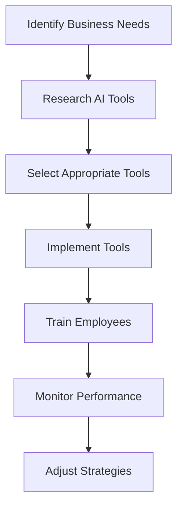

---

# The Future of AI for Business: Tools to Watch in 2026

As we step into a new era of technological advancement, businesses are increasingly turning to AI tools to streamline their operations, enhance productivity, and ultimately drive growth. By 2026, the landscape of AI tools for business will be more sophisticated, offering solutions that are both innovative and essential for navigating the complexities of modern commerce. In this blog post, we will explore the trends shaping AI tools for business, highlight key tools to watch, and provide practical examples of how these tools can revolutionize your operations.

## The Rise of AI in Business

AI has already made significant strides in business environments, automating mundane tasks, providing insights from data, and improving customer experiences. As we look ahead, several trends are emerging that will define the future of AI tools for business:

- **Hyper-Personalization**: AI tools will be able to analyze user data more efficiently, delivering personalized experiences and recommendations that improve customer engagement and satisfaction.
- **Intelligent Automation**: The automation of complex processes, not just repetitive tasks, will become a reality, allowing businesses to focus on strategic decision-making.
- **Enhanced Data Analysis**: AI will empower businesses to make data-driven decisions faster and more accurately, harnessing the power of predictive analytics and machine learning.
- **Collaboration with Humans**: AI tools will not replace humans but rather augment their capabilities, fostering collaboration between human intelligence and machine efficiency.

## Top AI Tools to Watch in 2026

### 1. ChatGPT for Customer Service

As one of the most advanced AI language models, [ChatGPT](https://chat.openai.com/?ref=AFFILIATE_ID) is transforming customer service. It can handle inquiries, provide instant responses, and even learn from interactions to improve future engagements.

**Pros:**
- 24/7 availability
- Scalable to handle large volumes of queries
- Reduces wait times for customers

**Cons:**
- May struggle with complex or nuanced inquiries
- Requires regular updates for improved performance

### 2. Salesforce Einstein for CRM

Salesforce Einstein is a powerful AI tool integrated into the Salesforce platform, providing predictive analytics, automation, and personalized recommendations for sales and marketing teams.

**Pros:**
- Seamless integration with existing Salesforce systems
- Offers actionable insights for better decision-making
- Enhances customer interactions through personalized campaigns

**Cons:**
- Can be expensive for small businesses
- Requires some training for optimal use

### 3. Zapier for Workflow Automation

Zapier is a no-code automation tool that connects different applications, streamlining workflows by automating repetitive tasks across platforms.

**Pros:**
- User-friendly interface
- Supports thousands of integrations
- Saves time by automating mundane tasks

**Cons:**
- May have limitations based on app compatibility
- Some advanced features require a premium subscription

### 4. Tableau for Data Visualization

Tableau is a leading data visualization tool that uses AI to help businesses analyze their data and share insights visually. By 2026, we can expect even more AI-driven features to enhance data storytelling.

**Pros:**
- Powerful data visualization capabilities
- User-friendly drag-and-drop interface
- Strong community support and resources

**Cons:**
- High learning curve for advanced features
- Can be costly for small businesses

### 5. Notion for Team Collaboration

Notion is an all-in-one workspace that integrates notes, tasks, databases, and collaboration features, all enhanced with AI capabilities for better productivity and organization.

**Pros:**
- Highly customizable to fit diverse needs
- Integrates with various other tools
- Encourages collaboration and transparency within teams

**Cons:**
- Some users may find it overwhelming due to its extensive features
- Limited offline functionality

### AI Tools Comparison Table

Here’s a quick comparison of the key features of the mentioned AI tools for business:

<table>
  <thead>
    <tr>
      <th>Tool</th>
      <th>Main Functionality</th>
      <th>Pros</th>
      <th>Cons</th>
    </tr>
  </thead>
  <tbody>
    <tr>
      <td>[ChatGPT](https://chat.openai.com/?ref=AFFILIATE_ID)</td>
      <td>Customer Service</td>
      <td>24/7 availability, scalable</td>
      <td>Complex inquiries may be challenging</td>
    </tr>
    <tr>
      <td>Salesforce Einstein</td>
      <td>CRM</td>
      <td>Actionable insights, integration</td>
      <td>Costly for small businesses</td>
    </tr>
    <tr>
      <td>Zapier</td>
      <td>Workflow Automation</td>
      <td>User-friendly, extensive integrations</td>
      <td>Limitations on app compatibility</td>
    </tr>
    <tr>
      <td>Tableau</td>
      <td>Data Visualization</td>
      <td>Powerful visualizations, community support</td>
      <td>High learning curve</td>
    </tr>
    <tr>
      <td>Notion</td>
      <td>Team Collaboration</td>
      <td>Customizable, encourages teamwork</td>
      <td>Overwhelming for some users</td>
    </tr>
  </tbody>
</table>

## The Role of AI in Business Strategy

Integrating AI tools into your business strategy is not just about adopting new technologies; it's about rethinking how you operate. Here’s a simple workflow to illustrate how businesses can implement AI tools effectively:

### Practical Examples of AI Tools in Action

1. **[ChatGPT](https://chat.openai.com/?ref=AFFILIATE_ID) in Retail**: A retail business can utilize [ChatGPT](https://chat.openai.com/?ref=AFFILIATE_ID) to manage customer inquiries on their website. This not only enhances customer satisfaction but also frees up human agents to handle more complex issues.

2. **Salesforce Einstein in Sales**: A sales team can leverage Einstein to analyze customer interactions and predict which leads are most likely to convert, allowing them to focus their efforts effectively.

3. **Zapier in Marketing**: A marketing team can set up Zapier to automate the process of adding new leads from a website form to their email marketing tool, ensuring no potential customer falls through the cracks.

4. **Tableau in Finance**: A finance department can use Tableau to visualize spending patterns, enabling them to identify areas for cost savings and better budget forecasting.

5. **Notion in Project Management**: Teams can use Notion to create a centralized workspace for projects, integrating task management with documentation to foster collaboration and accountability.

## Conclusion

The future of AI tools for business looks promising, with innovations that will redefine how we operate. By staying informed about these tools and understanding their applications, businesses can harness the power of AI to enhance productivity and drive growth. Whether you are a small startup or a large corporation, the time to explore and implement these tools is now.

Are you ready to embrace the future of AI in your business? Start by exploring these tools and see how they can work for you. Share your experiences and insights in the comments below, and let’s start a conversation about the future of business!

## 関連記事

- [AI for Business Operations: A Decision-Maker's Guide](/posts/ai-for-business-streamlining-operations-with-intelligent-tools/)
- [AI Productivity Tools: A Complete Category Breakdown](/posts/ai-productivity-tools-transforming-the-future-of-work/)
- [Automating Business Processes with AI: A Step-by-Step Playbook](/posts/automating-business-processes-with-ai-a-complete-guide/)
