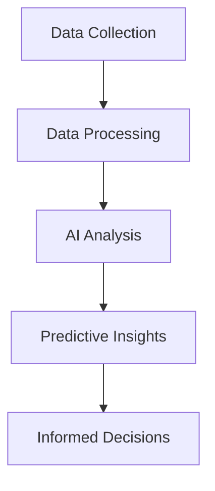

---

# The Future of AI for Business: Trends to Watch in 2026

The world of artificial intelligence (AI) is evolving rapidly, and businesses are at the forefront of this technological revolution. As we look ahead to 2026, several key trends in AI for business are emerging, offering new opportunities for innovation, efficiency, and growth. In this article, we’ll explore these trends in detail, providing insights and practical examples of how they can be leveraged to enhance business operations.

## The Surge in AI-Powered Automation

One of the most significant trends in AI for business is the increasing adoption of AI-powered automation tools. By automating repetitive tasks, businesses can free up employees to focus on more strategic activities. For instance, customer service chatbots powered by AI can handle basic inquiries, allowing human agents to concentrate on complex issues.

### Use Case: Enhanced Customer Support

Consider a retail company that implements an AI chatbot on its website. This chatbot can answer frequently asked questions, assist with order tracking, and provide product recommendations. As a result, the company can provide 24/7 support, improve response times, and increase customer satisfaction.

### Pros and Cons of AI-Powered Automation

| Pros                          | Cons                          |
|-------------------------------|-------------------------------|
| Increases efficiency           | Initial setup costs can be high|
| Reduces human error            | Potential job displacement     |
| Enhances scalability           | Requires ongoing maintenance    |

## AI-Driven Data Analytics

Data is at the heart of every successful business, and AI is revolutionizing how we analyze and interpret this data. With advanced AI algorithms, businesses can uncover insights from vast datasets, enabling informed decision-making and strategic planning.

### Use Case: Predictive Analytics in Retail

A retail chain can use AI-driven data analytics to predict shopping trends based on seasonal data, customer preferences, and purchasing behavior. This insight allows them to optimize inventory, reduce waste, and enhance customer experience.

## The Rise of Hyper-Personalization

In 2026, hyper-personalization will be a game-changer for businesses looking to provide tailored experiences to their customers. By leveraging AI, companies can analyze individual customer data and create highly personalized marketing campaigns.

### Use Case: Personalized Marketing Campaigns

Imagine a streaming service that uses AI to analyze user behavior and preferences. By doing so, it can recommend personalized content and create targeted email campaigns. This approach not only increases engagement but also drives customer loyalty.

### Pros and Cons of Hyper-Personalization

| Pros                          | Cons                          |
|-------------------------------|-------------------------------|
| Boosts customer loyalty        | Privacy concerns               |
| Increases conversion rates     | Data management complexity      |
| Enhances user experience       | Requires robust data infrastructure |

## AI in Decision-Making

AI is not just about automation and analytics; it's also becoming a vital tool for decision-making. With AI systems capable of simulating various business scenarios, leaders can make better-informed decisions.

### Use Case: Financial Forecasting

A manufacturing company can use AI to analyze market trends, production capabilities, and supply chain logistics to forecast financial outcomes. This predictive modeling helps stakeholders make strategic decisions that minimize risks and maximize profits.

## Integrating AI with Other Technologies

As we move towards 2026, the integration of AI with other emerging technologies will be pivotal. Technologies such as the Internet of Things (IoT), blockchain, and augmented reality will work alongside AI to create innovative business solutions.

### Use Case: Smart Supply Chains

Consider a smart supply chain that employs IoT sensors to track inventory levels. With AI analyzing this data in real-time, businesses can optimize their supply chain operations, reduce costs, and enhance delivery times.

### Pros and Cons of Technology Integration

| Pros                          | Cons                          |
|-------------------------------|-------------------------------|
| Creates innovative solutions    | Integration complexity         |
| Enhances operational efficiency  | Requires skilled personnel     |
| Improves customer engagement     | Potential security risks       |

## The Ethical Considerations of AI

As AI becomes more integrated into business practices, ethical considerations will inevitably come to the forefront. Ensuring fairness, transparency, and accountability in AI systems will be crucial for maintaining customer trust.

### Use Case: Fair Hiring Practices

An AI-powered recruitment tool can help eliminate bias in the hiring process by analyzing candidate resumes and applications based solely on qualifications. However, it’s essential to regularly audit these systems to ensure they do not inadvertently perpetuate biases.

### Pros and Cons of Ethical AI

| Pros                          | Cons                          |
|-------------------------------|-------------------------------|
| Builds customer trust         | Requires ongoing oversight     |
| Promotes diversity            | Can be costly to implement     |
| Enhances brand reputation     | May slow down decision-making  |

## Conclusion

As we approach 2026, the trends in AI for business will reshape how companies operate, engage with customers, and make strategic decisions. By leveraging AI-powered automation, data analytics, hyper-personalization, and ethical considerations, businesses can enhance their operations and stay ahead of the competition.

The future of AI for business is bright, and those who embrace these trends will unlock new levels of productivity and innovation. Are you ready to take your business to the next level with AI? 

### Call to Action

Stay updated with the latest trends in AI by subscribing to our newsletter at AI Tools Lab! Join our community of forward-thinking professionals and discover how AI can transform your business strategy.

## 関連記事

- [AI Agents: The Future of Personal Assistants in 2026](/posts/ai-agents-the-future-of-personal-assistants-in-2026/)
- [AI Automation: A Game Changer for Small Businesses](/posts/ai-automation-a-game-changer-for-small-businesses/)
- [AI Automation: The Key to Enhanced Business Efficiency](/posts/ai-automation-the-key-to-enhanced-business-efficiency/)
