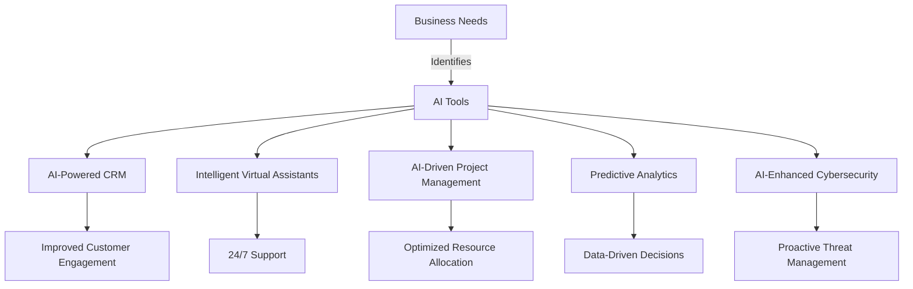

---

# The Future of AI in Business: Tools to Watch in 2026

As we step deeper into the 2020s, the future of AI tools in business is brighter than ever. With advancements in machine learning, natural language processing, and automation, companies are leveraging AI to improve efficiency, drive innovation, and enhance customer experiences. In this article, we will explore the emerging AI tools that are set to revolutionize business operations by 2026 and how you can prepare to harness their potential.

## The Rise of AI Tools in Business

AI tools are already making waves across various industries, from healthcare to finance, marketing to logistics. The integration of AI is not just a trend; it's becoming a necessity for businesses looking to stay competitive. As we look forward to 2026, several key trends are shaping the future of AI tools:

1. **Increased Automation**: Automation is expected to reach new heights, with AI tools capable of handling more complex tasks that require cognitive abilities.
2. **Personalization**: AI will enable businesses to offer hyper-personalized experiences to customers by analyzing data and predicting preferences.
3. **Advanced Data Analysis**: Tools will become smarter in analyzing vast datasets, providing insights that drive strategic decision-making.
4. **Collaboration Tools**: The future will see enhanced collaboration tools powered by AI, enabling teams to work seamlessly, regardless of location.

## Key AI Tools to Watch in 2026

Let’s delve into some of the most promising AI tools that are anticipated to make a significant impact in the business landscape by 2026.

### 1. AI-Powered Customer Relationship Management (CRM) Systems

AI-driven CRM systems, like Salesforce Einstein and HubSpot, will evolve to offer even more predictive analytics, enabling businesses to anticipate customer needs and tailor their strategies accordingly. 

**Use Case**: For instance, a marketing team can use AI-powered CRM to segment customers based on purchasing behavior and tailor specific campaigns that are more likely to convert.

**Pros**:
- Enhanced customer insights
- Improved targeting for marketing campaigns
- Increased sales efficiency

**Cons**:
- High implementation costs
- Requires ongoing data management and maintenance

### 2. Intelligent Virtual Assistants (IVAs)

IVAs like Drift and Intercom will become fundamental in customer service, providing instant support and freeing up human resources for more complex inquiries.

**Use Case**: A retail company can deploy an IVA to handle common customer inquiries about shipping and returns, thereby reducing wait times and improving customer satisfaction.

**Pros**:
- 24/7 customer support
- Cost-effective in the long run
- Scalable solutions

**Cons**:
- Limited understanding of complex requests
- May frustrate customers seeking human interaction

### 3. AI-Driven Project Management Tools

Tools like Monday.com and Asana are integrating AI to enhance project management capabilities. By 2026, we can expect these tools to automate task assignments based on team members' strengths and availability.

**Use Case**: A tech startup could utilize an AI-driven project management tool to automatically assign tasks based on the skills of each team member, optimizing productivity.

**Pros**:
- Streamlined project workflows
- Enhanced team collaboration
- Better resource allocation

**Cons**:
- Dependence on data accuracy
- Potential resistance to change from team members

### 4. Predictive Analytics Platforms

Platforms such as Tableau and Looker are expected to evolve, allowing businesses to forecast trends and make data-driven decisions more effectively.

**Use Case**: A financial institution could use predictive analytics to assess market trends and make informed investment decisions.

**Pros**:
- Improved forecasting accuracy
- Data-driven decision-making
- Competitive advantage

**Cons**:
- Complex integration with existing systems
- Requires skilled personnel for interpretation

### 5. AI-Enhanced Cybersecurity Tools

With the rise of cyber threats, tools like Darktrace and CrowdStrike will leverage AI to predict and counteract potential security breaches before they happen.

**Use Case**: A healthcare provider can use AI-enhanced cybersecurity tools to monitor network traffic and detect anomalies in real time, safeguarding sensitive patient data.

**Pros**:
- Proactive threat detection
- Reduced risk of data breaches
- Enhanced compliance with regulations

**Cons**:
- High initial investment
- Possible false positives requiring human intervention

## The Future of AI Tools: A Visual Perspective

To better understand the landscape of AI tools in the future, here's a workflow diagram showcasing how these tools could integrate into business operations by 2026.

## Preparing for the Future of AI Tools

To stay ahead of the curve, businesses should start preparing for these emerging AI tools. Here are some actionable steps to consider:

1. **Invest in Training**: Equip your team with the skills necessary to leverage AI tools effectively. This includes not only technical training but also fostering a culture of innovation.
   
2. **Integrate AI Gradually**: Begin by integrating one or two AI tools into your existing workflows. Monitor their impact and adapt as needed before scaling up.

3. **Focus on Data Quality**: Ensure that the data feeding into your AI tools is accurate and relevant. High-quality data is essential for obtaining meaningful insights.

4. **Stay Informed**: Keep abreast of the latest developments in AI technology. Attend industry conferences, webinars, and follow thought leaders in the AI space.

## Conclusion: Embrace the Future of AI Tools

The future of AI tools is bright, with significant advancements set to transform how businesses operate. By embracing these tools and preparing for their integration into your organization, you can improve productivity, enhance customer experiences, and gain a competitive edge. 

Are you ready to take the plunge into the future of AI tools? Start by evaluating your current processes and identifying areas where AI can make a difference. The tools of tomorrow are here today—don’t get left behind!

**Call to Action**: Share your thoughts on the future of AI tools in business! Which tools are you most excited about, and how do you envision them impacting your industry? Let us know in the comments below!