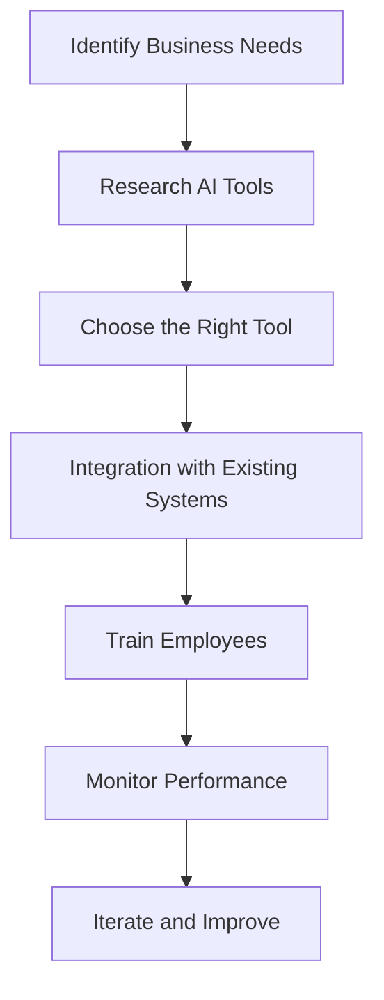

The Future of AI in Business: Trends and Tools for 2026

As we look towards 2026, the integration of AI in business continues to evolve at an unprecedented pace. Companies are harnessing the power of AI business tools to streamline operations, enhance decision-making, and improve customer experiences. In this article, we will explore the key trends shaping AI in business and highlight some of the most effective tools you can leverage to stay ahead of the competition.

### Key Trends in AI for Business

#### 1. Increased Automation

Automation remains at the forefront of AI advancements in business. By 2026, businesses are expected to rely heavily on AI-driven automation tools to handle repetitive tasks. This not only increases efficiency but also allows employees to focus on higher-value tasks. For instance, AI chatbots are now capable of managing customer inquiries, freeing up human agents to tackle more complex issues.

#### 2. Enhanced Data Analytics

With the explosion of data, AI tools are becoming essential for data analytics. Businesses can analyze vast amounts of data in real-time, gaining insights that were previously impossible to obtain. For example, AI-powered tools can identify trends in consumer behavior, enabling businesses to make data-driven decisions quickly.

#### 3. Personalization at Scale

AI is transforming how businesses approach personalization. By 2026, we can expect AI tools to deliver hyper-personalized experiences to customers across various channels. For instance, e-commerce platforms are using AI algorithms to recommend products based on individual browsing history, thereby enhancing customer satisfaction and driving sales.

#### 4. Ethical AI Practices

As AI becomes more integrated into business processes, ethical considerations are increasingly important. By 2026, companies will need to ensure that their AI tools are free from bias and respect user privacy. This trend will push businesses to adopt transparency and accountability in their AI strategies.

### AI Business Tools to Watch in 2026

With these trends in mind, let’s dive into some of the leading AI business tools that will shape the landscape in 2026.

#### 1. ChatGPT for Customer Support

[ChatGPT](https://chat.openai.com/?ref=AFFILIATE_ID) has emerged as a powerful AI tool for customer support. With its natural language processing capabilities, it can engage with customers in a conversational manner, providing instant responses and resolving issues efficiently.

**Pros:**
- 24/7 availability
- Reduces wait times for customers
- Learns from interactions to improve over time

**Cons:**
- May struggle with complex queries
- Requires training to align with brand voice

#### 2. Salesforce Einstein for CRM

Salesforce Einstein is an AI feature embedded in the Salesforce platform that provides intelligent insights and automation for customer relationship management (CRM). It can predict customer behavior, automate tasks, and enhance marketing strategies.

**Pros:**
- Improves lead scoring and forecasting
- Integrates seamlessly with existing Salesforce tools
- Provides actionable insights based on data

**Cons:**
- Can be expensive for small businesses
- Requires a learning curve for new users

#### 3. Tableau for Data Visualization

Tableau is a leading data visualization tool that leverages AI to help businesses understand their data better. It can transform complex datasets into interactive dashboards that are easy to interpret.

**Pros:**
- User-friendly interface
- Powerful analytics capabilities
- Supports collaboration among teams

**Cons:**
- High cost for advanced features
- May require technical expertise for complex visualizations

#### 4. HubSpot for Marketing Automation

HubSpot is an all-in-one marketing platform that uses AI to automate marketing tasks, personalize customer interactions, and analyze marketing performance.

**Pros:**
- Comprehensive marketing tools in one platform
- Strong customer support
- Free tier available for small businesses

**Cons:**
- Can become costly as features are added
- Some users report a steep learning curve

### Comparison of AI Business Tools

To help you choose the best AI business tools for your needs, here’s a comparison table that outlines the key features of the tools discussed:

<table>
  <tr>
    <th>Tool</th>
    <th>Best For</th>
    <th>Key Features</th>
    <th>Pricing</th>
  </tr>
  <tr>
    <td>[ChatGPT](https://chat.openai.com/?ref=AFFILIATE_ID)</td>
    <td>Customer Support</td>
    <td>24/7 chat capabilities, learns from conversations</td>
    <td>Subscription-based</td>
  </tr>
  <tr>
    <td>Salesforce Einstein</td>
    <td>CRM</td>
    <td>Predictive analytics, automated tasks</td>
    <td>Varies by plan</td>
  </tr>
  <tr>
    <td>Tableau</td>
    <td>Data Visualization</td>
    <td>Interactive dashboards, collaborative features</td>
    <td>Subscription-based</td>
  </tr>
  <tr>
    <td>HubSpot</td>
    <td>Marketing Automation</td>
    <td>Personalized interactions, performance analytics</td>
    <td>Free tier available, paid plans vary</td>
  </tr>
</table>

### Workflow of Implementing AI Business Tools

To visualize how businesses can effectively implement AI tools, here’s a workflow diagram:

### Conclusion: Why Invest in AI Business Tools Now

The future of AI in business is promising, with tools and technologies designed to enhance productivity and drive growth. By investing in AI business tools now, you position your company to leverage emerging trends and remain competitive in an increasingly digital landscape.

Don't get left behind—embrace the future of AI in your business today! Explore the tools mentioned, assess your business needs, and start implementing AI solutions that can transform your operations and customer interactions.

### Call to Action

Are you ready to take your business to the next level with AI? Start exploring the tools mentioned in this article today, and discover how you can harness the power of AI to fuel growth and efficiency in your organization. Share your thoughts in the comments below and let us know which AI tools you’re excited to try!

## 関連記事

- [AI Agents: The Future of Personal Assistants in 2026](/posts/ai-agents-the-future-of-personal-assistants-in-2026/)
- [AI Automation: A Game Changer for Small Businesses](/posts/ai-automation-a-game-changer-for-small-businesses/)
- [AI Automation: The Key to Enhanced Business Efficiency](/posts/ai-automation-the-key-to-enhanced-business-efficiency/)
