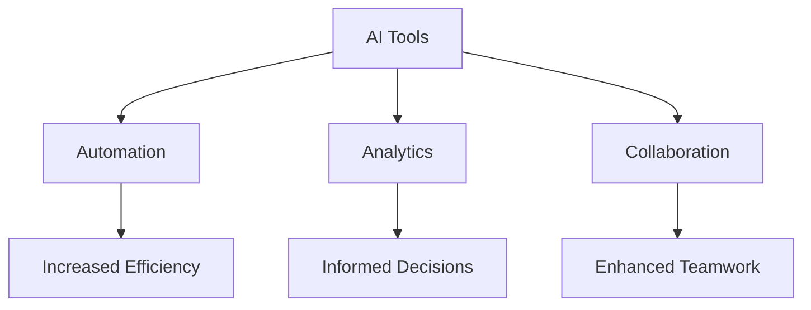

---

## The Future of AI in Enhancing Workplace Productivity

In the ever-evolving landscape of work, artificial intelligence (AI) is not just a buzzword; it's a vital component of modern productivity strategies. As businesses strive to become more efficient, harnessing the power of AI workplace productivity tools can provide a significant competitive advantage. In this article, we will explore how AI is enhancing workplace productivity, the tools that are leading the charge, and practical examples of their use.

### Understanding AI Workplace Productivity

AI workplace productivity refers to the use of artificial intelligence technologies to streamline processes, improve efficiency, and enhance collaboration within organizations. This can involve anything from automating repetitive tasks to providing insights through data analysis. As companies increasingly adopt AI solutions, the future of work is being reshaped dramatically.

### How AI Tools Are Changing the Game

#### 1. Automation of Routine Tasks

One of the most significant impacts of AI on workplace productivity is the automation of routine tasks. Tools like Zapier and Microsoft Power Automate allow businesses to create workflows that automatically handle repetitive tasks, freeing up employees to focus on higher-level responsibilities. 

**Use Case:** Imagine a marketing team that spends hours manually entering data from various sources into spreadsheets. With automation tools, this process can be streamlined, allowing the team to dedicate more time to creative strategy and execution.

#### 2. Enhanced Decision-Making

AI-powered analytics tools such as Tableau and Google Analytics use machine learning algorithms to analyze vast amounts of data and provide actionable insights. This helps teams make informed decisions quickly, without getting bogged down in data processing.

**Use Case:** A sales team can use AI analytics to identify trends in customer behavior, which can inform their outreach strategies and improve conversion rates.

#### 3. Improved Communication and Collaboration

AI chatbots and virtual assistants like Slackbot or Microsoft Teams' AI capabilities enhance communication by managing schedules, answering FAQs, and even facilitating team collaboration. These tools ensure that everyone stays on the same page, reducing misunderstandings and promoting teamwork.

**Use Case:** A project team can use AI chatbots to schedule meetings and share updates, streamlining communication and keeping everyone aligned on project goals.

### The Pros and Cons of AI Workplace Productivity Tools

As with any technology, AI tools have their advantages and disadvantages. Let’s take a closer look.

| Pros                                    | Cons                                    |
|-----------------------------------------|-----------------------------------------|
| Increases efficiency and productivity    | Potential job displacement               |
| Reduces human error                      | Initial implementation costs can be high|
| Provides valuable insights for decision-making | Requires ongoing maintenance and updates |
| Enhances employee satisfaction by reducing mundane tasks | Data privacy and security concerns       |

### Popular AI Tools for Workplace Productivity

To capitalize on the benefits of AI workplace productivity, several tools stand out in the market. Below is a comparison of some of the most popular AI tools:

<table>
  <tr>
    <th>Tool</th>
    <th>Key Features</th>
    <th>Best For</th>
    <th>Pricing</th>
  </tr>
  <tr>
    <td>Zapier</td>
    <td>Workflow automation, integration with 2,000+ apps</td>
    <td>Small to medium-sized businesses</td>
    <td>Starts at $19.99/month</td>
  </tr>
  <tr>
    <td>Tableau</td>
    <td>Data visualization, advanced analytics</td>
    <td>Data-driven decision making</td>
    <td>Starts at $70/user/month</td>
  </tr>
  <tr>
    <td>Slackbot</td>
    <td>Team communication, task management</td>
    <td>Teams looking to enhance collaboration</td>
    <td>Free and paid plans available</td>
  </tr>
  <tr>
    <td>Microsoft Power Automate</td>
    <td>Automate workflows, integration with Microsoft apps</td>
    <td>Organizations using Microsoft products</td>
    <td>Starts at $15/user/month</td>
  </tr>
</table>

### Looking Ahead: The Future of AI in the Workplace

As we look to the future, the integration of AI in workplace productivity is expected to grow. Companies will increasingly leverage AI to not only enhance efficiency but also to foster innovation. Here are a few trends to watch:

1. **AI-Powered Personalization:** AI will enable businesses to tailor experiences for employees and customers alike, from personalized learning and development plans to customized marketing strategies.

2. **Augmented Decision-Making:** AI will play a more substantial role in decision-making processes, providing predictive analytics that helps organizations anticipate market changes and adjust strategies accordingly.

3. **Collaborative AI:** As AI tools become more advanced, we can expect to see collaborative AI systems that work alongside human employees, enhancing creativity and problem-solving.

### Conclusion: Embrace the AI Revolution

The future of AI in enhancing workplace productivity holds immense potential. By adopting AI tools, businesses can streamline processes, make informed decisions, and improve team collaboration. However, it’s essential to approach these technologies thoughtfully, considering their pros and cons while ensuring data privacy and security.

Are you ready to transform your workplace with AI? Start exploring AI tools today and unlock the full potential of your team's productivity.

**Call to Action:** Sign up for our newsletter to stay updated on the latest AI tools and strategies that can help your business thrive!

## 関連記事

- [AI Agents: The Future of Personal Assistants in 2026](/posts/ai-agents-the-future-of-personal-assistants-in-2026/)
- [AI Automation: A Game Changer for Small Businesses](/posts/ai-automation-a-game-changer-for-small-businesses/)
- [AI Automation: Revolutionizing Business Operations in 2026](/posts/ai-automation-revolutionizing-business-operations-in-2026/)
