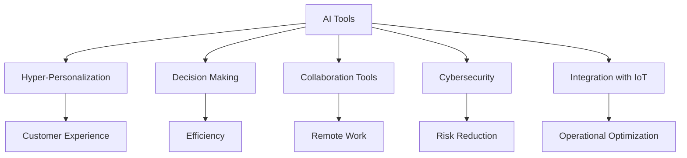

As we advance toward 2026, the role of artificial intelligence (AI) in business is becoming increasingly significant. Companies worldwide are beginning to harness the power of AI tools to streamline operations, enhance customer interactions, and drive profitability. But what does the future hold for these tools? In this blog post, we will explore the trends that are likely to shape the future AI tools for business, the innovations on the horizon, and how you can prepare your organization to embrace these changes.

## The Rise of Hyper-Personalization

One of the most exciting trends in future AI tools for business is the shift toward hyper-personalization. By 2026, AI systems will be capable of analyzing vast amounts of data to create tailored experiences for customers. This goes beyond traditional personalization, which often includes name-based interactions or segmented marketing. Instead, hyper-personalization will leverage customer behavior, preferences, and even emotional responses to tailor recommendations and interactions in real-time.

### Example Use Case

Imagine an e-commerce platform that utilizes AI to analyze not just your previous purchases but also your browsing behavior, social media activity, and even the time of day you typically shop. This platform could recommend products that match your current mood or needs, significantly boosting conversion rates and customer satisfaction.

## AI-Driven Decision Making

In the future, businesses will increasingly rely on AI tools for data-driven decision-making processes. The ability to analyze data at lightning speed will empower companies to make informed choices quickly, potentially transforming their strategies.

### Pros and Cons of AI-Driven Decision Making

| Pros                                          | Cons                                        |
|-----------------------------------------------|---------------------------------------------|
| Faster, more accurate decision-making         | Dependence on data quality                  |
| Ability to identify trends and patterns       | Possible loss of human element in decisions |
| Enhanced predictive analytics capabilities     | Risk of overfitting models                  |

## Enhanced Collaboration Tools

As remote work continues to evolve, AI-powered collaboration tools will become a staple in business environments. By 2026, expect to see sophisticated systems that can facilitate seamless collaboration among teams, regardless of their geographical location.

### Example Use Case

Consider a virtual meeting platform equipped with AI that can transcribe conversations, track action items, and even translate in real-time for global teams. Such tools will not only enhance productivity but also bridge communication gaps.

## The Role of AI in Cybersecurity

As businesses become more digital, the risk of cyberattacks will increase. AI tools will play a crucial role in enhancing cybersecurity measures. By 2026, we can anticipate AI systems capable of detecting and responding to threats in real-time, thus minimizing potential damage.

### Example Use Case

Imagine an AI system that continuously monitors network activity and can automatically quarantine suspicious behavior before it escalates into a full-blown breach. This proactive approach will save businesses from potential losses and reputational damage.

## Integration of AI with IoT Devices

The convergence of AI and the Internet of Things (IoT) will create exciting possibilities for businesses. By 2026, expect to see AI tools that can analyze data from various IoT devices in real-time to optimize operations.

### Example Use Case

Consider a manufacturing plant equipped with IoT sensors that monitor equipment performance. An AI tool could analyze this data to predict equipment failures before they occur, allowing for timely maintenance and reducing downtime.

## The Future of AI Tools for Business: Key Innovations

As we look toward 2026, several key innovations are likely to emerge in the realm of AI tools for business:

- **Natural Language Processing (NLP):** Future AI tools will leverage advanced NLP to enhance communication, enabling businesses to understand customer sentiment better and respond accordingly.
  
- **AI Ethics and Governance:** As AI becomes more pervasive, businesses will need to adopt ethical frameworks and governance structures to address concerns about bias, privacy, and accountability.

- **Augmented Reality (AR) and AI:** The integration of AR and AI will create immersive experiences for customers and employees alike, transforming training, marketing, and customer service.

## How to Prepare for the Future

To stay ahead in this rapidly evolving landscape, businesses should consider the following strategies:

1. **Invest in Training:** Equip your team with the skills to leverage AI tools effectively. Continuous learning and upskilling will be essential in adapting to new technologies.

2. **Stay Informed:** Keep an eye on emerging trends and innovations in AI. Follow industry leaders, attend conferences, and participate in webinars to stay updated.

3. **Embrace a Culture of Innovation:** Foster an environment where experimentation and innovation are encouraged. This mindset will help your organization adapt to changes more effectively.

4. **Collaborate with AI Experts:** Consider partnering with AI consultants or firms that specialize in AI implementations. Their expertise can guide your business in adopting the right tools for your needs.

## Conclusion

The future of AI tools for business is bright, offering opportunities for enhanced personalization, improved decision-making, and robust cybersecurity. By understanding these trends and preparing for the innovations on the horizon, your organization can thrive in the evolving landscape. 

Are you ready to embrace the future of AI tools? Start exploring how you can integrate these technologies into your business strategy today. 

### Call to Action

If you're interested in learning more about specific AI tools that can benefit your business, subscribe to our newsletter for expert insights, reviews, and the latest trends in AI technology!

## 関連記事

- [AI Agents: The Future of Personal Assistants in 2026](/posts/ai-agents-the-future-of-personal-assistants-in-2026/)
- [AI Automation: A Game Changer for Small Businesses](/posts/ai-automation-a-game-changer-for-small-businesses/)
- [AI Automation: The Key to Enhanced Business Efficiency](/posts/ai-automation-the-key-to-enhanced-business-efficiency/)
