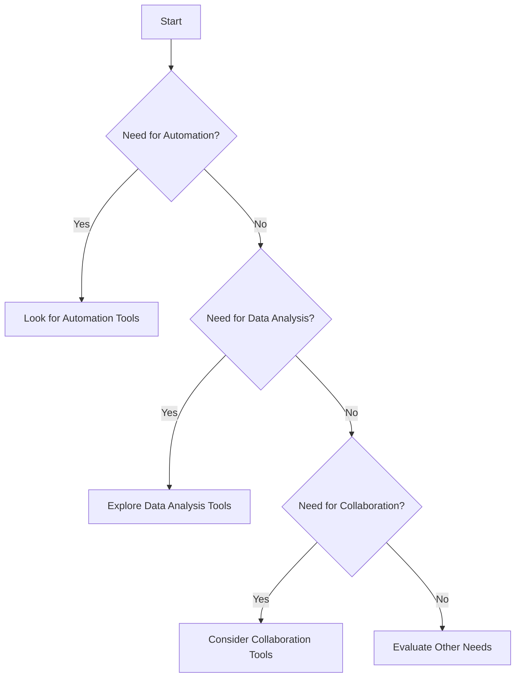

---

## The Future of AI Tools: Productivity Tips for 2026 and Beyond

As we move further into the 21st century, the integration of AI tools into our daily workflows is becoming increasingly prominent. By 2026, these tools are set to redefine productivity standards across industries. In this blog post, we’ll explore the future of AI tools, provide practical tips for enhancing productivity, and highlight tools that can help you stay ahead of the curve. 

### Why AI Tools Matter for Productivity

AI tools streamline workflows, automate repetitive tasks, and provide insightful data analysis. As businesses strive for efficiency, the adoption of AI-driven solutions is no longer a luxury but a necessity. From project management to customer service, AI tools can enhance productivity in various ways:

- **Automation of Routine Tasks**: Automate mundane tasks such as scheduling meetings, data entry, and email sorting.
- **Enhanced Data Analysis**: Use AI to analyze large datasets quickly, allowing for informed decision-making.
- **Personalized User Experiences**: AI tools can adapt to user preferences, making interactions smoother and more efficient.

### The Future Landscape of AI Tools

The landscape of AI productivity tools is evolving rapidly. By 2026, we can expect:

- **Increased Integration**: Seamless integration of AI tools with existing software will become the norm, reducing friction in workflows.
- **More User-Friendly Interfaces**: As AI technology matures, user interfaces will become more intuitive, allowing even non-technical users to leverage these tools effectively.
- **Greater Customization**: AI tools will allow for more personalized settings, catering to individual user needs and preferences.

### Practical Tips for Using AI Tools in 2026

To thrive in this AI-driven future, here are some actionable productivity tips:

#### 1. Embrace Automation

**Use Case**: Implement AI-driven automation tools like Zapier or Integromat to connect different applications. For instance, you can automate your social media postings, pulling content from Google Sheets directly into your social media platforms.

**Pros**:
- Saves time on repetitive tasks.
- Reduces human error.

**Cons**:
- Initial setup can be time-consuming.
- May require ongoing maintenance as workflows change.

#### 2. Leverage AI for Data Insights

**Use Case**: Utilize tools like Tableau or Microsoft Power BI that incorporate AI to visualize and analyze your business data. For example, a sales team can use these tools to identify trends and forecast sales based on historical data.

**Pros**:
- Quick access to actionable insights.
- Helps in making informed decisions.

**Cons**:
- Can be costly for smaller businesses.
- Requires training to use effectively.

#### 3. Personalize Customer Interactions

**Use Case**: AI chatbots, such as those from Drift or Intercom, can handle customer inquiries 24/7. Imagine a retail company using chatbots to provide personalized product recommendations based on user behavior.

**Pros**:
- Enhances customer support.
- Increases customer engagement.

**Cons**:
- May not handle complex queries well.
- Can lead to customer frustration if not implemented properly.

### The Role of Collaboration Tools

Collaboration tools are essential for teams aiming to maximize productivity. AI-powered platforms such as Slack, Microsoft Teams, and Asana can help streamline communication and project management.

#### Comparison of Collaboration Tools

Here's a quick comparison of three popular AI collaboration tools:

<table>
  <tr>
    <th>Feature</th>
    <th>Slack</th>
    <th>Microsoft Teams</th>
    <th>Asana</th>
  </tr>
  <tr>
    <td>Real-time Messaging</td>
    <td>Yes</td>
    <td>Yes</td>
    <td>No</td>
  </tr>
  <tr>
    <td>Video Conferencing</td>
    <td>Yes (via integrations)</td>
    <td>Yes</td>
    <td>No</td>
  </tr>
  <tr>
    <td>Project Management</td>
    <td>Limited</td>
    <td>Basic</td>
    <td>Advanced</td>
  </tr>
  <tr>
    <td>AI Features</td>
    <td>Searchable history, automation</td>
    <td>Integrates with Office 365 AI</td>
    <td>Task automation, reporting</td>
  </tr>
</table>

### Future AI Tools to Watch

As we look ahead, several emerging AI tools are worth keeping an eye on:

- **[Notion AI](https://www.notion.so/product/ai?ref=AFFILIATE_ID)**: A powerful tool that can assist in project planning, note-taking, and task management all in one place.
- **[Jasper](https://www.jasper.ai/?ref=AFFILIATE_ID) AI**: A content generation tool that helps marketers create high-quality content faster.
- **[Otter.ai](https://otter.ai/?ref=AFFILIATE_ID)**: A transcription service that converts spoken language into written text, making meeting documentation effortless.

### Navigating Through AI Tools

Choosing the right AI tools for your needs can be overwhelming. Here’s a simple decision tree to help you navigate:

### Conclusion

The future of productivity is undoubtedly intertwined with AI tools. As we approach 2026, embracing these innovations will be crucial for individuals and organizations alike. By implementing automation, leveraging data insights, and personalizing interactions, you can vastly improve your productivity. 

Are you ready to transform your workflow with AI tools? Start exploring the options today, and don't get left behind in this rapidly evolving landscape. 

### Call to Action

Want to stay updated on the latest AI tools and productivity tips? Subscribe to our newsletter at AI Tools Lab and take the first step towards enhancing your efficiency today!

## 関連記事

- [AI Productivity Gains: What the Data Actually Shows](/posts/the-future-of-work-integrating-ai-for-productivity-gains/)
- [5 Must-Have AI Tools to Streamline Your Workflow in 2026](/posts/5-must-have-ai-tools-to-streamline-your-workflow-in-2026/)
- [AI Agents vs. Traditional Productivity Tools: An Honest Comparison](/posts/ai-agents-vs-traditional-tools-which-enhances-productivity/)
