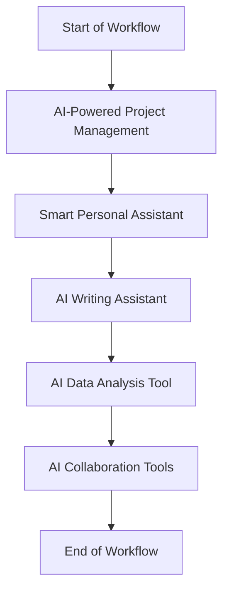

---

# The Future of Productivity: AI Tools You Need in 2026

As we step into a new era of technological advancement, the landscape of productivity is rapidly transforming. With the rise of artificial intelligence (AI), the future of work is not just about doing more; it's about doing more intelligently and efficiently. By 2026, several AI tools are expected to dominate the productivity space, helping individuals and organizations alike streamline their processes and enhance their output.

In this blog post, we’ll explore some of the most promising AI productivity tools on the horizon, their practical applications, and how they can revolutionize your workflow.

## The AI Revolution in Productivity

Artificial intelligence is reshaping how we work, making it possible to automate mundane tasks, analyze vast amounts of data, and improve decision-making processes. In 2026, we can expect AI tools to be more integrated into our daily workflows than ever before. Here are several ways AI is expected to impact productivity:

1. **Automation of Routine Tasks**: AI tools will handle repetitive tasks, freeing up time for more strategic activities.
2. **Enhanced Collaboration**: AI will facilitate better communication and collaboration among teams, regardless of their geographical locations.
3. **Data-Driven Insights**: Advanced analytics will offer insights that help in planning and execution, leading to better outcomes.
4. **Personalized Workflows**: AI will learn from individual work habits, creating customized productivity plans that suit personal work styles.

## Key AI Productivity Tools to Watch for in 2026

### 1. AI-Powered Project Management Tools

Project management is evolving with AI at its core. Tools like **Monday.com** and **Trello** are already integrating AI features to help teams manage tasks more efficiently.

**Use Case**: Imagine a project management tool that not only tracks tasks but also analyzes team performance and suggests optimal resource allocation based on past data. By 2026, expect to see features like predictive analytics that can forecast project timelines and risks.

| Feature            | Monday.com                  | Trello                        |
|--------------------|----------------------------|-------------------------------|
| AI Integration      | Yes                        | Limited                       |
| Predictive Analytics| Advanced                   | Basic                         |
| Custom Workflows    | Yes                        | Yes                           |

### 2. Smart Personal Assistants

The smart personal assistant market is booming, with tools like **Google Assistant**, **Siri**, and **Amazon Alexa** leading the way. However, by 2026, these assistants will become even more intelligent.

**Use Case**: Imagine an assistant that schedules your meetings based on your preferences, prioritizes your emails, and even drafts responses for you. With natural language processing (NLP) advancements, these assistants will be able to understand context better than ever.

**Pros/Cons**:
- **Pros**: Saves time, increases organization, and enhances productivity.
- **Cons**: Privacy concerns, reliance on technology, and potential for errors in understanding context.

### 3. Advanced AI Writing Assistants

Writing is an integral part of many professions, and AI tools like **Grammarly** and **Jasper** are already making waves. By 2026, expect to see tools that not only check grammar but also provide context-based suggestions, enhance creativity, and even generate complete articles.

**Use Case**: A marketing team could use an AI writing assistant to draft blog posts and social media content in a matter of minutes, improving both speed and creativity.

**Pros/Cons**:
- **Pros**: Enhances writing quality, saves time, and boosts creativity.
- **Cons**: May reduce personal touch in writing, potential for over-reliance.

### 4. AI-Driven Data Analysis Tools

Data is the new oil, and AI tools like **Tableau** and **Power BI** are set to become even more powerful by 2026. These tools will harness machine learning to provide deeper insights and predictive analytics.

**Use Case**: A finance team could use AI-driven analytics to forecast future trends, enabling proactive decision-making that could save money and enhance performance.

**Pros/Cons**:
- **Pros**: Provides valuable insights, enhances decision-making, and identifies trends.
- **Cons**: Requires data literacy, potential for misinterpretation of data.

### 5. AI Collaboration Tools

Collaboration tools like **Slack** and **Microsoft Teams** are essential for remote work. By 2026, we can expect these platforms to integrate AI features that enhance communication.

**Use Case**: AI could analyze team interactions and suggest optimal times for meetings or identify potential bottlenecks in communication.

**Pros/Cons**:
- **Pros**: Improves team collaboration, reduces misunderstandings, and enhances productivity.
- **Cons**: Over-reliance on AI insights, potential for information overload.

## Future AI Productivity Tools Workflow

To illustrate how these AI tools will integrate into our workflows, here’s a simple diagram showing the anticipated interaction between various tools:

## Conclusion

The future of productivity is undeniably intertwined with the advancements in AI. As we look toward 2026, the potential for AI tools to enhance our efficiency, creativity, and collaboration is immense. From project management to data analysis, these tools will redefine how we work, making us more productive and effective in our endeavors.

Are you ready to embrace the future of productivity? Start exploring these tools today, and position yourself at the forefront of this transformative journey. Share your thoughts in the comments below—what AI tools do you think will be essential in 2026? 

Don't wait for the future; take action now and supercharge your productivity with AI tools!