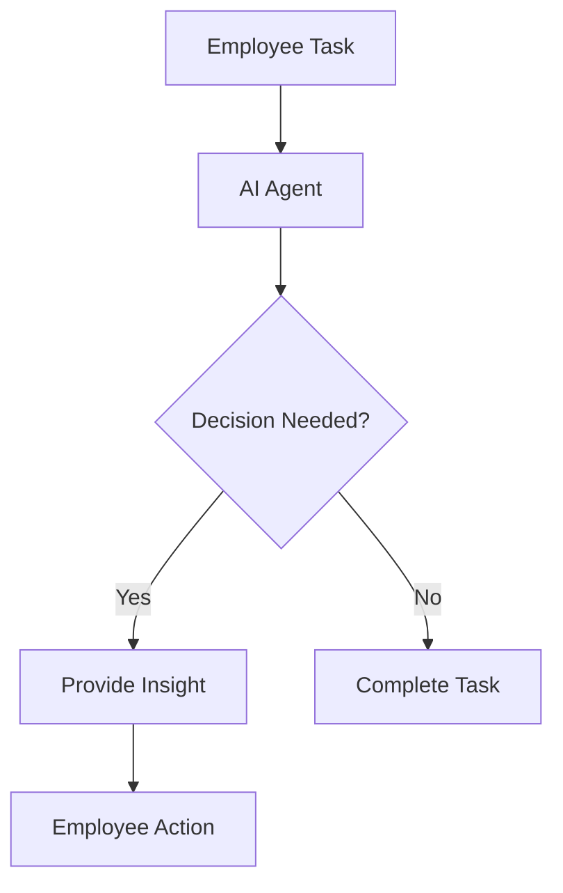

The workplace of the future is rapidly evolving, driven by advances in artificial intelligence (AI) and the implementation of AI agents designed to boost employee productivity. As organizations grapple with the challenges of a hybrid work environment and the need for efficient operations, AI agents are stepping in to enhance productivity, streamline workflows, and provide valuable insights. In this blog post, we’ll explore the role of AI agents in the workplace, their impact on employee productivity, and provide practical examples and use cases to illustrate their potential.

## Understanding AI Agents

Before diving into the specifics of how AI agents influence employee productivity, it’s essential to define what these agents are. AI agents are software programs that utilize artificial intelligence to perform tasks that typically require human intelligence. They can learn from data, adapt to new information, and automate processes, making them invaluable tools for modern businesses.

### Types of AI Agents

1. **Virtual Assistants**: These are AI agents like Siri, Google Assistant, and [ChatGPT](https://chat.openai.com/?ref=AFFILIATE_ID) that help with scheduling, reminders, and information retrieval.
2. **Chatbots**: Used in customer service, chatbots can handle inquiries, provide support, and automate communication.
3. **Robotic Process Automation (RPA)**: RPA bots automate repetitive tasks, such as data entry and invoicing, allowing employees to focus on more strategic work.
4. **Data Analysis Bots**: These agents sift through large datasets, providing insights that help in decision-making processes.

## The Role of AI Agents in Enhancing Employee Productivity

AI agents play a crucial role in enhancing employee productivity across various domains. Here are some of the ways they contribute:

### 1. Automating Mundane Tasks

One of the most significant benefits of AI agents is their ability to take over repetitive, mundane tasks. This allows employees to redirect their focus toward more strategic and creative initiatives.

**Example**: An AI-powered RPA tool can automate the process of data entry. Instead of spending hours inputting data into spreadsheets, employees can focus on analyzing that data and making impactful decisions.

### 2. Streamlining Communication

AI agents can enhance communication within teams by managing emails, scheduling meetings, and providing instant responses to common queries.

**Example**: A virtual assistant can manage a team’s calendar, setting up meetings by finding suitable times for all participants and sending reminders, thus reducing the back-and-forth often involved in scheduling.

### 3. Enhancing Decision-Making

Data analysis bots can quickly process large volumes of data and provide insights that are critical for decision-making. This can significantly reduce the time spent on research.

**Example**: Suppose a marketing team is looking to launch a new campaign. An AI agent can analyze past campaign data, customer preferences, and market trends to suggest the best course of action, enabling the team to make informed decisions rapidly.

### 4. Facilitating Learning and Development

AI agents can also assist in employee training and development by personalizing learning experiences based on individual performance and preferences.

**Example**: An AI-driven training platform can assess an employee's skills and recommend tailored learning modules, enabling them to upskill effectively and at their own pace.

## Pros and Cons of AI Agents

To provide a balanced view, let’s look at the pros and cons of incorporating AI agents into the workplace:

### Pros

- **Increased Efficiency**: By automating repetitive tasks, AI agents free up employee time for more valuable work.
- **Enhanced Accuracy**: AI agents can minimize human error in data handling and reporting.
- **Scalability**: With AI, businesses can scale operations more efficiently without a proportional increase in workforce.
- **24/7 Availability**: AI agents can operate around the clock, providing support and automation even outside of standard working hours.

### Cons

- **Job Displacement**: Automation can lead to concerns about job losses, particularly in roles primarily focused on repetitive tasks.
- **Dependence on Technology**: Over-reliance on AI tools can lead to skill degradation among employees.
- **Data Privacy Concerns**: The use of AI agents often involves handling sensitive data, raising concerns about security and privacy.
- **Implementation Costs**: Initial investment in AI technology can be significant, which may deter smaller companies.

## Use Cases of AI Agents in Various Industries

Let’s delve into some practical examples of AI agents in different sectors, showcasing their impact on employee productivity:

### Healthcare

In healthcare, AI agents assist medical professionals by managing patient records, scheduling appointments, and providing diagnostic support.

**Example**: An AI chatbot can triage patients by asking preliminary questions about their symptoms, allowing healthcare providers to focus on cases that require immediate attention.

### Finance

AI agents in finance automate the analysis of financial data, identify trends, and manage customer inquiries.

**Example**: Robo-advisors can manage investment portfolios, providing clients with tailored financial advice based on real-time data, thus enhancing client satisfaction and retention.

### E-commerce

E-commerce platforms utilize AI agents for personalized shopping experiences, inventory management, and customer service.

**Example**: A virtual shopping assistant can provide personalized recommendations based on a customer’s browsing history, increasing conversion rates and enhancing user experience.

## Future of AI Agents and Employee Productivity

As we look toward the future, the integration of AI agents in the workplace will only become more pronounced. With advancements in machine learning and natural language processing, AI agents will continue to evolve, becoming more capable of understanding and responding to complex human needs.

### Workflow Integration

The future will see seamless integration of AI agents into existing workflows, enhancing collaboration among teams. By providing real-time data and insights, AI agents will empower employees to make informed decisions swiftly.

This simple workflow diagram illustrates how an AI agent can assist in decision-making, enhancing the overall productivity of the employee.

## Conclusion

The future of work is undeniably intertwined with the advancements in AI agents. By automating mundane tasks, facilitating communication, enhancing decision-making, and providing personalized learning experiences, AI agents significantly boost employee productivity. However, it’s crucial for organizations to navigate the challenges that come with this technology, ensuring that the human touch remains an integral part of the workplace. 

As we continue to embrace AI agents, organizations must focus on balancing automation with the development of human skills. The key to success lies in collaboration between humans and AI, creating a future where both can thrive.

**Call to Action**: Are you ready to transform your workplace with AI agents? Start exploring the various AI tools available today and discover how they can enhance your team's productivity. Share your thoughts and experiences with AI tools in the comments below!

## 関連記事

- [AI Agents: The Future of Personal Assistants in 2026](/posts/ai-agents-the-future-of-personal-assistants-in-2026/)
- [AI Automation: A Game Changer for Small Businesses](/posts/ai-automation-a-game-changer-for-small-businesses/)
- [AI Automation: The Key to Enhanced Business Efficiency](/posts/ai-automation-the-key-to-enhanced-business-efficiency/)
