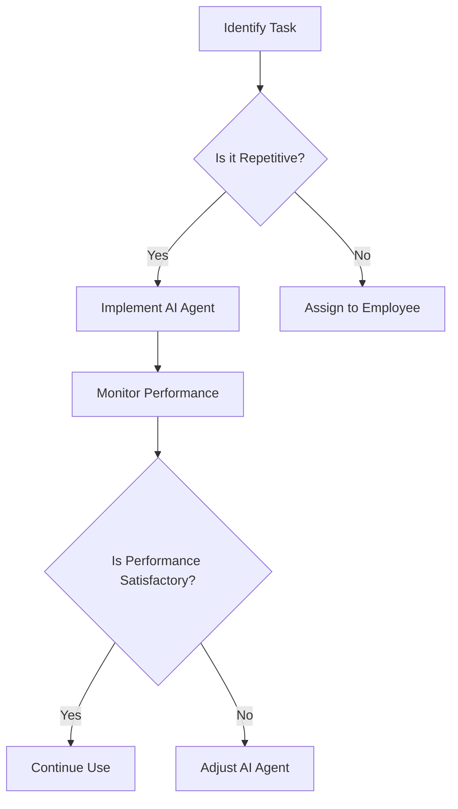

---

## The Future of Work: AI Agents Transforming Productivity

In recent years, the workplace has undergone a significant transformation thanks to advancements in technology. Among these advancements, *AI agents* have emerged as game-changers in enhancing productivity. These intelligent systems not only automate mundane tasks but also assist in decision-making, streamlining workflows, and improving overall efficiency. As we look toward the future of work, understanding how AI agents can drive productivity is essential for businesses and professionals alike.

### What Are AI Agents?

AI agents are software programs designed to perform tasks autonomously or semi-autonomously. They utilize machine learning, natural language processing, and other AI technologies to learn from data, understand user needs, and adapt their functions accordingly. These agents can range from simple bots that handle customer inquiries to sophisticated systems that analyze data and provide strategic insights.

### The Role of AI Agents in Productivity

AI agents play a significant role in improving productivity across various sectors. Here are some key areas where they make an impact:

1. **Automation of Repetitive Tasks**
   - AI agents can take over repetitive tasks such as data entry, scheduling meetings, and managing emails. This frees up employees to focus on higher-value activities that require creativity and critical thinking.

2. **Enhanced Decision-Making**
   - By analyzing large datasets quickly and accurately, AI agents can provide valuable insights that aid in decision-making. For example, a marketing AI agent can analyze customer behavior and suggest optimal strategies for targeting specific demographics.

3. **Improved Collaboration**
   - AI agents can facilitate communication and collaboration among team members. They can manage project timelines, track progress, and send reminders, ensuring that everyone stays on the same page.

4. **Personalized Learning and Development**
   - AI agents can tailor training programs to individual employee needs, identifying skill gaps and recommending resources. This personalized approach helps in enhancing employee performance and satisfaction.

### Real-World Examples of AI Agents in Action

Let’s explore some practical examples of AI agents transforming productivity in various industries:

#### 1. Customer Service

**Example: Chatbots**

Many companies now deploy AI-driven chatbots to handle customer service inquiries. For instance, Zendesk's Answer Bot uses AI to resolve common questions, reducing the workload on human agents and providing instant support to customers.

#### 2. Project Management

**Example: Trello with Butler AI**

Trello's Butler AI allows users to automate repetitive tasks within their project boards. For instance, users can set up rules to automatically move cards between lists based on specific triggers, enhancing team productivity and reducing management overhead.

#### 3. Marketing Analytics

**Example: HubSpot’s AI Tools**

HubSpot's AI tools analyze marketing data to help businesses understand customer behavior and optimize their campaigns. By predicting which leads are most likely to convert, teams can focus their efforts more effectively.

### Benefits of Using AI Agents

While the advantages of incorporating AI agents into work processes are numerous, it's essential to weigh them against potential challenges. Here are some pros and cons:

#### Pros:
- **Increased Efficiency**: Automating routine tasks saves time and reduces human error.
- **Data-Driven Insights**: AI agents provide actionable insights that can drive better decision-making.
- **Cost Savings**: By streamlining operations, businesses can reduce costs associated with human labor and inefficiencies.
- **24/7 Availability**: AI agents can operate around the clock, providing continuous support and productivity.

#### Cons:
- **Initial Implementation Costs**: Integrating AI systems can require significant investment in technology and training.
- **Data Privacy Concerns**: AI agents often rely on large datasets, raising issues around data security and privacy.
- **Dependence on Technology**: Relying too heavily on AI can lead to skill degradation among employees.

### Comparing Popular AI Agents for Productivity

To better understand the landscape of AI agents available today, let’s compare a few popular tools that enhance productivity. 

<table>
    <tr>
        <th>Tool</th>
        <th>Key Feature</th>
        <th>Best For</th>
        <th>Pricing</th>
    </tr>
    <tr>
        <td>Zapier</td>
        <td>Automates workflows between apps</td>
        <td>Small to medium businesses</td>
        <td>Starts at $19.99/month</td>
    </tr>
    <tr>
        <td>[Grammarly](https://www.grammarly.com/?ref=AFFILIATE_ID)</td>
        <td>Real-time writing assistance</td>
        <td>Content creators and professionals</td>
        <td>Free; premium starts at $11.66/month</td>
    </tr>
    <tr>
        <td>Asana with Automation</td>
        <td>Project management with automation</td>
        <td>Teams managing complex projects</td>
        <td>Free; premium starts at $10.99/month</td>
    </tr>
</table>

### The Future of AI Agents in the Workplace

As AI technology continues to evolve, we can expect even more sophisticated AI agents capable of handling complex tasks and improving productivity. The integration of AI with other technologies, such as the Internet of Things (IoT) and blockchain, will likely lead to new opportunities for operational efficiency.

#### Workflow Example: AI Agent Implementations

To visualize how AI agents can be integrated into a workplace, consider the following workflow example:

This decision tree illustrates the process of identifying tasks suitable for AI automation, implementing the technology, and monitoring its effectiveness.

### Conclusion: Embrace the Future with AI Agents

The future of work lies in leveraging the capabilities of AI agents to transform how we approach productivity. By automating routine tasks, enhancing decision-making, and fostering collaboration, these intelligent systems can significantly improve efficiency. However, businesses must also consider the challenges that come with such a shift, including costs and data privacy concerns.

Are you ready to embrace the future of work? Start exploring AI agents today and discover how they can revolutionize your productivity. It’s time to harness the power of technology and stay ahead in this rapidly evolving landscape!

### Call to Action

If you found this article valuable, don’t forget to share it with your network! For more insights on AI tools and productivity, subscribe to our newsletter and stay updated on the latest trends in the tech world. Your future of work awaits!

## 関連記事

- [Boost Productivity with AI Agents: 2026 Strategies](/posts/boost-productivity-with-ai-agents-2026-strategies/)
- [Boosting Productivity with AI Agents in 2026](/posts/boosting-productivity-with-ai-agents-in-2026/)
- [Boosting Team Productivity with AI Agents in 2026](/posts/boosting-team-productivity-with-ai-agents-in-2026/)
