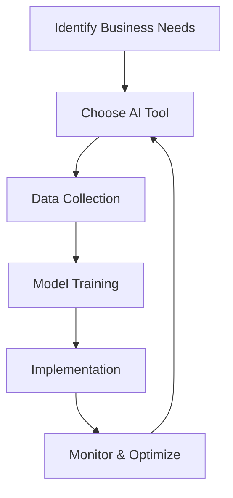

The Future of Work: AI in Business Processes

Artificial Intelligence (AI) is no longer a buzzword of the future; it is now an integral part of business processes across various sectors. From automating mundane tasks to providing insightful analytics, AI transforms how businesses operate and engage with their customers. In this article, we will explore the implications of AI in business processes, its benefits and challenges, and how it is reshaping the workplace landscape.

### Understanding AI in Business Processes

AI in business processes refers to the integration of artificial intelligence technologies to enhance, automate, and streamline various organizational tasks. This can include everything from customer service chatbots to advanced data analytics that help in decision-making. The goal is to improve efficiency, reduce costs, and ultimately drive better business outcomes.

#### Why AI is Essential in Today's Business Environment

1. **Efficiency and Productivity**: AI can handle repetitive tasks, allowing employees to focus on high-value activities. For instance, AI-driven tools can manage scheduling, data entry, and inventory management with minimal human intervention.

2. **Data-Driven Decision Making**: AI can analyze vast amounts of data quickly and accurately. For businesses that rely on data for strategic decisions, AI provides insights that can lead to more informed choices.

3. **Enhanced Customer Experience**: AI tools such as chatbots and virtual assistants can provide instant responses to customer inquiries, improving satisfaction and engagement.

4. **Cost Reduction**: By automating processes, companies can reduce labor costs and minimize the chances of human error, which can be costly.

### Use Cases of AI in Business Processes

Let's explore some practical examples of AI in various business processes:

#### 1. Customer Service

AI-powered chatbots are revolutionizing customer service. Companies like Amazon and Zappos use chatbots to handle customer queries round-the-clock, providing quick responses and freeing up human agents for more complex issues. These chatbots can learn from interactions and improve over time, creating a more seamless experience for customers.

#### 2. Human Resources

AI tools assist in recruitment by screening resumes and identifying the best candidates based on predefined criteria. For example, software like HireVue uses AI to analyze video interviews, helping HR teams make quicker, data-driven hiring decisions.

#### 3. Marketing Automation

AI in marketing helps companies analyze customer behavior to create personalized campaigns. Tools like HubSpot and Marketo can segment audiences and tailor messages to increase conversion rates, leveraging predictive analytics to anticipate customer needs.

#### 4. Supply Chain Management

AI algorithms can predict demand, optimize inventory levels, and streamline logistics. Companies like Walmart employ AI to enhance their supply chain operations, ensuring products are available when and where they are needed.

### Pros and Cons of Implementing AI in Business Processes

While the benefits of AI in business processes are clear, it’s essential to consider potential drawbacks as well.

#### Pros

- **Increased Efficiency**: Automation of routine tasks saves time and resources.
- **Improved Accuracy**: AI reduces errors in data handling and processing.
- **Scalability**: AI solutions can easily scale with business growth.
- **Better Insights**: Advanced analytics lead to data-driven decisions.

#### Cons

- **High Initial Investment**: Implementing AI technology can require a significant upfront investment.
- **Job Displacement**: Automation may lead to job loss in certain sectors.
- **Complexity**: Integrating AI into existing systems can be challenging.
- **Data Privacy Concerns**: Handling sensitive data with AI raises ethical considerations.

### The Challenges of Adopting AI in Business Processes

Despite its benefits, the implementation of AI in business processes is not without challenges. Organizations must navigate issues such as data privacy, the need for skilled personnel, and the potential backlash from employees concerned about job displacement. Moreover, integrating AI solutions with existing systems can pose technical hurdles.

#### Strategies for Successful AI Implementation

1. **Start Small**: Begin with a pilot project to test AI solutions on a smaller scale before rolling them out company-wide.

2. **Training and Development**: Invest in training programs to upskill employees, ensuring they can work alongside AI tools.

3. **Data Governance**: Establish clear protocols for data usage and privacy to build trust among customers and comply with regulations.

4. **Continuous Feedback**: Encourage a culture of feedback to refine AI processes and address concerns promptly.

### The Future Landscape of AI in Business Processes

As we look ahead, the future of AI in business processes appears promising. With advancements in machine learning, natural language processing, and automation technologies, businesses will continue to find innovative ways to leverage AI for competitive advantage. 

#### Mermaid Diagram: AI Integration Workflow

### Conclusion: Embracing AI for Business Success

AI in business processes is not just a trend; it’s a fundamental shift that can redefine how businesses operate and succeed. By embracing AI, organizations can enhance productivity, improve customer experiences, and make better decisions based on data-driven insights. 

As you consider integrating AI into your business processes, remember to weigh the benefits against the challenges. Start with small initiatives, invest in training, and maintain open communication with your team. The future of work is here, and with the right approach, your business can thrive in this new era of technology.

### Call to Action

Are you ready to embrace the power of AI in your business processes? Start your journey today by exploring AI tools that can transform your operations. Join us at AI Tools Lab for insightful resources, reviews, and the latest trends in AI technology!

## 関連記事

- [AI Agents: The Future of Personal Assistants in 2026](/posts/ai-agents-the-future-of-personal-assistants-in-2026/)
- [AI Automation: A Game Changer for Small Businesses](/posts/ai-automation-a-game-changer-for-small-businesses/)
- [AI Automation: The Key to Enhanced Business Efficiency](/posts/ai-automation-the-key-to-enhanced-business-efficiency/)
