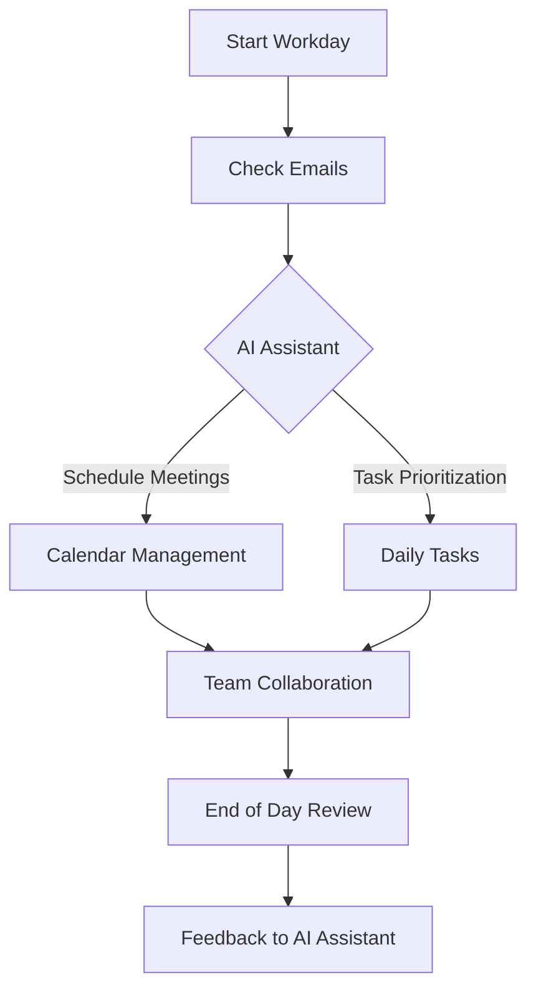

---

# The Future of Work: AI Tools Enhancing Productivity

The workplace is evolving at an unprecedented pace, and as we look forward to 2026, the integration of AI tools into our daily workflows promises to transform productivity in ways we can only imagine. From automating tedious tasks to enhancing decision-making, AI tools are set to redefine how we work. In this article, we’ll explore the future of work and how AI tools will enhance productivity, providing you with practical examples and insights.

## The Rise of AI Tools in the Workplace

AI tools have already begun making significant inroads into various industries. Whether it's through chatbots improving customer service, machine learning algorithms optimizing supply chains, or AI-powered analytics enabling data-driven decision-making, the impact is clear: AI tools are enhancing productivity.

### Current State of AI Tools

As of now, the landscape is filled with various AI tools that cater to different aspects of productivity. Tools like Trello and Asana have incorporated AI features to help project managers streamline their workflows. Additionally, platforms such as Slack are integrating AI to enhance communication. 

### What to Expect by 2026

By 2026, we can expect a dramatic shift in how AI tools function. Here are some predictions:

1. **Increased Personalization**: AI tools will be able to analyze individual work habits and preferences, delivering tailored recommendations that boost productivity. Imagine an AI assistant that knows when you work best and schedules your most important tasks accordingly.

2. **Collaboration Enhancement**: With AI tools, collaboration will become more seamless. Think about AI-driven platforms that automatically suggest team members for projects based on their skills and past performance.

3. **Automation of Routine Tasks**: The automation potential of AI tools will expand, allowing workers to focus on high-value tasks. For instance, AI could handle scheduling meetings, data entry, and even preliminary analysis of reports.

4. **Data-Driven Insights**: AI analytics will provide insights that help teams make better decisions faster. By 2026, expect AI tools that can predict market trends or employee performance based on historical data.

## Practical Use Cases of AI Tools by 2026

Let’s dive into some practical use cases that illustrate the potential of AI tools for enhancing productivity in 2026:

### 1. AI-Powered Virtual Assistants

Imagine having a virtual assistant that not only manages your calendar but also predicts when you need breaks based on your productivity patterns. For example, tools like Google Assistant or Microsoft’s Cortana could evolve to analyze your workload and suggest optimal working hours and breaks.

### 2. Intelligent Project Management

AI tools like Monday.com and ClickUp are expected to evolve to manage larger projects autonomously. By analyzing past project performance, these tools could suggest timelines, resource allocations, and risk assessments tailored for each unique project.

### 3. Enhanced Customer Experience

In customer service, AI chatbots are continually improving. By 2026, we might see AI tools that can handle complex customer queries with human-like empathy. For instance, an AI tool could analyze customer sentiment in real-time and adjust responses to fit the emotional tone of the conversation.

### 4. Smart Recruitment

In human resources, AI tools will streamline recruitment processes. Imagine a tool that scans resumes and matches candidates not just based on qualifications but also on company culture fit. Tools like HireVue are already moving in this direction, but by 2026, expect more advanced capabilities, such as predicting employee success.

## AI Tools Comparison Table

To help you navigate the current landscape of AI tools, here’s a comparison table of some popular AI productivity tools available today:

<table>
  <tr>
    <th>Tool</th>
    <th>Best For</th>
    <th>Key Features</th>
    <th>Pricing</th>
  </tr>
  <tr>
    <td>Trello</td>
    <td>Project Management</td>
    <td>Task automation, deadline reminders, AI suggestions</td>
    <td>Free / $12.50/month for Business Class</td>
  </tr>
  <tr>
    <td>Slack</td>
    <td>Team Communication</td>
    <td>AI chatbots, integration with other tools, reminders</td>
    <td>Free / $6.67/month for Standard</td>
  </tr>
  <tr>
    <td>Asana</td>
    <td>Task Management</td>
    <td>Customizable workflows, AI recommendations, reporting</td>
    <td>Free / $10.99/month for Premium</td>
  </tr>
  <tr>
    <td>Monday.com</td>
    <td>Work Operating System</td>
    <td>Automation features, data visualization, collaboration tools</td>
    <td>$8/month per user</td>
  </tr>
</table>

## Pros and Cons of AI Tools

While the advantages of integrating AI tools into your workplace are numerous, it's essential to consider both sides.

### Pros

1. **Increased Efficiency**: Automating repetitive tasks saves time and allows teams to focus on strategic initiatives.
2. **Enhanced Decision-Making**: AI tools provide insights that can lead to better-informed decisions.
3. **Improved Collaboration**: Tools that facilitate communication and project management can foster better teamwork.
4. **Cost Savings**: By streamlining processes, businesses can reduce operational costs.

### Cons

1. **Dependence on Technology**: Relying too heavily on AI can lead to skill deterioration among employees.
2. **Data Privacy Concerns**: AI tools often require access to sensitive data, raising concerns about privacy and security.
3. **Initial Setup Costs**: Implementing AI tools may require a significant upfront investment.
4. **Resistance to Change**: Employees might be hesitant to adopt new technologies, impacting productivity.

## The Role of AI in Shaping Future Work Culture

As we approach 2026, the role of AI tools in shaping workplace culture cannot be understated. The ability to automate routine tasks will not only free up time but will also allow employees to engage in more meaningful work. Additionally, AI tools can help create an inclusive work environment by reducing bias in recruitment and performance evaluations.

### Workflow Optimization with AI

To illustrate how AI can enhance workflow, consider the following diagram, which outlines a typical workflow enhanced by AI tools:

## Conclusion

The future of work is undeniably intertwined with the evolution of AI tools. As we move towards 2026, these tools will play a pivotal role in enhancing productivity, fostering collaboration, and driving decision-making. While challenges remain, the potential benefits far outweigh the drawbacks. 

Are you ready to embrace the future of work with AI tools? Start exploring the options available today, and prepare your team for a more productive tomorrow. Your journey toward enhanced productivity begins now—don’t get left behind!

### Call to Action

If you're interested in learning more about how AI tools can transform your productivity, subscribe to our blog for the latest updates, insights, and reviews of cutting-edge AI tools! Let's embrace the future together!

## 関連記事

- [AI Agents: The Future of Personal Assistants in 2026](/posts/ai-agents-the-future-of-personal-assistants-in-2026/)
- [AI Automation: A Game Changer for Small Businesses](/posts/ai-automation-a-game-changer-for-small-businesses/)
- [AI Automation: The Key to Enhanced Business Efficiency](/posts/ai-automation-the-key-to-enhanced-business-efficiency/)
