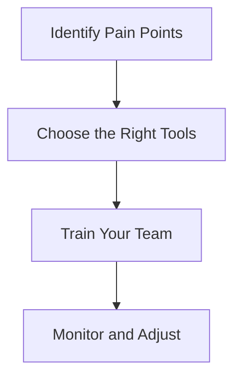

---

# The Future of Work: AI Tools Enhancing Productivity

As we move deeper into the digital age, the landscape of work is undergoing a seismic shift. The integration of AI tools into the workplace is not just a trend; it's becoming a necessity. These AI tools are designed to enhance productivity, streamline workflows, and ultimately make our jobs easier. In this blog post, we will explore various AI tools and their impact on productivity, providing practical examples and use cases that can help you leverage these technologies effectively.

## Understanding AI Tools and Their Role in Productivity

AI tools refer to software and applications that utilize artificial intelligence to perform tasks that typically require human intelligence. This includes everything from data analysis and natural language processing to automated customer service and project management. The goal of these tools is to optimize workflows and increase efficiency, allowing employees to focus on more strategic tasks.

### How AI Tools Enhance Productivity

AI tools enhance productivity in various ways, including:

- **Automation of Mundane Tasks**: AI can handle repetitive tasks such as data entry, appointment scheduling, and email management, allowing employees to concentrate on more complex responsibilities.
- **Data Analysis and Insights**: AI can analyze vast amounts of data quickly, providing insights that inform decision-making processes.
- **Personalized Experiences**: AI tools can tailor experiences for users, whether it's through personalized marketing campaigns or customized project management workflows.
- **Enhanced Collaboration**: AI-driven collaboration tools facilitate communication and project management among team members, regardless of location.

## Popular AI Tools for Boosting Productivity

Let’s dive into some popular AI tools that are making significant waves in enhancing workplace productivity.

### 1. Trello with Butler Automation

Trello is a well-known project management tool, and its Butler automation feature is a game-changer for productivity. Butler allows users to automate tasks based on specific triggers, such as card movements or due dates.

#### Pros:
- Streamlines project management.
- Reduces the burden of repetitive tasks.
- User-friendly interface.

#### Cons:
- Limited automation options in the free version.
- May require initial setup time to configure automation rules.

### 2. Grammarly

[Grammarly](https://www.grammarly.com/?ref=AFFILIATE_ID) is an AI-powered writing assistant that helps users improve their writing by checking for grammar, punctuation, and style errors. It’s particularly useful for professionals who need to produce high-quality written content.

#### Pros:
- Real-time suggestions improve writing quality.
- Works across various platforms (emails, documents, etc.).
- Offers a premium version with advanced features.

#### Cons:
- The free version is somewhat limited in functionality.
- May not catch every nuance in complex writing styles.

### 3. Slack with Workflow Builder

Slack is a communication tool that many organizations use for team collaboration. Its Workflow Builder allows users to automate routine tasks within the platform.

#### Pros:
- Enhances team communication and collaboration.
- Automates repetitive processes, saving time.
- Integrates with numerous other tools.

#### Cons:
- Can become cluttered with too many workflows.
- Requires regular maintenance to ensure workflows are relevant.

### 4. Zapier

Zapier is a powerful automation tool that connects different applications to automate workflows. By setting up “Zaps,” users can trigger actions in one app based on events in another.

#### Pros:
- Supports thousands of apps, providing extensive connectivity.
- User-friendly interface for setting up automations.
- Saves time by automating repetitive tasks.

#### Cons:
- Free version has limitations on the number of Zaps.
- Some users may find it overwhelming to navigate.

### Comparison of AI Tools for Productivity

Here’s a quick comparison of the aforementioned AI tools:

<table>
  <tr>
    <th>Tool</th>
    <th>Key Feature</th>
    <th>Pros</th>
    <th>Cons</th>
  </tr>
  <tr>
    <td>Trello (Butler)</td>
    <td>Automate project tasks</td>
    <td>User-friendly, streamlines management</td>
    <td>Limited free version</td>
  </tr>
  <tr>
    <td>[Grammarly](https://www.grammarly.com/?ref=AFFILIATE_ID)</td>
    <td>Writing assistance</td>
    <td>Real-time suggestions, works on various platforms</td>
    <td>Limited free version</td>
  </tr>
  <tr>
    <td>Slack (Workflow Builder)</td>
    <td>Automate team workflows</td>
    <td>Enhances communication, saves time</td>
    <td>Can become cluttered</td>
  </tr>
  <tr>
    <td>Zapier</td>
    <td>Connect apps for automation</td>
    <td>Extensive app support, user-friendly</td>
    <td>Free version limitations</td>
  </tr>
</table>

## Implementation of AI Tools in Your Workflow

To effectively implement AI tools into your workflow, consider the following steps:

1. **Identify Pain Points**: Assess your current workflow to identify repetitive tasks that could benefit from automation.
2. **Choose the Right Tools**: Based on your needs, select AI tools that align with your operational goals. For instance, if written communication is a pain point, consider [Grammarly](https://www.grammarly.com/?ref=AFFILIATE_ID). If project management is the issue, explore Trello.
3. **Train Your Team**: Ensure that your team is adequately trained to use these tools. Conduct workshops or provide access to online resources to help them adapt.
4. **Monitor and Adjust**: Once implemented, monitor the effectiveness of the tools and be open to making adjustments. Collect feedback from your team to identify any challenges.

## The Future of AI Tools in Productivity

The future of work is undoubtedly tied to AI tools that enhance productivity. As these technologies continue to evolve, we can expect even more sophisticated solutions that address complex workplace challenges. Companies investing in AI tools today are likely to gain a competitive edge in the market.

### Final Thoughts

The integration of AI tools into your daily operations can dramatically enhance productivity, allowing you to work smarter, not harder. Embrace these technologies to streamline your processes and free up time for more strategic work. If you haven’t started exploring AI tools yet, now is the perfect time to begin!

### Call to Action

Are you ready to supercharge your productivity with AI tools? Explore our in-depth reviews and guides on the latest AI software at AI Tools Lab, and start transforming your workflow today!

## 関連記事

- [AI Agents: The Future of Personal Assistants in 2026](/posts/ai-agents-the-future-of-personal-assistants-in-2026/)
- [AI Automation: A Game Changer for Small Businesses](/posts/ai-automation-a-game-changer-for-small-businesses/)
- [AI Automation: Revolutionizing Business Operations in 2026](/posts/ai-automation-revolutionizing-business-operations-in-2026/)
