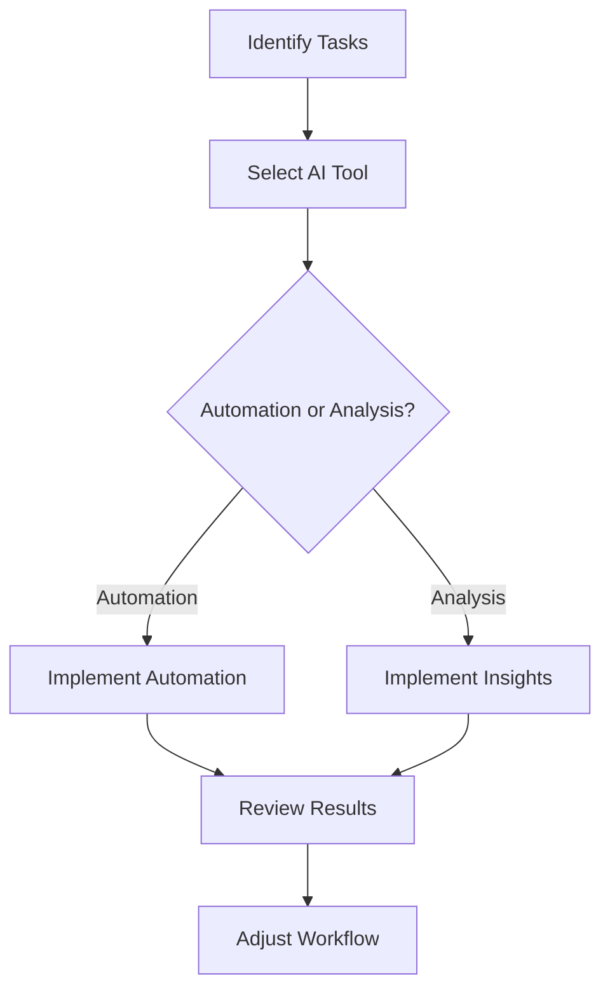

The Future of Work: AI Tools for Enhanced Productivity

In today's fast-paced world, the way we work is undergoing a significant transformation, largely driven by advancements in artificial intelligence (AI). AI tools for productivity are becoming increasingly sophisticated, empowering employees to optimize their workflows, enhance collaboration, and ultimately achieve more in less time. In this blog post, we'll explore some of the most effective AI tools available today, their practical applications, and how they can revolutionize your work experience.

## Understanding AI Tools for Productivity

AI tools for productivity leverage machine learning, natural language processing, and data analytics to streamline tasks and improve efficiency. From automating repetitive processes to providing insights that drive better decision-making, these tools are designed to help individuals and teams work smarter, not harder. 

### How AI Tools Enhance Productivity

1. **Automation of Repetitive Tasks**: AI tools can handle mundane tasks like data entry, scheduling, and email management, freeing up employees to focus on more strategic work.
  
2. **Data Analysis and Insights**: AI can sift through vast amounts of data to uncover trends and insights that humans might miss, enabling informed decision-making.
  
3. **Personalized Learning and Support**: Intelligent systems can adapt to individual preferences and learning styles, providing tailored resources that enhance skills and knowledge.

4. **Enhanced Collaboration**: AI-powered collaboration tools help teams communicate more effectively and manage projects seamlessly, regardless of location.

## Popular AI Tools for Productivity

The following table compares some of the most popular AI tools for productivity, highlighting their key features, pros, and cons.

<table>
    <tr>
        <th>Tool</th>
        <th>Key Features</th>
        <th>Pros</th>
        <th>Cons</th>
    </tr>
    <tr>
        <td>Zapier</td>
        <td>Automates workflows by connecting apps</td>
        <td>Easy to use, supports many apps</td>
        <td>Limited customization, may require premium for advanced features</td>
    </tr>
    <tr>
        <td>Notion</td>
        <td>All-in-one workspace for notes and tasks</td>
        <td>Highly customizable, excellent team collaboration</td>
        <td>Can be overwhelming for new users</td>
    </tr>
    <tr>
        <td>[Grammarly](https://www.grammarly.com/?ref=AFFILIATE_ID)</td>
        <td>Real-time grammar and style checking</td>
        <td>Improves writing quality, easy to use</td>
        <td>Limited functionality in free version</td>
    </tr>
    <tr>
        <td>Trello</td>
        <td>Project management with boards and cards</td>
        <td>Visual organization, great for teams</td>
        <td>Can be too simplistic for complex projects</td>
    </tr>
    <tr>
        <td>[Otter.ai](https://otter.ai/?ref=AFFILIATE_ID)</td>
        <td>AI-powered transcription services</td>
        <td>Accurate transcriptions, easy sharing</td>
        <td>Requires internet connection, limited editing features</td>
    </tr>
</table>

### Zapier: Automate Your Workflows

Zapier is a powerful automation tool that connects various apps and services, allowing you to create workflows called "Zaps." For instance, you can set up a Zap to automatically save email attachments from Gmail to your Dropbox. This not only saves time but also reduces the risk of forgetting important files.

#### Pros
- User-friendly interface
- Supports a wide range of apps
- Helps reduce manual data entry

#### Cons
- Limited customization options
- Advanced features may require a subscription

### Notion: Your All-in-One Workspace

Notion is a versatile workspace that combines note-taking, project management, and collaboration in one platform. Teams can create shared documents, manage tasks, and keep track of projects all in one place. For example, a marketing team could use Notion to brainstorm ideas, plan campaigns, and track progress.

#### Pros
- Highly customizable
- Excellent for team collaboration

#### Cons
- Can be overwhelming for new users

### Grammarly: Write with Confidence

[Grammarly](https://www.grammarly.com/?ref=AFFILIATE_ID) is an AI-powered writing assistant that helps users improve their writing by providing real-time grammar and style suggestions. Whether you’re drafting an email, creating a report, or writing a blog post, Grammarly can enhance your writing quality significantly.

#### Pros
- Improves writing clarity and style
- Easy to integrate with various platforms

#### Cons
- Limited functionality in the free version

### Trello: Organize Projects Visually

Trello is a project management tool that uses boards, lists, and cards to help teams organize tasks visually. For instance, a software development team can create boards for different projects, with cards for each task that can be moved through stages like "To Do," "In Progress," and "Done."

#### Pros
- Visual organization makes it easy to track tasks
- Great for team collaboration

#### Cons
- May be too simplistic for complex projects

### Otter.ai: Transcribe and Collaborate

[Otter.ai](https://otter.ai/?ref=AFFILIATE_ID) is an AI transcription service that transcribes spoken words into text in real time. It’s particularly useful for meetings, interviews, and lectures. For example, during a team meeting, Otter can provide an instant transcript that can be shared with all participants for reference.

#### Pros
- Accurate transcriptions
- Easy sharing and collaboration

#### Cons
- Requires an internet connection
- Limited editing features

## The Benefits of Implementing AI Tools for Productivity

Integrating AI tools into your work routine can lead to numerous benefits, including:

1. **Time Savings**: Automating repetitive tasks allows employees to focus on higher-value work, increasing overall productivity.
  
2. **Improved Accuracy**: AI tools can minimize human error in tasks such as data entry and analysis, leading to better outcomes.
  
3. **Enhanced Collaboration**: With real-time collaboration tools, teams can communicate more effectively and share information instantly.

4. **Better Decision-Making**: AI-driven insights can inform strategic decisions, helping businesses adapt to changing market conditions.

## Potential Challenges of AI Tools

While the advantages are numerous, there are also challenges to consider when implementing AI tools for productivity:

1. **Cost**: Some AI tools come with a hefty price tag, especially for businesses that need advanced features.

2. **Learning Curve**: Employees may require training to effectively use new AI tools, which can take time and resources.

3. **Data Privacy**: The use of AI tools often involves sharing sensitive data, raising concerns about privacy and security.

4. **Integration Issues**: Not all AI tools seamlessly integrate with existing systems, which can hinder productivity if not managed properly.

## Future Trends in AI Tools for Productivity

As technology continues to evolve, so will the capabilities of AI tools for productivity. Here are a few trends to watch:

- **Increased Personalization**: Future AI tools will likely offer even more personalized experiences, adapting to individual user needs and preferences.

- **Greater Integration**: Tools will become more interconnected, allowing for smoother workflows and data sharing across platforms.

- **Focus on Collaboration**: As remote work becomes more common, AI tools will increasingly prioritize collaboration features to support distributed teams.

- **Ethical AI**: There will be a growing emphasis on ethical AI practices, ensuring that tools are developed and used responsibly.

## Conclusion: Embrace the Future of Work with AI Tools

The future of work is undeniably intertwined with the rise of AI tools for productivity. By embracing these innovative solutions, businesses and individuals can enhance their efficiency, improve collaboration, and ultimately achieve greater success. 

So, are you ready to transform your workflow with AI tools? Start exploring the options available today and discover how they can empower you to work smarter and more effectively. 

### Call to Action

If you found this article helpful, don’t forget to share it with your colleagues and friends! Subscribe to our blog for more insights on AI tools and productivity, and stay ahead in this ever-evolving landscape of work.

## 関連記事

- [AI Agents: The Future of Personal Assistants in 2026](/posts/ai-agents-the-future-of-personal-assistants-in-2026/)
- [AI Automation: A Game Changer for Small Businesses](/posts/ai-automation-a-game-changer-for-small-businesses/)
- [AI Automation: The Key to Enhanced Business Efficiency](/posts/ai-automation-the-key-to-enhanced-business-efficiency/)
