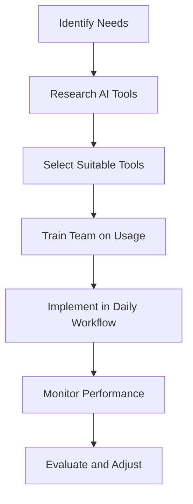

---

## The Future of Work: AI Tools You Need to Know

As we navigate through the rapid evolution of technology, AI tools are becoming increasingly critical in shaping the future of work. These tools not only enhance productivity but also facilitate smarter decision-making, streamline processes, and foster innovation. In this article, we will explore some of the most impactful AI tools available today and how they can transform your workflow.

### What Are AI Tools?

AI tools are software applications that utilize artificial intelligence to perform tasks that typically require human intelligence. These tasks might include data analysis, natural language processing, image recognition, and automation of repetitive tasks. By leveraging AI tools, businesses can reduce operational costs, enhance efficiency, and improve overall productivity. 

### Why AI Tools Matter for Your Workflow

AI tools have the potential to revolutionize the way we work. Here are several reasons why they matter:

1. **Enhanced Productivity**: AI tools can automate routine tasks, allowing employees to focus on more strategic initiatives.
2. **Data-Driven Insights**: With advanced data analytics, businesses can make informed decisions based on real-time insights.
3. **Improved Collaboration**: Many AI tools facilitate better communication and collaboration within teams.
4. **Cost Efficiency**: Automating tasks can lead to significant cost savings over time.

### Top AI Tools Transforming the Workplace

Let’s delve into some of the most impactful AI tools you should consider incorporating into your workflow.

#### 1. ChatGPT by OpenAI

**Overview**: [ChatGPT](https://chat.openai.com/?ref=AFFILIATE_ID) is a conversational AI tool that can assist with customer service, content generation, and brainstorming ideas. 

**Use Cases**:
- Customer support chatbots that provide 24/7 assistance.
- Content creators can use it for generating blog posts, social media content, or even scripts.

**Pros**:
- Highly versatile and easy to integrate into various applications.
- Can save time on repetitive writing tasks.

**Cons**:
- May produce inaccuracies or irrelevant content if not properly guided.
- Requires human oversight for quality assurance.

#### 2. Trello + Butler

**Overview**: Trello is a project management tool, and when combined with its automation feature, Butler, it becomes a powerful AI tool for enhancing productivity.

**Use Cases**:
- Automating repetitive tasks like moving cards or sending reminders.
- Setting up workflows that notify team members of task updates.

**Pros**:
- Streamlines project management and enhances team collaboration.
- User-friendly interface.

**Cons**:
- Automation features can be limited for complex projects.
- Requires some time to fully utilize the tool's capabilities.

#### 3. Grammarly

**Overview**: [Grammarly](https://www.grammarly.com/?ref=AFFILIATE_ID) is an AI-powered writing assistant that checks for grammatical errors, tone, and style.

**Use Cases**:
- Improving the quality of written communication in professional settings.
- Assisting non-native English speakers in crafting coherent texts.

**Pros**:
- Real-time feedback helps enhance writing skills.
- Integrates with various platforms such as email and word processors.

**Cons**:
- Premium features come at a cost.
- May not always understand context perfectly, leading to awkward suggestions.

### Comparison of AI Tools

Here’s a quick comparison table of the AI tools mentioned above:

<table>
  <tr>
    <th>Tool</th>
    <th>Use Cases</th>
    <th>Pros</th>
    <th>Cons</th>
  </tr>
  <tr>
    <td>ChatGPT</td>
    <td>Customer service, content generation</td>
    <td>Versatile, time-saving</td>
    <td>May produce inaccuracies</td>
  </tr>
  <tr>
    <td>Trello + Butler</td>
    <td>Project management, task automation</td>
    <td>Streamlines collaboration</td>
    <td>Limited automation for complex tasks</td>
  </tr>
  <tr>
    <td>Grammarly</td>
    <td>Writing enhancement</td>
    <td>Real-time feedback</td>
    <td>Premium features costly</td>
  </tr>
</table>

### A Workflow for Implementing AI Tools

To effectively integrate AI tools into your business operations, consider the following workflow:

### The Future of AI Tools

The landscape of AI tools is rapidly changing, and we can expect continuous advancements. Emerging technologies such as machine learning and natural language processing will further enhance the capabilities of AI tools, making them indispensable in various sectors. 

### Conclusion

AI tools are redefining productivity in the workplace, allowing teams to focus on strategic tasks rather than mundane ones. By adopting tools like ChatGPT, Trello + Butler, and Grammarly, you can significantly enhance your operational efficiency and improve the quality of your work. 

Are you ready to step into the future of work with AI tools? Explore these resources and start transforming your workflow today!

### Call to Action

Don’t let your business fall behind. Explore the power of AI tools and choose the ones that fit your needs. Start implementing today and watch your productivity soar! If you found this article helpful, share it with your colleagues or leave a comment below with your thoughts on AI tools!

## 関連記事

- [AI Agents: The Future of Personal Assistants in 2026](/posts/ai-agents-the-future-of-personal-assistants-in-2026/)
- [AI Automation: A Game Changer for Small Businesses](/posts/ai-automation-a-game-changer-for-small-businesses/)
- [AI Automation: The Key to Enhanced Business Efficiency](/posts/ai-automation-the-key-to-enhanced-business-efficiency/)
