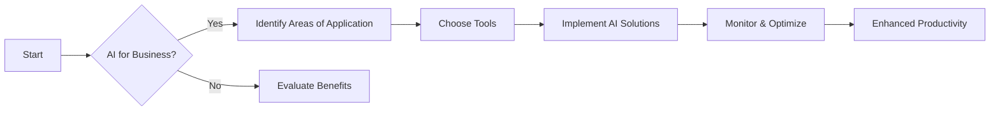

---

# The Future of Work: Embracing AI for Enhanced Productivity

The landscape of modern business is rapidly transforming. With the advent of artificial intelligence (AI), organizations are finding innovative ways to streamline operations, boost productivity, and redefine the workplace. In this blog post, we will explore how AI for business is not just a buzzword but a powerful tool that can enhance productivity in various sectors. 

## Understanding AI in Business

Before diving into the practical applications of AI, it's essential to understand what AI means in the context of business. AI refers to the simulation of human intelligence in machines programmed to think and learn like humans. It encompasses various technologies, including machine learning, natural language processing, and robotics, among others.

### The Importance of AI for Business

Integrating AI in business processes can lead to significant improvements in efficiency and productivity. Here are a few reasons why businesses should consider adopting AI:

- **Data-Driven Decision Making**: AI tools can analyze vast amounts of data quickly, providing insights that help businesses make informed decisions.
- **Automation of Repetitive Tasks**: By automating mundane tasks, employees can focus on more strategic initiatives.
- **Enhanced Customer Experience**: AI can personalize customer interactions, leading to improved satisfaction and loyalty.

## Practical Applications of AI for Enhanced Productivity

Let's delve into some practical examples of how AI is being used to enhance productivity in various business functions.

### 1. Customer Support

AI-powered chatbots are revolutionizing customer service by providing instant responses to customer inquiries. These bots can handle a variety of tasks, from answering frequently asked questions to processing orders.

**Example**: Companies like Zendesk and Drift offer AI chatbots that can engage with customers 24/7, reducing the need for a large customer support team and ensuring timely responses.

**Pros**:
- Reduces response times
- Available around the clock

**Cons**:
- May lack human empathy
- Can struggle with complex queries

### 2. Project Management

AI tools can assist in project management by analyzing project data and predicting outcomes. These tools can help determine the best course of action based on historical data.

**Example**: Applications like Asana and Trello now incorporate AI-driven features to help teams prioritize tasks and allocate resources more effectively.

**Pros**:
- Improved resource allocation
- Enhanced team collaboration

**Cons**:
- Requires training to utilize effectively
- Dependence on data quality

### 3. Marketing Automation

AI can significantly enhance marketing efforts by analyzing consumer behavior and optimizing campaigns. AI tools can segment audiences, personalize content, and even predict future buying behaviors.

**Example**: Platforms like HubSpot and Marketo leverage AI to automate email marketing campaigns, ensuring that the right message reaches the right audience at the right time.

**Pros**:
- Increased engagement rates
- Better return on investment (ROI)

**Cons**:
- Potential for data privacy concerns
- Requires continuous monitoring

### 4. Human Resources

In HR, AI tools can streamline recruitment processes by screening resumes and identifying the best candidates for a job. This saves time and reduces bias in hiring.

**Example**: Tools like HireVue use AI to analyze candidates' video interviews, providing insights into their suitability for the position.

**Pros**:
- Faster hiring processes
- Reduced bias in selection

**Cons**:
- Risk of over-reliance on technology
- May miss nuances in candidate evaluation

## Comparison of AI Tools for Business

To help you make informed decisions, here's a comparison of popular AI tools that can enhance productivity in different business areas:

<table>
  <tr>
    <th>Tool</th>
    <th>Functionality</th>
    <th>Pros</th>
    <th>Cons</th>
  </tr>
  <tr>
    <td>Zendesk</td>
    <td>Customer support chatbot</td>
    <td>24/7 availability, quick response</td>
    <td>Lacks human touch</td>
  </tr>
  <tr>
    <td>Asana</td>
    <td>Project management</td>
    <td>Task prioritization, collaboration</td>
    <td>Learning curve</td>
  </tr>
  <tr>
    <td>HubSpot</td>
    <td>Marketing automation</td>
    <td>Personalization, increased engagement</td>
    <td>Data privacy concerns</td>
  </tr>
  <tr>
    <td>HireVue</td>
    <td>Recruitment</td>
    <td>Speedy hiring, bias reduction</td>
    <td>Over-reliance on AI</td>
  </tr>
</table>

## The Future of AI in Business

As we look to the future, AI will continue to evolve, bringing new capabilities and innovations. The integration of AI in business processes will not only enhance productivity but also reshape the way organizations operate. 

### The Role of Human Oversight

While AI offers numerous benefits, it is crucial to maintain human oversight. AI should complement human abilities, not replace them. Businesses must focus on training employees to work alongside AI tools effectively, ensuring that the technology serves as an enhancement rather than a hindrance.

## Embracing AI for a Productive Future

In conclusion, AI for business is not just a trend; it’s a transformative force that can significantly enhance productivity across various sectors. By embracing AI, companies can streamline operations, improve customer interactions, and make data-driven decisions that propel them towards success.

### Call to Action

Are you ready to leverage AI for enhanced productivity in your business? Explore the tools mentioned above and start integrating AI into your processes today. The future of work is here, and it's time to take advantage of the opportunities that AI presents!

Embrace the future of work and become a leader in your industry by integrating AI into your business strategy!