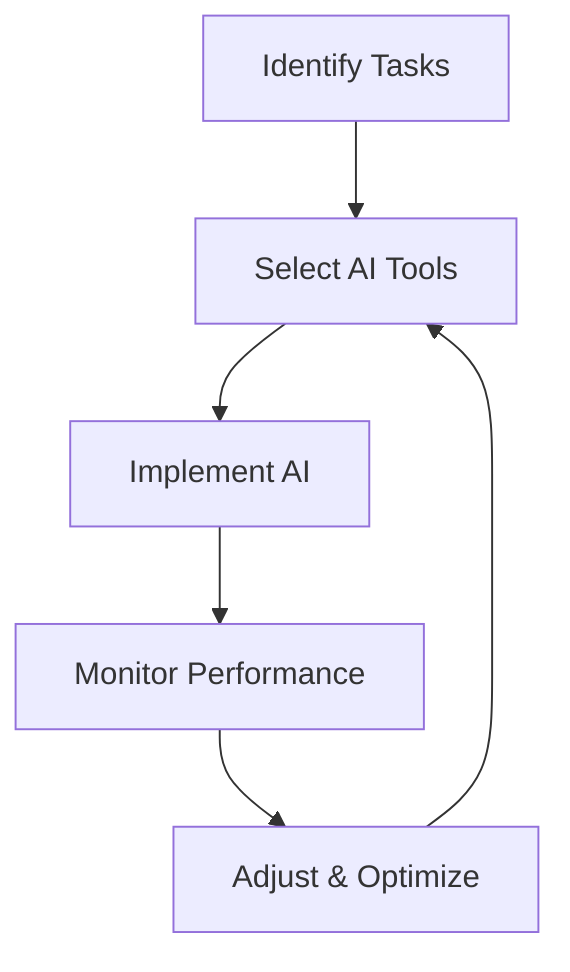

---

The Impact of AI on Small Business Productivity in 2026

As we step into 2026, the landscape of small businesses is undergoing a revolutionary transformation thanks to the integration of artificial intelligence (AI) tools. In a world where efficiency and productivity are paramount, AI is not just a buzzword; it’s a game-changer. This blog post will explore the various ways AI is enhancing productivity in small businesses, practical examples, and what you can do to harness these advancements.

### Understanding AI and Its Role in Small Business Productivity

AI refers to the simulation of human intelligence processes by machines, particularly computer systems. These processes include learning, reasoning, and self-correction. For small businesses, AI can significantly enhance productivity by streamlining operations, improving customer service, and aiding decision-making processes.

Imagine having a virtual assistant that can handle routine tasks such as scheduling, data entry, and even responding to customer inquiries. This is the reality for many small businesses today, thanks to AI tools designed to simplify operations. 

### Key Areas Where AI is Boosting Small Business Productivity

#### 1. Automating Routine Tasks

One of the most immediate benefits of AI in small business operations is automation. By leveraging AI tools, small business owners can automate repetitive tasks that consume valuable time. 

**Practical Example:** A small e-commerce store can use AI chatbots to manage customer queries. This not only reduces the workload for employees but also ensures that customers receive immediate responses, enhancing customer satisfaction.

#### 2. Enhanced Decision-Making

AI can analyze large volumes of data far more efficiently than humans, allowing business owners to make informed decisions based on real-time insights. 

**Practical Example:** A small restaurant can utilize AI to analyze customer preferences and sales trends, helping them decide on menu changes or promotional offers. This data-driven approach ensures that changes align with customer demands and boost sales.

#### 3. Improved Customer Engagement

AI tools can help small businesses personalize customer interactions, leading to higher engagement and satisfaction levels. By analyzing customer behavior, AI can suggest products, tailor marketing messages, and even predict future purchases.

**Practical Example:** A local boutique can use AI-driven recommendation engines to suggest outfits based on previous purchases or browsing history, enhancing the shopping experience and increasing sales.

### Pros and Cons of AI Tools for Small Businesses

While the benefits of AI are vast, it’s essential to consider the potential downsides.

| **Pros**                           | **Cons**                             |
|------------------------------------|--------------------------------------|
| Increased efficiency and productivity | Initial setup costs can be high      |
| Enhanced customer service            | Dependence on technology              |
| Data-driven insights for decision making | Potential job displacement for some roles |
| Personalization of customer interactions | Security concerns regarding data privacy |

### Common AI Tools for Small Business Productivity

To help you better understand the available options, here’s a comparison of popular AI tools that can enhance small business productivity:

<table>
  <tr>
    <th>Tool</th>
    <th>Functionality</th>
    <th>Best For</th>
    <th>Pricing</th>
  </tr>
  <tr>
    <td>Zapier</td>
    <td>Automation of workflows</td>
    <td>Integrating apps and services</td>
    <td>Starts at $19.99/month</td>
  </tr>
  <tr>
    <td>HubSpot</td>
    <td>CRM and marketing automation</td>
    <td>Customer relationship management</td>
    <td>Free tier available, paid plans start at $45/month</td>
  </tr>
  <tr>
    <td>Zoho</td>
    <td>Comprehensive business management</td>
    <td>All-in-one business solution</td>
    <td>Starts at $12/user/month</td>
  </tr>
  <tr>
    <td>[ChatGPT](https://chat.openai.com/?ref=AFFILIATE_ID)</td>
    <td>Natural language processing</td>
    <td>Customer support and content creation</td>
    <td>Free tier available, paid plans start at $20/month</td>
  </tr>
</table>

### The Future of AI in Small Business Productivity

As we look ahead, the potential for AI to further enhance small business productivity is immense. With advancements in machine learning and data analytics, the tools available will become even more sophisticated. 

**Mermaid Diagram: AI Integration Workflow**

This diagram illustrates a simple workflow for integrating AI into small business operations. By identifying tasks that can be automated, selecting the right tools, implementing them, and continually monitoring their performance, small businesses can optimize their productivity.

### Conclusion: Embrace AI for Enhanced Productivity

In conclusion, the impact of AI on small business productivity in 2026 is undeniable. From automating mundane tasks to providing deep data insights, AI tools offer significant advantages for small business owners looking to enhance efficiency and customer satisfaction.

If you haven’t yet explored how AI can fit into your business strategy, now is the time to start. Don't get left behind in this technological revolution. Investigate the tools mentioned, assess your business needs, and take actionable steps to integrate AI into your operations.

**Call to Action:** Ready to boost your small business productivity with AI? Explore the tools we've discussed today and start your journey toward a more efficient and profitable business. Visit AI Tools Lab for more insights and resources on leveraging AI for your business success!

## 関連記事

- [AI Agents: The Future of Personal Assistants in 2026](/posts/ai-agents-the-future-of-personal-assistants-in-2026/)
- [AI Automation: A Game Changer for Small Businesses](/posts/ai-automation-a-game-changer-for-small-businesses/)
- [AI Automation: The Key to Enhanced Business Efficiency](/posts/ai-automation-the-key-to-enhanced-business-efficiency/)
