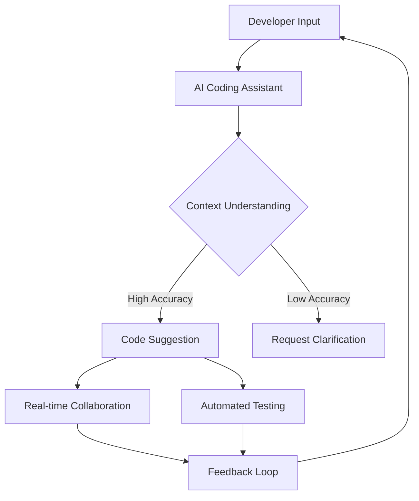

---

## The Rise of AI Coding Assistants: What to Expect in 2026

The world of software development is evolving at an unprecedented pace, largely thanks to the emergence of AI coding assistants. These tools, powered by sophisticated machine learning algorithms, are reshaping how developers approach coding tasks. But what does the future hold for AI coding assistants by 2026? In this blog post, we’ll explore the trends, advancements, and potential impact these tools will have on the software development industry.

### What Are AI Coding Assistants?

AI coding assistants are software tools designed to help developers write code more efficiently and effectively. They utilize natural language processing (NLP) and machine learning to provide suggestions, automate repetitive tasks, and even debug code. Popular AI coding assistants today include GitHub Copilot, Tabnine, and Kite, each offering unique functionalities.

### The Evolution of AI Coding Assistants

Over the past few years, AI coding assistants have made significant strides. Initially, they functioned mainly as code completion tools. Fast forward to 2026, and we can expect these assistants to become even more sophisticated, integrating seamlessly into the developer workflow.

#### Key Trends to Watch:

1. **Enhanced Natural Language Understanding**: As NLP technologies advance, AI coding assistants will better understand context and intent. This means developers can communicate with them in more conversational tones, making coding feel less technical.

2. **Real-time Collaboration**: AI coding assistants will increasingly facilitate collaboration among developers, allowing teams to work together in real-time, regardless of their physical locations.

3. **Continuous Learning**: By 2026, AI coding assistants will likely incorporate continuous learning capabilities, adapting to a developer's unique coding style and preferences over time.

4. **Integration with Other Tools**: Expect AI coding assistants to integrate more deeply with project management tools, CI/CD pipelines, and version control systems, streamlining the development process.

5. **Automated Testing and Debugging**: Future assistants will likely include robust testing frameworks, enabling them to identify bugs and suggest fixes automatically.

### Use Cases for AI Coding Assistants

To appreciate the potential of AI coding assistants, let’s examine some practical use cases:

- **Code Generation**: Imagine writing a function to sort a list without needing to remember the syntax. An AI coding assistant can generate that code snippet based on a simple prompt.
  
- **Bug Fixing**: When encountering an error message, developers can ask their AI assistant for troubleshooting tips or even let it suggest code corrections.

- **Learning and Onboarding**: New developers can use AI coding assistants as a learning tool, receiving real-time feedback on their code and explanations of concepts.

- **Documentation Generation**: AI coding assistants can automate the creation of documentation based on the code, saving developers hours of manual work.

### Pros and Cons of AI Coding Assistants

While AI coding assistants offer numerous benefits, they are not without drawbacks. Here’s a breakdown of the pros and cons:

| Pros                                  | Cons                                    |
|---------------------------------------|-----------------------------------------|
| Increases coding efficiency            | Dependence on AI for basic coding tasks |
| Reduces repetitive work               | May generate incorrect or inefficient code |
| Supports learning and development      | Limited understanding of complex problems |
| Enhances collaboration                 | Privacy and security concerns            |

### The Future of AI Coding Assistants: What to Expect in 2026

In 2026, we can anticipate several exciting developments in the realm of AI coding assistants:

#### 1. **Personalized Coding Experiences**

AI coding assistants will likely learn from individual developers' behaviors, adapting their suggestions to improve productivity. For example, if a developer frequently uses certain libraries or frameworks, the assistant will prioritize suggestions relevant to those tools.

#### 2. **Integration with Augmented Reality (AR)**

Imagine coding in an augmented reality environment where your AI assistant highlights potential code flaws in real-time as you write. This could transform the coding experience, making it more interactive and immersive.

#### 3. **Increased Accessibility**

AI coding assistants will make programming more accessible to non-developers. For instance, marketers or project managers could use these tools to create scripts or automate tasks without extensive coding knowledge.

#### 4. **Ethical Coding Practices**

As AI coding assistants become more prevalent, the focus will shift to ethical coding practices. Developers will need to ensure that the code generated promotes inclusivity and doesn’t inadvertently perpetuate biases.

### Visualizing the Future of AI Coding Assistants

To better understand the evolution and future of AI coding assistants, here’s a diagram illustrating the workflow of an ideal AI coding assistant in 2026:

### Conclusion: Embrace the AI Revolution

As we look ahead to 2026, it’s clear that AI coding assistants will play a pivotal role in shaping the software development landscape. With their potential to enhance productivity, streamline processes, and foster collaboration, these tools will become indispensable resources for both novice and experienced developers alike.

Are you ready to embrace the future of coding? Stay ahead of the curve by exploring the latest AI coding assistants available today, and start integrating them into your workflow. The future of programming is here—don’t get left behind!

### Call to Action

If you found this article informative, share it with your fellow developers and tech enthusiasts! Explore our blog for more insights on AI tools and productivity, and subscribe for the latest updates in the tech world. Your coding journey is about to get a whole lot easier!