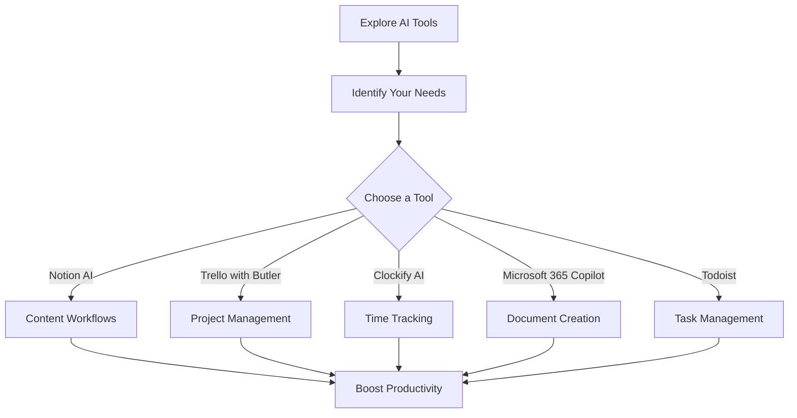

---

# Top 5 AI Tools to Boost Your Productivity in 2026

In today's fast-paced digital world, the pressure to stay productive has never been greater. Enter AI productivity tools—innovative technologies designed to streamline your tasks, enhance collaboration, and optimize your workflow. As we look towards 2026, it's essential to know which tools stand out in this rapidly evolving landscape. This guide will explore the top five AI productivity tools that can significantly boost your productivity and help you make the most out of your time.

## 1. Notion AI

### What is Notion AI?

Notion AI is an all-in-one workspace that integrates notes, tasks, databases, and project management. With AI capabilities, it enhances these features by automating repetitive tasks, generating content, and organizing information seamlessly.

### Use Cases

- **Content Generation**: Need to draft an article? Notion AI can help generate outlines or entire sections based on your prompts.
- **Project Management**: Automatically update project statuses and remind team members of deadlines using AI-generated task lists.

### Pros and Cons

| Pros | Cons |
|------|------|
| Intuitive interface | Some features may require a learning curve |
| Versatile use cases | Pricing can get steep for larger teams |

## 2. Trello with Butler AI

### What is Trello with Butler AI?

Trello is a popular project management tool that uses boards, lists, and cards to organize tasks. Butler, an AI-powered automation tool within Trello, takes this a step further by automating repetitive tasks.

### Use Cases

- **Task Automation**: Automatically move cards between lists based on due dates or project milestones.
- **Custom Alerts**: Set up notifications for team members when a task is updated or a deadline is approaching.

### Pros and Cons

| Pros | Cons |
|------|------|
| Highly customizable | Automation features are limited on the free plan |
| Easy to use | Limited reporting features |

## 3. Clockify AI

### What is Clockify AI?

Clockify is a time tracking tool that helps teams and individuals understand how much time they spend on tasks. With its AI features, it can analyze your time usage and suggest optimizations.

### Use Cases

- **Time Analysis**: Clockify can automatically categorize tasks and provide insights into where you can save time.
- **Productivity Reports**: Generate weekly reports that show your most productive hours and tasks.

### Pros and Cons

| Pros | Cons |
|------|------|
| Free tier available | Advanced features require a paid subscription |
| Detailed analytics | Mobile app can be glitchy at times |

## 4. Microsoft 365 Copilot

### What is Microsoft 365 Copilot?

Microsoft 365 Copilot is an AI assistant integrated into Microsoft Office applications like Word, Excel, and PowerPoint. It uses natural language processing to help users draft documents, analyze data, and create presentations.

### Use Cases

- **Document Drafting**: Type a few keywords, and Copilot can generate entire paragraphs or formatting suggestions.
- **Data Analysis**: In Excel, it can analyze datasets and provide visualizations or insights with ease.

### Pros and Cons

| Pros | Cons |
|------|------|
| Seamless integration with Office | Requires a Microsoft 365 subscription |
| Powerful AI capabilities | Can be overwhelming for new users |

## 5. Todoist with AI Features

### What is Todoist?

Todoist is a task management app that helps users keep track of their to-do lists and projects. The AI features allow for smart scheduling and task prioritization.

### Use Cases

- **Smart Scheduling**: Todoist can suggest the best times to complete tasks based on your habits and deadlines.
- **Priority Levels**: Automatically prioritize tasks based on due dates and importance.

### Pros and Cons

| Pros | Cons |
|------|------|
| User-friendly interface | Limited features in the free version |
| Cross-platform availability | Some users may find it basic compared to competitors |

## Comparing the Top AI Productivity Tools

To help you make an informed decision, here's a quick comparison of the features and pricing of the tools mentioned above:

<table>
  <tr>
    <th>Tool</th>
    <th>Main Features</th>
    <th>Pricing</th>
  </tr>
  <tr>
    <td>Notion AI</td>
    <td>Content generation, project management, task automation</td>
    <td>Free with limited features; paid plans start at $8/month</td>
  </tr>
  <tr>
    <td>Trello with Butler AI</td>
    <td>Task automation, custom alerts</td>
    <td>Free with limited automation; paid plans start at $10/month</td>
  </tr>
  <tr>
    <td>Clockify AI</td>
    <td>Time tracking, productivity reports</td>
    <td>Free with basic features; paid plans start at $9/month</td>
  </tr>
  <tr>
    <td>Microsoft 365 Copilot</td>
    <td>Document drafting, data analysis</td>
    <td>Requires Microsoft 365 subscription (starts at $6/month)</td>
  </tr>
  <tr>
    <td>Todoist</td>
    <td>Smart scheduling, task prioritization</td>
    <td>Free version available; premium plans start at $3/month</td>
  </tr>
</table>

## Conclusion: Embrace AI for Enhanced Productivity

The tools mentioned above represent the forefront of AI productivity tools for 2026. Each one has unique features and advantages that can help you maximize your efficiency at work or in your personal life. By integrating these tools into your workflow, you can automate mundane tasks, gain insights into your productivity, and ultimately focus on what matters most.

Are you ready to take the leap and adopt these AI productivity tools? Start exploring them today and see how they can transform your daily routine. Share your experiences or let us know if you have other favorites in the comments below!

---

By leveraging AI productivity tools, you're not just keeping pace with the demands of modern work—you're setting the pace. Start your journey towards enhanced productivity today!