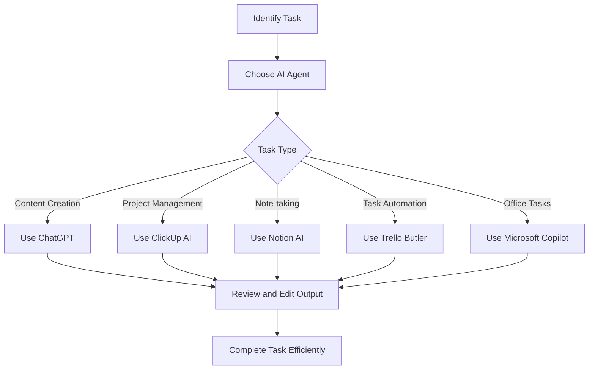

---

# Top AI Agents Revolutionizing Productivity in 2026

In recent years, the landscape of productivity tools has evolved dramatically, thanks to the advent of artificial intelligence (AI) agents. As we move into 2026, these AI agents are not just enhancing our efficiency; they are fundamentally changing how we work. Whether you’re a freelancer juggling multiple clients or a project manager overseeing a large team, AI agents are here to streamline your workflow and help you reach your goals faster.

## What Are AI Agents?

AI agents are sophisticated software programs designed to perform tasks that typically require human intelligence. They can analyze data, automate repetitive processes, and even make decisions based on predefined algorithms or learning from past behaviors. In the realm of productivity, AI agents can assist with a variety of tasks, from scheduling meetings to providing data-driven insights.

### Why Are AI Agents Important for Productivity?

The integration of AI agents into our daily workflows offers several compelling benefits:

- **Time-Saving**: By automating routine tasks, AI agents free up valuable time, allowing you to focus on higher-priority work.
- **Enhanced Decision-Making**: AI agents can analyze large data sets and provide insights that inform better decision-making.
- **Improved Collaboration**: Many AI agents are designed to enhance team communication and collaboration, breaking down silos and fostering a more integrated work environment.
- **Scalability**: As your tasks grow, AI agents can easily adapt, allowing for seamless scaling of your operations.

## Top AI Agents for Productivity in 2026

As we explore the top AI agents making waves in the productivity sector this year, we’ll look at their features, pros and cons, and how they can be applied in real-world scenarios.

### 1. ChatGPT by OpenAI

ChatGPT has become a go-to AI agent for many professionals. Its natural language processing capabilities make it ideal for drafting emails, generating reports, and even brainstorming ideas.

#### Use Case:
Imagine you need to write a marketing proposal. Instead of starting from scratch, you can prompt ChatGPT with your requirements, and it will generate a comprehensive outline or even a full draft.

#### Pros:
- User-friendly interface
- Excellent at generating human-like text
- Versatile applications across industries

#### Cons:
- May require fine-tuning for accuracy
- Limited context retention in longer conversations

### 2. Notion AI

Notion, a popular workspace tool, has integrated AI capabilities to enhance its already robust platform. Notion AI helps users summarize notes, generate task lists, and even suggest content improvements.

#### Use Case:
You can utilize Notion AI to transform meeting notes into actionable tasks automatically, ensuring that nothing falls through the cracks.

#### Pros:
- Seamless integration within the Notion environment
- Great for team collaboration
- Supports a variety of content types

#### Cons:
- Limited functionality outside Notion
- Requires a Notion subscription for full features

### 3. Trello Automation (Butler)

Trello's Butler automation feature allows users to create rules that automate repetitive tasks within the Trello boards. This AI agent helps in managing workflows effortlessly.

#### Use Case:
Set up Butler to automatically move cards to specific lists based on due dates, saving you the hassle of manual updates.

#### Pros:
- Highly customizable automation
- Easy to implement
- Reduces manual workload

#### Cons:
- Limited to Trello's environment
- May require initial setup time

### 4. Microsoft Copilot

Microsoft Copilot integrates seamlessly with Microsoft 365 applications, offering AI-driven suggestions and insights directly within tools like Word, Excel, and Outlook.

#### Use Case:
In Excel, Copilot can analyze data trends and suggest graphs or pivot tables, making complex data analysis more manageable.

#### Pros:
- Deep integration with Microsoft 365
- Enhances existing tools
- Strong data analysis capabilities

#### Cons:
- Requires a Microsoft 365 subscription
- May not be as intuitive for new users

### 5. ClickUp AI

ClickUp has added AI features to its project management platform, allowing users to generate status reports, create tasks from conversations, and summarize project updates.

#### Use Case:
During a project meeting, you can use ClickUp AI to take notes and automatically generate tasks based on the discussion points.

#### Pros:
- Comprehensive project management tool
- Supports collaboration across teams
- Offers diverse AI functionalities

#### Cons:
- Can be overwhelming for new users due to feature richness
- Requires learning curve

## Comparison of AI Agents for Productivity

Here’s a quick comparison table to help you evaluate these AI agents based on key features:

<table>
  <tr>
    <th>AI Agent</th>
    <th>Best For</th>
    <th>Key Features</th>
    <th>Pricing</th>
  </tr>
  <tr>
    <td>ChatGPT</td>
    <td>Content Creation</td>
    <td>Text generation, brainstorming</td>
    <td>Free with limitations; Paid plans available</td>
  </tr>
  <tr>
    <td>Notion AI</td>
    <td>Note-taking and Task Management</td>
    <td>Summarization, content suggestions</td>
    <td>Subscription required</td>
  </tr>
  <tr>
    <td>Trello Automation</td>
    <td>Task Management</td>
    <td>Custom automation rules</td>
    <td>Free with pro features</td>
  </tr>
  <tr>
    <td>Microsoft Copilot</td>
    <td>Office Productivity</td>
    <td>Insights, suggestions, automation</td>
    <td>Requires Microsoft 365 subscription</td>
  </tr>
  <tr>
    <td>ClickUp AI</td>
    <td>Project Management</td>
    <td>Status updates, task generation</td>
    <td>Free with paid upgrades</td>
  </tr>
</table>

## Workflow Integration of AI Agents

To illustrate how these AI agents can fit into your productivity workflow, consider the following diagram:

## Conclusion

The rise of AI agents in 2026 marks a significant turning point for productivity. These tools are designed to help us work smarter, not harder. By integrating AI into your daily operations, you can enhance efficiency, reduce repetitive tasks, and ultimately improve your overall productivity.

As you consider which AI agent fits your needs best, take the time to explore their unique features, pros, and cons. The right choice can revolutionize your workflow and lead you to greater success.

### Call to Action

Ready to boost your productivity with AI agents? Start by trying out one of the tools mentioned in this article today! Explore their features, see which one resonates with your workflow, and take the first step towards a more efficient future. Don’t forget to share your experiences in the comments below!