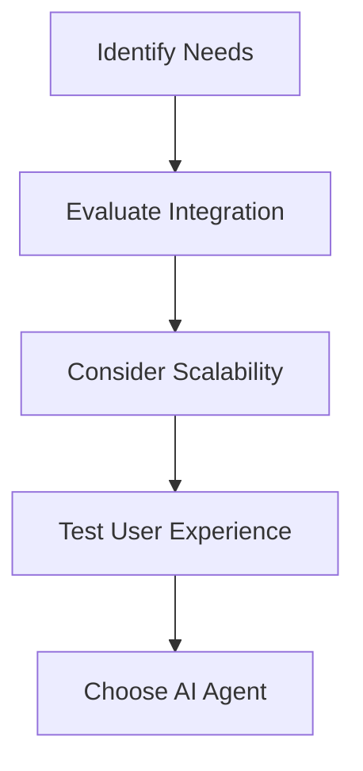

### Top AI Agents Transforming Workplace Productivity in 2026

As we move into 2026, the workplace landscape is rapidly evolving, influenced heavily by emerging technologies. Among these, AI agents are becoming pivotal in enhancing workplace productivity. From automating mundane tasks to facilitating seamless collaboration, AI agents are transforming how teams operate and interact. In this blog post, we will explore some of the most effective AI agents that are changing the game for productivity in various industries.

### What Are AI Agents?

AI agents are sophisticated software programs designed to perform tasks autonomously or semi-autonomously, leveraging artificial intelligence to learn from data and make decisions. These agents can handle a variety of functions, including scheduling meetings, sending reminders, analyzing data, and even engaging in customer service. Their ability to operate without human intervention makes them invaluable for increasing efficiency in the workplace.

### Why Focus on AI Agents for Productivity?

The primary goal of adopting AI agents in the workplace is to enhance productivity. They can:

- **Automate Repetitive Tasks**: Daily tasks such as data entry or email sorting can be automated, saving employees valuable time.
- **Enhance Decision-Making**: AI agents analyze vast amounts of data quickly, providing insights that aid in making informed decisions.
- **Facilitate Collaboration**: Many AI agents are designed to improve communication within teams, ensuring everyone stays on the same page.
- **Support Personalization**: They can tailor workflows and recommendations based on individual user needs and preferences.

### Top AI Agents in 2026

Let’s take a closer look at some of the top AI agents that are making waves in workplace productivity in 2026.

#### 1. **ChatGPT Pro**

[ChatGPT](https://chat.openai.com/?ref=AFFILIATE_ID) Pro, an advanced version of the popular conversational AI by OpenAI, is designed to assist in various communication tasks. It can draft emails, summarize documents, and even serve as a virtual assistant for customer inquiries.

**Pros:**
- Highly versatile and capable of handling diverse communication tasks.
- Can learn and adapt to the user's style, improving over time.

**Cons:**
- May require supervision to ensure accuracy, particularly in sensitive communications.
- Limited understanding of nuanced or highly specialized topics.

#### 2. **Trello AI Assistant**

Trello has integrated an AI assistant to help teams manage projects more efficiently. This AI agent can analyze project progress and suggest optimal task allocations based on team members’ workloads.

**Pros:**
- Enhances project visibility and accountability.
- Provides personalized task recommendations.

**Cons:**
- Requires a learning curve for optimal utilization.
- Limited to users familiar with the Trello platform.

#### 3. **Zapier AI**

Zapier has taken automation to the next level with its AI-driven features. It allows users to create complex workflows that connect different applications, automating repetitive tasks without any coding knowledge.

**Pros:**
- Extremely user-friendly with a drag-and-drop interface.
- Supports integration with thousands of apps.

**Cons:**
- Complex workflows may become cumbersome and challenging to manage.
- Pricing can escalate with increased usage.

#### 4. **Notion AI**

[Notion AI](https://www.notion.so/product/ai?ref=AFFILIATE_ID) is revolutionizing note-taking and documentation. It provides smart suggestions for content creation, helping users generate ideas and organize their thoughts more effectively.

**Pros:**
- Enhances creativity and organization in documentation.
- Intuitive interface that integrates seamlessly with existing Notion features.

**Cons:**
- May not be suitable for users who prefer traditional documentation methods.
- Full potential requires familiarity with Notion’s ecosystem.

### Comparison of AI Agents for Productivity

Here’s a quick comparison of the AI agents discussed above, highlighting their functionalities, pros, and cons:

<table>
  <tr>
    <th>AI Agent</th>
    <th>Main Functionality</th>
    <th>Pros</th>
    <th>Cons</th>
  </tr>
  <tr>
    <td>[ChatGPT](https://chat.openai.com/?ref=AFFILIATE_ID) Pro</td>
    <td>Communication and drafting</td>
    <td>Versatile, adaptive learning</td>
    <td>Requires supervision</td>
  </tr>
  <tr>
    <td>Trello AI Assistant</td>
    <td>Project management</td>
    <td>Visibility, personalized tasking</td>
    <td>Learning curve</td>
  </tr>
  <tr>
    <td>Zapier AI</td>
    <td>Workflow automation</td>
    <td>User-friendly, app integration</td>
    <td>Complexity in workflows</td>
  </tr>
  <tr>
    <td>[Notion AI](https://www.notion.so/product/ai?ref=AFFILIATE_ID)</td>
    <td>Note-taking and documentation</td>
    <td>Enhances creativity, organization</td>
    <td>Requires Notion familiarity</td>
  </tr>
</table>

### How to Choose the Right AI Agent for Your Workplace

When selecting an AI agent to enhance productivity, consider the following factors:

- **Identify Your Needs**: Determine the specific tasks you want to automate or improve.
- **Evaluate Integration**: Ensure that the AI agent can seamlessly integrate with your existing tools and software.
- **Consider Scalability**: Choose a solution that can grow with your organization’s needs.
- **Test the User Experience**: Opt for tools with intuitive interfaces that your team can easily adapt to.

### The Future of AI Agents in Workplace Productivity

As we look to the future, AI agents will continue to evolve, becoming even more capable and integral to workplace productivity. With advancements in machine learning and natural language processing, these agents will be able to handle increasingly complex tasks, further freeing up human workers to focus on higher-value activities.

### Conclusion

AI agents are undeniably transforming the workplace landscape, making it more efficient and productive. Whether you’re looking to streamline communication, enhance project management, or automate routine tasks, there’s an AI agent out there that can meet your needs. 

So, are you ready to embrace the future of workplace productivity with AI agents? Explore these tools and see how they can revolutionize your organization!

### Call to Action

Don’t get left behind in the productivity revolution! Start exploring AI agents today and take the first step toward a more efficient workplace. Share your thoughts or experiences with these tools in the comments below!

## 関連記事

- [Boosting Productivity with AI Agents in 2026](/posts/boosting-productivity-with-ai-agents-in-2026/)
- [Enhancing Productivity with AI Agents in 2026](/posts/enhancing-productivity-with-ai-agents-in-2026/)
- [Harnessing AI Agents for Enhanced Workplace Productivity](/posts/harnessing-ai-agents-for-enhanced-workplace-productivity/)
