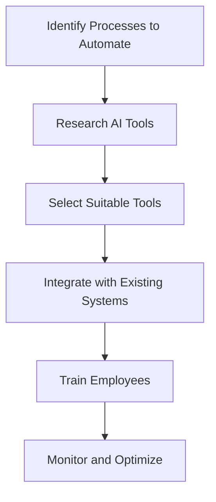

---

# Top AI Automation Strategies for Small Businesses

In today’s fast-paced business environment, small businesses face unique challenges that require innovative solutions to stay competitive. One of the most effective ways to enhance efficiency and productivity is through AI automation strategies. In this blog post, we will dive deep into various AI automation strategies tailored for small businesses, offering practical examples and insights to help you implement these strategies effectively.

## Understanding AI Automation

Before we explore specific strategies, let’s clarify what AI automation means. AI automation refers to the use of artificial intelligence technologies to automate repetitive tasks and processes, allowing businesses to focus on higher-value activities. By leveraging AI, small businesses can streamline operations, reduce costs, and improve customer experience.

## Why Small Businesses Should Embrace AI Automation

The adoption of AI automation strategies offers several advantages for small businesses, including:

- **Increased Efficiency**: Automating mundane tasks frees up valuable time for employees to focus on strategic initiatives.
- **Cost Savings**: Reducing the need for manual labor can significantly lower operational costs.
- **Enhanced Customer Experience**: AI can provide personalized experiences, leading to improved customer satisfaction and loyalty.
- **Data-Driven Insights**: AI tools can analyze data more efficiently, providing actionable insights that drive better decision-making.

## Top AI Automation Strategies for Small Businesses

Now that we understand the importance of AI automation, let’s explore some actionable strategies that small businesses can implement.

### 1. Automate Customer Support with Chatbots

**Use Case**: Implementing AI-driven chatbots on your website can handle customer inquiries 24/7. This not only reduces response times but also allows your support team to focus on complex queries.

**Pros**:
- Immediate customer responses
- 24/7 availability
- Reduces workload on human agents

**Cons**:
- Limited to predefined responses
- May frustrate customers if poorly designed

### 2. Streamline Marketing with AI Tools

**Use Case**: AI tools like HubSpot or Mailchimp can automate email marketing campaigns, segmenting audiences and sending personalized messages based on user behavior.

**Pros**:
- Increased engagement through targeted messaging
- Time-saving automation for repetitive tasks
- Analyzes customer behavior for better targeting

**Cons**:
- Requires initial setup and learning curve
- May lack personalization if not properly configured

### 3. Optimize Inventory Management with AI

**Use Case**: Tools like TradeGecko or Infor CloudSuite can forecast inventory needs based on sales trends, reducing overstock and stockouts.

**Pros**:
- Accurate forecasting reduces waste
- Real-time inventory tracking
- Streamlined operations

**Cons**:
- Integration with existing systems can be complex
- Initial cost may be high for small businesses

### 4. Automate Social Media Management

**Use Case**: Platforms like Buffer or Hootsuite utilize AI to schedule posts at optimal times, analyze performance, and suggest content strategies.

**Pros**:
- Saves time on manual posting
- Provides insights into engagement metrics
- Helps maintain a consistent online presence

**Cons**:
- Limited creative control over automation
- Requires regular content updates

### 5. Enhance Financial Management

**Use Case**: AI-powered tools like QuickBooks or Xero can automate invoicing, expense tracking, and reporting, allowing business owners to focus on strategy.

**Pros**:
- Reduces manual entry errors
- Simplifies tax preparation
- Provides real-time financial insights

**Cons**:
- May require training to utilize fully
- Subscription costs can add up

### AI Tools Comparison

When choosing AI tools for your business, it’s essential to compare their features, pricing, and functionalities. Here’s a quick comparison of popular AI tools for small businesses:

<table>
  <tr>
    <th>Tool</th>
    <th>Purpose</th>
    <th>Key Features</th>
    <th>Pricing</th>
  </tr>
  <tr>
    <td>HubSpot</td>
    <td>Marketing Automation</td>
    <td>Email campaigns, analytics, CRM</td>
    <td>Free/Starts at $45/month</td>
  </tr>
  <tr>
    <td>QuickBooks</td>
    <td>Financial Management</td>
    <td>Invoicing, expense tracking, reporting</td>
    <td>Starts at $25/month</td>
  </tr>
  <tr>
    <td>TradeGecko</td>
    <td>Inventory Management</td>
    <td>Forecasting, real-time tracking</td>
    <td>Starts at $39/month</td>
  </tr>
  <tr>
    <td>Buffer</td>
    <td>Social Media Management</td>
    <td>Post scheduling, analytics</td>
    <td>Free/Starts at $15/month</td>
  </tr>
</table>

## Visualizing the AI Automation Workflow

To better understand how these strategies can be implemented, here’s a simple workflow diagram illustrating the process of integrating AI automation into your small business:

## Conclusion

AI automation strategies offer small businesses a powerful way to streamline operations, enhance customer experiences, and drive growth. By implementing tools that automate customer support, marketing, inventory management, social media, and financial processes, you can free up valuable resources and focus on what truly matters—growing your business.

If you’re ready to take your small business to the next level with AI automation, start exploring the tools mentioned above, and don’t hesitate to reach out for more insights or assistance. Your journey towards increased efficiency and productivity begins now!

**Call to Action**: Want to learn more about how AI can transform your business? Subscribe to our newsletter for the latest insights and tips on AI tools and productivity strategies!

## 関連記事

- [Small Business Growth Playbook: AI Automation Edition](/posts/leveraging-ai-automation-for-small-business-growth-in-2026/)
- [Automating Business Processes with AI: A Step-by-Step Playbook](/posts/automating-business-processes-with-ai-a-complete-guide/)
- [7 AI Automation Strategies to Supercharge Business Efficiency](/posts/boosting-business-efficiency-with-ai-automation-strategies/)
