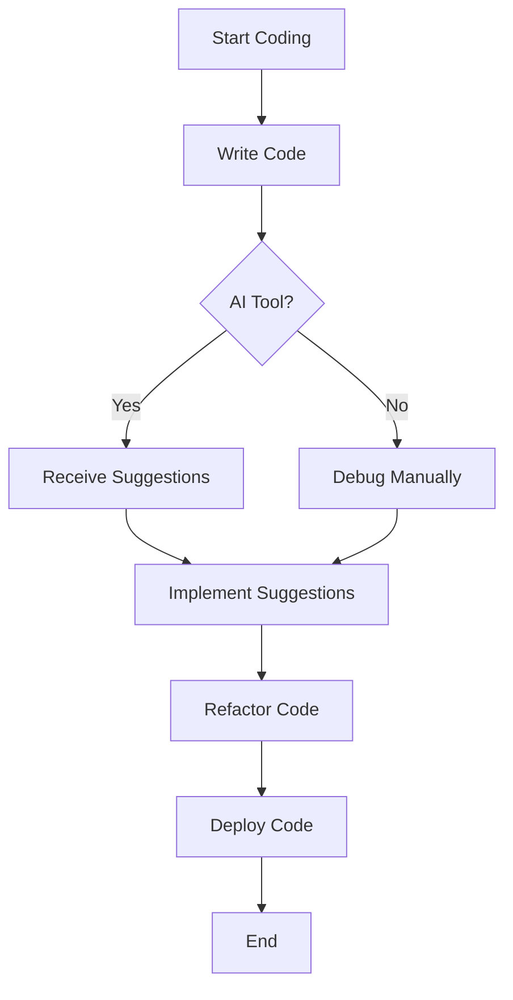

---

## Top AI Coding Tools for Developers in 2026

As we step into 2026, the landscape of software development is undergoing a significant transformation, thanks to the rise of AI coding tools. These innovative resources are designed to assist developers in writing code more efficiently, debugging more effectively, and even learning new programming languages. Whether you’re a seasoned programmer or a beginner looking to enhance your skills, AI coding tools can revolutionize the way you code. In this article, we’ll dive into the top AI coding tools that every developer should consider integrating into their workflow this year.

### What Are AI Coding Tools?

AI coding tools leverage artificial intelligence algorithms to automate aspects of the coding process. They can assist with code suggestions, error detection, and even generate entire code snippets based on the context provided by the developer. By using these tools, developers can save time, reduce errors, and improve their overall coding efficiency.

### Why Use AI Coding Tools?

The benefits of integrating AI coding tools into your workflow are numerous:
- **Increased Productivity**: Automating repetitive tasks allows developers to focus on more complex challenges.
- **Error Reduction**: AI tools can help identify bugs and suggest fixes, leading to cleaner code.
- **Learning Aid**: For beginners, AI tools can provide instant feedback and learning suggestions based on coding patterns.

### Top AI Coding Tools in 2026

Let’s take a closer look at some of the leading AI coding tools available this year.

#### 1. GitHub Copilot

[GitHub Copilot](https://github.com/features/copilot?ref=AFFILIATE_ID) is a powerful AI pair programmer powered by OpenAI's Codex. It integrates seamlessly with popular IDEs like Visual Studio Code and helps developers by suggesting entire lines or blocks of code as they type.

**Pros:**
- Context-aware suggestions.
- Supports multiple programming languages.
- Learns from your coding style over time.

**Cons:**
- Requires an internet connection.
- Suggestions may not always be optimal.

#### 2. Tabnine

[Tabnine](https://www.tabnine.com/?ref=AFFILIATE_ID) is an AI-powered code completion tool that supports numerous programming languages. Its deep learning model predicts and suggests the next code segment based on your coding habits and patterns.

**Pros:**
- Highly customizable.
- Works offline.
- Integrates with various IDEs.

**Cons:**
- May have a steep learning curve for new users.
- Performance can vary depending on the programming language.

#### 3. Codeium

[Codeium](https://codeium.com/?ref=AFFILIATE_ID) is a relatively new contestant in the AI coding tool arena but has quickly gained traction due to its robust features. It offers code completion, real-time collaboration features, and even an AI-powered documentation generator.

**Pros:**
- Real-time collaboration capabilities.
- Excellent documentation features.
- Fast and responsive.

**Cons:**
- Still in the early stages; may lack some advanced features.
- Limited language support compared to others.

#### 4. Sourcery

Sourcery focuses on improving the quality of your Python code. It analyzes your code to suggest improvements and automatically refactors it to enhance readability and performance.

**Pros:**
- Great for Python developers.
- Helps maintain code quality.
- Provides actionable feedback.

**Cons:**
- Limited to Python.
- May not always align with your coding style.

### Comparison of AI Coding Tools

To make it easier for you to choose the right AI coding tool, here’s a comparison table highlighting the key features of the tools discussed:

<table>
    <tr>
        <th>Tool</th>
        <th>Languages Supported</th>
        <th>Key Features</th>
        <th>Pricing</th>
    </tr>
    <tr>
        <td>GitHub [Copilot](https://github.com/features/copilot?ref=AFFILIATE_ID)</td>
        <td>Multiple</td>
        <td>Context-aware suggestions, IDE integration</td>
        <td>$10/month</td>
    </tr>
    <tr>
        <td>Tabnine</td>
        <td>Multiple</td>
        <td>Customizable, offline mode</td>
        <td>Free & Pro versions</td>
    </tr>
    <tr>
        <td>Codeium</td>
        <td>Multiple</td>
        <td>Real-time collaboration, documentation generator</td>
        <td>Free</td>
    </tr>
    <tr>
        <td>Sourcery</td>
        <td>Python</td>
        <td>Code improvement suggestions, refactoring</td>
        <td>Free & Premium options</td>
    </tr>
</table>

### Workflow of Integrating AI Coding Tools

To visualize how these tools can be integrated into your development workflow, here's a simple Mermaid diagram:

### Choosing the Right AI Coding Tool

When selecting the right AI coding tool for your needs, consider the following factors:
- **Language Support**: Ensure the tool supports the programming languages you use most frequently.
- **Integration**: Check if the tool can seamlessly integrate with your current IDE.
- **Cost**: Evaluate your budget and choose a tool that offers the best value for your requirements.

### Conclusion

AI coding tools are becoming indispensable for developers looking to enhance their productivity and streamline their coding processes. Whether you choose GitHub Copilot for its seamless integration, Tabnine for its customization, Codeium for collaboration, or Sourcery for Python enhancement, each tool has unique advantages that can help you code smarter.

If you haven’t explored AI coding tools yet, now is the time to start. Embrace the future of coding and see how these tools can revolutionize your development experience. 

### Call to Action

Are you ready to elevate your coding game? Start by trying out one of the AI coding tools mentioned above today! Share your experiences in the comments below, and let’s discuss how AI is changing the way we code.

## 関連記事

- [AI Coding Tools: Boosting Developer Efficiency in 2026](/posts/ai-coding-tools-boosting-developer-efficiency-in-2026/)
- [How AI Coding Tools are Revolutionizing Software Development](/posts/how-ai-coding-tools-are-revolutionizing-software-development/)
- [How AI Coding Tools Boost Developer Efficiency in 2026](/posts/how-ai-coding-tools-boost-developer-efficiency-in-2026/)
