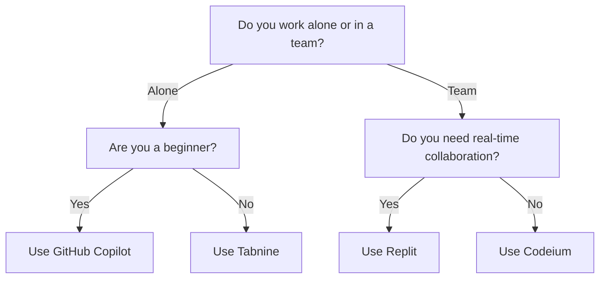

---

# Top AI Coding Tools for Developers in 2026

In the ever-evolving world of software development, AI coding tools are becoming indispensable for developers seeking to boost productivity and streamline their workflows. As we step into 2026, these tools have advanced significantly, offering innovative features that not only reduce coding time but also enhance code quality. In this article, we’ll explore the top AI coding tools that are shaping the future of development, including their pros and cons, practical use cases, and how they can make your coding journey smoother.

## What Are AI Coding Tools?

AI coding tools leverage artificial intelligence and machine learning to assist developers in writing, reviewing, and optimizing code. These tools can suggest code snippets, detect bugs, and even automate repetitive tasks, allowing developers to focus on more complex issues. In an industry that thrives on efficiency, these tools are becoming more than just nice-to-have; they’re essential.

## Why Use AI Coding Tools?

- **Increased Productivity**: With intelligent suggestions and automation, developers can write code faster.
- **Error Reduction**: AI tools can spot potential errors before they become significant issues.
- **Learning Opportunities**: Many tools provide insights and learning resources, helping developers improve their skills.
- **Enhanced Collaboration**: AI tools often integrate with collaboration platforms, making teamwork easier.

## Top AI Coding Tools for 2026

Here’s a look at some of the most effective AI coding tools available in 2026:

### 1. GitHub Copilot

#### Overview
GitHub Copilot, developed by GitHub and OpenAI, is one of the leading AI coding assistants. It suggests entire lines of code or functions based on natural language prompts provided by the developer.

#### Pros
- Context-aware code suggestions
- Supports multiple programming languages
- Integrates seamlessly with popular IDEs

#### Cons
- May suggest incorrect or insecure code
- Requires internet access for optimal performance

#### Use Cases
- For beginners learning to code, Copilot can provide real-time feedback and suggestions.
- Experienced developers can use it to speed up routine tasks and focus on more complex problems.

### 2. Tabnine

#### Overview
Tabnine is an AI-powered code completion tool that works with many IDEs to enhance developer productivity. It uses deep learning models to analyze code patterns and suggest contextually relevant completions.

#### Pros
- Supports over 30 programming languages
- Works offline
- Highly customizable

#### Cons
- May require some configuration to optimize suggestions
- Pricing can be steep for teams

#### Use Cases
- Ideal for teams working on large projects where maintaining code consistency is crucial.
- Useful for individual developers looking for a reliable code completion tool.

### 3. Replit

#### Overview
Replit is a collaborative online coding environment that includes AI features for code suggestions, debugging, and project management. It’s perfect for both individual and team projects.

#### Pros
- Real-time collaboration features
- Supports various programming languages
- Easy to use interface

#### Cons
- Limited offline capabilities
- May not be as robust as traditional IDEs for larger projects

#### Use Cases
- Great for educational purposes and coding boot camps.
- Teams can use Replit for collaborative project development in real-time.

### 4. Codeium

#### Overview
Codeium is an AI-driven code assistant that provides real-time code suggestions, debugging assistance, and integration with various IDEs. Its focus is on enhancing developer efficiency while maintaining code quality.

#### Pros
- Offers extensive language support
- Integrates well with existing workflows
- Provides documentation and example code snippets

#### Cons
- Still in development, so features may be limited
- Learning curve for new users

#### Use Cases
- Suitable for experienced developers looking for a coding companion.
- Perfect for debugging sessions where immediate assistance is needed.

### Comparison Table of AI Coding Tools

<table>
  <tr>
    <th>Tool</th>
    <th>Best For</th>
    <th>Key Features</th>
    <th>Pricing</th>
  </tr>
  <tr>
    <td>GitHub Copilot</td>
    <td>All levels</td>
    <td>Context-aware suggestions, multi-language support</td>
    <td>$10/month</td>
  </tr>
  <tr>
    <td>Tabnine</td>
    <td>Teams</td>
    <td>Deep learning suggestions, offline mode</td>
    <td>$12/month/user</td>
  </tr>
  <tr>
    <td>Replit</td>
    <td>Collaboration</td>
    <td>Real-time collaboration, easy interface</td>
    <td>Free with premium features</td>
  </tr>
  <tr>
    <td>Codeium</td>
    <td>Debugging</td>
    <td>Real-time suggestions, extensive language support</td>
    <td>$15/month</td>
  </tr>
</table>

## How to Choose the Right AI Coding Tool

Choosing the right AI coding tool depends on various factors, including your development environment, team size, and specific needs. Here’s a simple decision tree to help you choose the right tool for your development process:

## Conclusion

As the landscape of software development continues to change, integrating AI coding tools into your workflow can significantly enhance your productivity and code quality. Whether you are a novice just starting or an experienced developer tackling complex projects, there's an AI coding tool that can meet your needs.

Don’t miss the chance to elevate your coding experience! Explore these tools, experiment with their features, and find out which one aligns best with your development style. If you're ready to boost your productivity and streamline your coding process, start using one of these AI coding tools today!

### Call to Action

Have you tried any of these AI coding tools? Share your experiences in the comments below! If you're looking for more insights on AI tools and productivity, subscribe to our newsletter for the latest updates from AI Tools Lab. Happy coding!