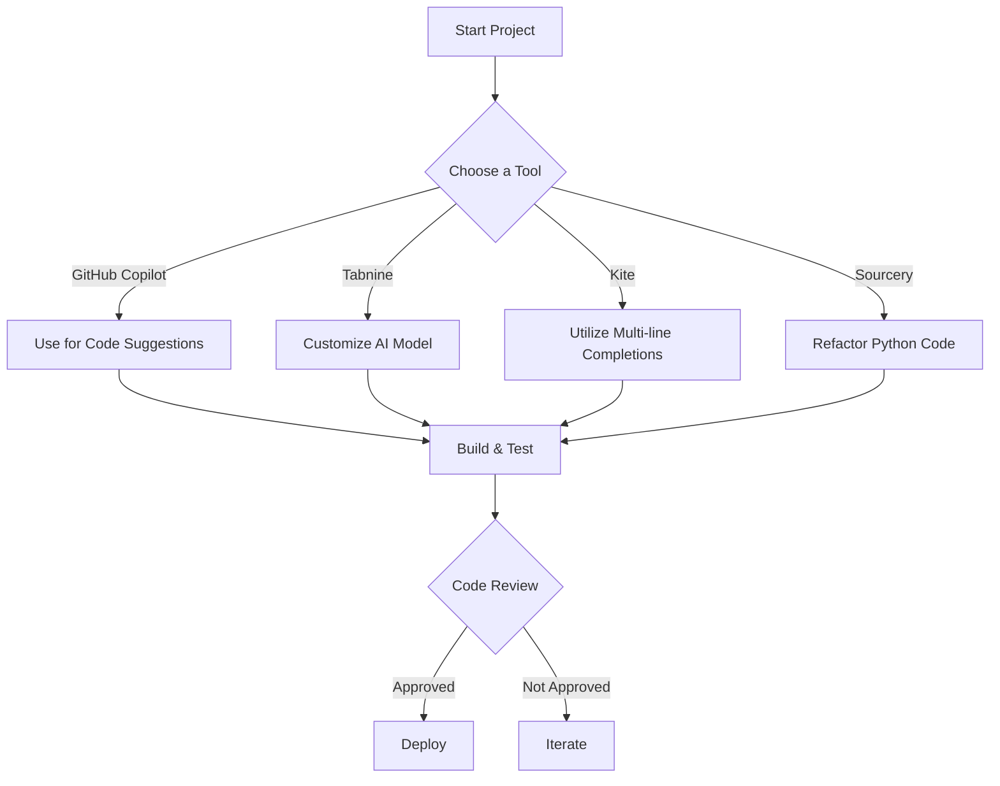

## Top AI Coding Tools for Developers in 2026

In the rapidly evolving world of software development, AI coding tools have become indispensable assets for developers looking to boost productivity and enhance code quality. As we navigate through 2026, a plethora of innovative coding tools powered by artificial intelligence have emerged, transforming how developers write, test, and maintain their code. In this guide, we'll explore the top AI coding tools available this year, along with their features, benefits, and drawbacks, to help you choose the right tools for your development needs.

### Why AI Coding Tools Matter

Before diving into the specifics, it's important to understand why AI coding tools are becoming increasingly crucial for developers. Here are a few reasons:

- **Increased Efficiency**: AI tools can automate repetitive tasks, enabling developers to focus on higher-value activities.
- **Error Reduction**: AI can assist in identifying bugs and suggesting fixes, leading to cleaner code.
- **Learning and Support**: Many AI coding tools provide real-time feedback and learning opportunities, helping developers improve their skills over time.

### Key Features of AI Coding Tools

When evaluating AI coding tools, consider the following features:

- **Code Suggestions**: Real-time code completion and suggestions based on context.
- **Error Detection**: Automatic identification of potential bugs or inefficiencies.
- **Documentation Assistance**: Tools that help generate or improve documentation.
- **Integration Capabilities**: Compatibility with popular IDEs and development environments.

### Top AI Coding Tools in 2026

Now, let's take a closer look at some of the leading AI coding tools that developers are leveraging this year.

#### 1. GitHub Copilot

GitHub Copilot is an AI-driven code completion tool developed by GitHub and OpenAI. It leverages a vast dataset of public code to provide context-aware code suggestions.

**Pros**:
- Excellent real-time code suggestions.
- Supports a wide range of programming languages.
- Integrates seamlessly with popular IDEs like Visual Studio Code.

**Cons**:
- Can sometimes generate incorrect or insecure code.
- May require an internet connection for optimal performance.

#### 2. Tabnine

Tabnine is an AI-powered code completion tool that learns from your coding patterns to offer personalized suggestions. It supports multiple languages and integrates with various IDEs.

**Pros**:
- Customizable AI model based on your codebase.
- Fast and responsive suggestions.
- Works offline with the local model.

**Cons**:
- The free version has limited features.
- May struggle with less commonly used languages.

#### 3. Kite

Kite is another popular AI coding assistant that provides code completions, documentation, and examples directly in your IDE. Its Copilot feature offers line-of-code predictions for various programming languages.

**Pros**:
- Has a user-friendly interface with extensive documentation.
- Offers multi-line completions and function signatures.
- Integrates with many popular code editors.

**Cons**:
- Limited language support compared to competitors.
- The desktop application can be resource-intensive.

#### 4. Sourcery

Sourcery is an AI tool specifically designed for Python developers. It analyzes code and suggests improvements, focusing on code quality and readability.

**Pros**:
- Great for refactoring and improving existing code.
- Provides insights into code quality metrics.
- Works seamlessly with popular Python IDEs.

**Cons**:
- Limited to Python, which may not suit developers working in other languages.
- Some suggestions may require manual adjustments.

### Comparison of AI Coding Tools

To help you choose the right tool, here’s a comparison of the key features of the tools discussed above:

<table>
    <tr>
        <th>Tool</th>
        <th>Code Suggestions</th>
        <th>Error Detection</th>
        <th>Documentation Assistance</th>
        <th>Supported Languages</th>
    </tr>
    <tr>
        <td>GitHub Copilot</td>
        <td>Yes</td>
        <td>Yes</td>
        <td>Yes</td>
        <td>Multiple</td>
    </tr>
    <tr>
        <td>Tabnine</td>
        <td>Yes</td>
        <td>No</td>
        <td>Yes</td>
        <td>Multiple</td>
    </tr>
    <tr>
        <td>Kite</td>
        <td>Yes</td>
        <td>No</td>
        <td>Yes</td>
        <td>Multiple</td>
    </tr>
    <tr>
        <td>Sourcery</td>
        <td>No</td>
        <td>No</td>
        <td>Yes</td>
        <td>Python Only</td>
    </tr>
</table>

### Workflow for Integrating AI Coding Tools

Here's a simple workflow to integrate AI coding tools into your development process:

### Conclusion

As we venture further into 2026, the landscape of AI coding tools continues to evolve, offering developers new ways to enhance efficiency and code quality. With tools like GitHub Copilot, Tabnine, Kite, and Sourcery leading the charge, developers have a wealth of options to choose from based on their specific needs and preferences.

The key takeaway is to assess your coding style, language preference, and project requirements when selecting an AI coding tool. By integrating these powerful tools into your workflow, you can streamline your coding processes and improve your overall productivity.

### Call to Action

Ready to supercharge your coding experience? Explore these AI coding tools and find the one that best fits your development style. Don’t forget to share your experiences and insights with us in the comments below! Happy coding!