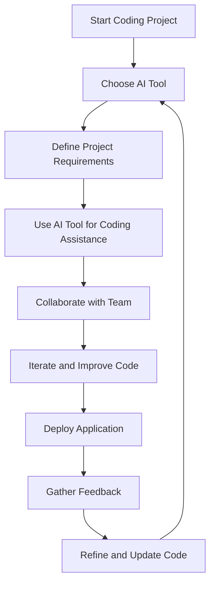

---

# Top AI Coding Tools for Developers in 2026

As we glide into 2026, the landscape of software development is evolving rapidly, propelled by advancements in artificial intelligence. AI coding tools are becoming indispensable allies for developers, enhancing productivity, improving code quality, and simplifying complex tasks. In this article, we’ll explore the top AI coding tools of 2026, showcasing their features, use cases, pros and cons, and how they can transform your coding workflow.

## Why AI Coding Tools Matter in 2026

The integration of AI into coding is not just a trend; it's a fundamental shift in how we approach software development. Here are some compelling reasons why AI coding tools are crucial for developers in 2026:

- **Increased Efficiency**: AI tools can automate repetitive tasks, allowing developers to focus on creative and critical thinking aspects of coding.
- **Code Quality Improvement**: AI can analyze vast amounts of code, providing suggestions that help prevent bugs and improve overall code quality.
- **Collaboration Enhancement**: Many AI tools offer features that facilitate collaboration among teams, making it easier to manage projects and codebases.

## Key AI Coding Tools of 2026

Let’s dive into some of the standout AI coding tools that developers are leveraging in 2026. Each tool brings unique capabilities to the table, making them essential for modern coding practices.

### 1. CodeAI

**Overview**: CodeAI is an all-in-one coding assistant designed to help developers write, test, and deploy code efficiently. It uses natural language processing (NLP) to understand coding queries and provide instant solutions.

**Use Cases**: 
- Code generation from simple descriptions.
- Code refactoring suggestions.
- Automated testing and debugging assistance.

**Pros**:
- Intuitive interface that simplifies coding tasks.
- Supports multiple programming languages.
- Great for both novice and experienced developers.

**Cons**:
- May occasionally misinterpret complex queries.
- Requires a stable internet connection for optimal performance.

### 2. GitHub Copilot 2.0

**Overview**: The next iteration of [GitHub Copilot](https://github.com/features/copilot?ref=AFFILIATE_ID) builds on its predecessor's strengths, utilizing advanced machine learning models to assist developers in real-time code generation.

**Use Cases**:
- Autocompletion of code snippets.
- Context-aware suggestions based on existing code.
- Seamless integration with popular IDEs.

**Pros**:
- Highly accurate and contextually aware.
- Continually learns from user behavior to improve suggestions.
- Directly integrates with GitHub repositories.

**Cons**:
- Subscription-based model may deter some users.
- Sometimes generates overly verbose code.

### 3. Tabnine

**Overview**: [Tabnine](https://www.tabnine.com/?ref=AFFILIATE_ID) is an AI-powered code completion tool that integrates with various IDEs to enhance productivity by predicting and suggesting code completions.

**Use Cases**:
- Contextual code suggestion for various programming languages.
- Team training through usage analytics.
- Enhanced coding speed with minimal keystrokes.

**Pros**:
- Works offline and online, providing flexibility.
- Supports a wide range of programming languages.
- Customizable settings for team environments.

**Cons**:
- Limited features in the free version.
- May require a learning curve for new users.

### 4. Replit

**Overview**: [Replit](https://replit.com/?ref=AFFILIATE_ID) is a collaborative online IDE that incorporates AI tools to assist with debugging, code generation, and learning new programming languages.

**Use Cases**:
- Real-time collaboration on coding projects.
- Interactive coding tutorials powered by AI.
- Instant feedback on code submissions.

**Pros**:
- Accessible from any device with internet connectivity.
- Strong community support and resources.
- Encourages collaborative learning.

**Cons**:
- Performance can lag with large projects.
- Subscription fees for advanced features may apply.

### 5. Codex by OpenAI

**Overview**: Codex is a powerful AI coding tool from OpenAI that can understand and generate code in multiple languages, making it a versatile asset for developers.

**Use Cases**:
- Conversion of natural language prompts into code.
- Creation of complex functions with minimal input.
- Enhancing existing codebases with smart suggestions.

**Pros**:
- Supports a wide variety of programming languages.
- Capable of generating detailed documentation.
- Continuously improving with user feedback.

**Cons**:
- Requires a deep understanding of AI to maximize its potential.
- Can be resource-intensive, requiring robust hardware.

## Comparison of AI Coding Tools in 2026

To help you choose the right AI coding tool, here’s a comparison table that highlights the key features, pros, and cons of each tool:

<table>
  <tr>
    <th>Tool</th>
    <th>Key Features</th>
    <th>Pros</th>
    <th>Cons</th>
  </tr>
  <tr>
    <td>CodeAI</td>
    <td>Code generation, testing, debugging</td>
    <td>Intuitive, multi-language support</td>
    <td>May misinterpret complex queries</td>
  </tr>
  <tr>
    <td>GitHub [Copilot](https://github.com/features/copilot?ref=AFFILIATE_ID) 2.0</td>
    <td>Real-time code generation, IDE integration</td>
    <td>Accurate, learns from user behavior</td>
    <td>Subscription model</td>
  </tr>
  <tr>
    <td>[Tabnine](https://www.tabnine.com/?ref=AFFILIATE_ID)</td>
    <td>Code completion, team analytics</td>
    <td>Works offline, customizable</td>
    <td>Limited features in free version</td>
  </tr>
  <tr>
    <td>[Replit](https://replit.com/?ref=AFFILIATE_ID)</td>
    <td>Collaborative IDE, interactive tutorials</td>
    <td>Accessible, strong community</td>
    <td>Performance issues with large projects</td>
  </tr>
  <tr>
    <td>Codex by OpenAI</td>
    <td>Natural language to code, documentation</td>
    <td>Versatile, continuously improving</td>
    <td>Resource-intensive</td>
  </tr>
</table>

## Workflow for Integrating AI Coding Tools

Understanding how to effectively integrate AI coding tools into your development workflow can maximize their benefits. Here's a simple workflow to consider:

This diagram illustrates a cycle of using AI tools throughout the development process, ensuring continuous improvement and collaboration.

## Conclusion

As we move through 2026, the importance of AI coding tools will only continue to grow. By adopting tools like CodeAI, [GitHub Copilot](https://github.com/features/copilot?ref=AFFILIATE_ID) 2.0, Tabnine, Replit, and Codex, developers can unlock new levels of productivity and creativity. Each tool has its strengths and weaknesses, so consider your specific needs and preferences when choosing the right one for your projects.

Are you ready to supercharge your coding experience? Explore these AI coding tools today, and take the first step toward elevating your development skills in 2026!

### Call to Action

Which AI coding tool are you most excited to try? Share your thoughts in the comments below, and don’t forget to subscribe to our blog for more insights into the latest AI tools and productivity tips!

## 関連記事

- [AI Agents: The Future of Personal Assistants in 2026](/posts/ai-agents-the-future-of-personal-assistants-in-2026/)
- [AI Tools for Small Businesses: Increase Your ROI](/posts/ai-tools-for-small-businesses-increase-your-roi/)
- [Automating Business Processes with AI in 2026](/posts/automating-business-processes-with-ai-in-2026/)
