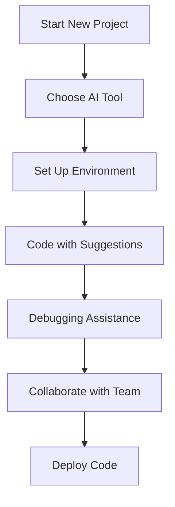

---

# Top AI Coding Tools for Developers in 2026

As we delve into 2026, the landscape of software development continues to evolve at a rapid pace. One of the most significant advancements influencing this change is the rise of AI coding tools. These tools not only help developers write better code faster but also enhance collaboration, debugging, and project management. In this article, we’ll explore the top AI coding tools that are transforming the way developers work, along with their benefits and considerations.

## Why AI Coding Tools Matter

The role of AI in coding is primarily about augmenting human capabilities. AI coding tools can handle repetitive tasks, suggest code snippets, and even predict bugs before they occur. This means developers can focus on more creative and complex aspects of their projects, significantly improving productivity.

### Key Benefits of AI Coding Tools
- **Increased Efficiency**: Automate mundane tasks and reduce the time spent on debugging and code writing.
- **Enhanced Code Quality**: AI tools can suggest improvements and catch errors early in the development process.
- **Better Collaboration**: Many AI coding tools come with collaborative features that make it easier for teams to work together.

## Top AI Coding Tools in 2026

Let’s take a closer look at some of the leading AI coding tools that every developer should consider:

### 1. GitHub Copilot

[GitHub Copilot](https://github.com/features/copilot?ref=AFFILIATE_ID), powered by OpenAI's Codex, continues to be a game-changer in the coding landscape. This AI pair programmer offers real-time code suggestions directly within your IDE.

#### Pros:
- Intuitive code suggestions based on natural language prompts.
- Supports a wide range of programming languages.
- Integrates seamlessly with popular IDEs like Visual Studio Code.

#### Cons:
- May generate incorrect or insecure code.
- Requires a stable internet connection for optimal performance.

### 2. Tabnine

[Tabnine](https://www.tabnine.com/?ref=AFFILIATE_ID) leverages deep learning to provide intelligent code completions. It learns from your codebase, allowing for personalized suggestions that fit your coding style.

#### Pros:
- Local model options for enhanced privacy.
- Supports almost all programming languages.
- Continuous improvement through machine learning.

#### Cons:
- The free version has limited features.
- Some users report occasional irrelevant suggestions.

### 3. Codeium

[Codeium](https://codeium.com/?ref=AFFILIATE_ID) is a relatively new player in the AI coding space, but it's gaining traction for its robust features. It aims to simplify the code review process and enhance developer productivity.

#### Pros:
- Real-time suggestions and debugging assistance.
- Offers a free version with essential features.
- Good support for collaborative coding environments.

#### Cons:
- Still developing its integration capabilities with major IDEs.
- May not be as mature as some competitors.

### 4. Replit Ghostwriter

[Replit](https://replit.com/?ref=AFFILIATE_ID) Ghostwriter is designed for collaborative coding and includes features like real-time feedback and AI-driven code suggestions, making it perfect for team projects.

#### Pros:
- Excellent for educational purposes and collaborative learning.
- Integrates directly with [Replit](https://replit.com/?ref=AFFILIATE_ID)’s collaborative coding platform.
- Provides an interactive coding experience.

#### Cons:
- Limited to the [Replit](https://replit.com/?ref=AFFILIATE_ID) ecosystem.
- May not suit professional developers looking for advanced features.

### 5. DeepCode

DeepCode uses AI to analyze your code and provide recommendations for improvements and bug fixes. Its focus on static code analysis makes it a great tool for code quality assurance.

#### Pros:
- Integrates well with CI/CD pipelines.
- Offers a detailed analysis of code quality.
- Continuous learning from your code base.

#### Cons:
- Requires familiarity with its setup process.
- May produce false positives in some cases.

## Comparison of AI Coding Tools

Here’s a quick comparison table to help you understand the strengths and weaknesses of these AI coding tools.

<table>
  <tr>
    <th>Tool</th>
    <th>Best For</th>
    <th>Pricing</th>
    <th>Key Features</th>
  </tr>
  <tr>
    <td>GitHub [Copilot](https://github.com/features/copilot?ref=AFFILIATE_ID)</td>
    <td>Real-time suggestions</td>
    <td>Subscription-based</td>
    <td>Natural language prompts, IDE integration</td>
  </tr>
  <tr>
    <td>[Tabnine](https://www.tabnine.com/?ref=AFFILIATE_ID)</td>
    <td>Personalized suggestions</td>
    <td>Free/Paid plans</td>
    <td>Local models, deep learning</td>
  </tr>
  <tr>
    <td>[Codeium](https://codeium.com/?ref=AFFILIATE_ID)</td>
    <td>Productivity enhancement</td>
    <td>Free/Paid plans</td>
    <td>Real-time debugging, collaboration</td>
  </tr>
  <tr>
    <td>[Replit](https://replit.com/?ref=AFFILIATE_ID) Ghostwriter</td>
    <td>Collaborative coding</td>
    <td>Subscription-based</td>
    <td>Interactive coding, real-time feedback</td>
  </tr>
  <tr>
    <td>DeepCode</td>
    <td>Code quality assurance</td>
    <td>Free/Paid plans</td>
    <td>Static analysis, CI/CD integration</td>
  </tr>
</table>

## Workflow Using AI Coding Tools

Let’s visualize how AI coding tools can be integrated into a typical development workflow.

## Conclusion

The future of coding is undeniably intertwined with AI technology. By leveraging AI coding tools, developers can significantly enhance their productivity, improve code quality, and foster better collaboration within teams. As we progress through 2026, tools like [GitHub Copilot](https://github.com/features/copilot?ref=AFFILIATE_ID), [Tabnine](https://www.tabnine.com/?ref=AFFILIATE_ID), [Codeium](https://codeium.com/?ref=AFFILIATE_ID), Replit Ghostwriter, and DeepCode are leading the way in transforming the development process.

Are you ready to take your coding skills to the next level? Explore these AI coding tools and see how they can streamline your workflow today!

### Call to Action

Which AI coding tool resonates with your development needs? Start a free trial today and elevate your coding experience. Share your thoughts and experiences in the comments below!

## 関連記事

- [AI Coding Tools: Boosting Developer Efficiency in 2026](/posts/ai-coding-tools-boosting-developer-efficiency-in-2026/)
- [How AI Coding Tools are Revolutionizing Software Development](/posts/how-ai-coding-tools-are-revolutionizing-software-development/)
- [How AI Coding Tools Boost Developer Efficiency in 2026](/posts/how-ai-coding-tools-boost-developer-efficiency-in-2026/)
