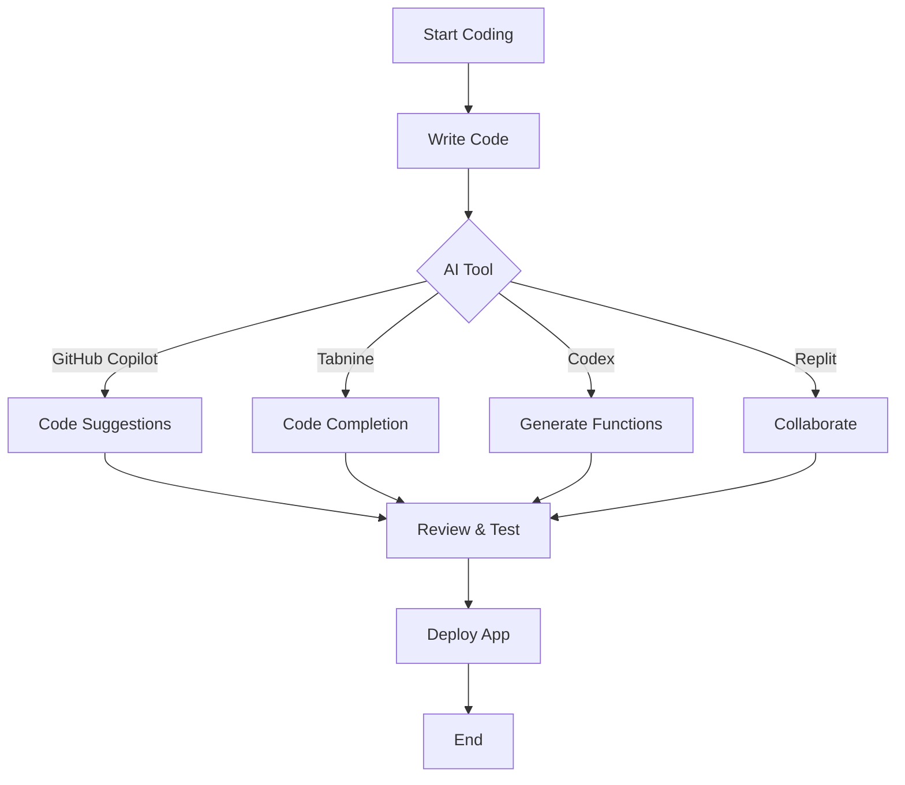

---

# Top AI Coding Tools for Efficient Software Development

In the ever-evolving landscape of software development, AI coding tools have emerged as game-changers, significantly enhancing productivity, accuracy, and efficiency. Whether you are a seasoned developer or just starting your coding journey, leveraging these tools can streamline your workflow and improve code quality. In this blog post, we will explore some of the top AI coding tools available today, discussing their features, pros and cons, and practical use cases.

## Why Use AI Coding Tools?

AI coding tools are designed to assist developers in various aspects of the coding process. They can help automate repetitive tasks, suggest code snippets, identify bugs, and even generate entire functions based on natural language prompts. By integrating these tools into your development process, you can:

- **Boost Productivity**: AI tools can save time by automating mundane tasks, allowing developers to focus on more complex issues.
- **Enhance Code Quality**: With the ability to identify errors and suggest improvements, these tools can significantly reduce bugs in your code.
- **Accelerate Learning**: For new developers, AI tools can serve as an educational resource, providing insights and examples to learn from.

## Top AI Coding Tools

Let's take a closer look at some of the leading AI coding tools that are making waves in the software development community.

### 1. GitHub Copilot

[GitHub Copilot](https://github.com/features/copilot?ref=AFFILIATE_ID) is an AI-powered code completion tool developed by GitHub and OpenAI. It uses machine learning to suggest whole lines or blocks of code based on the context of your project.

#### Features:
- Context-aware code suggestions
- Supports multiple programming languages
- Built-in documentation lookup

#### Pros:
- Increases coding speed significantly
- Reduces the need for searching documentation
- Can learn from your coding style over time

#### Cons:
- May generate incorrect or insecure code
- Not a replacement for thorough code reviews

### 2. Tabnine

[Tabnine](https://www.tabnine.com/?ref=AFFILIATE_ID) is another popular AI assistant that integrates with various code editors to provide real-time code completion and suggestions. It uses deep learning models to predict what code you might want to write next.

#### Features:
- Supports over 30 programming languages
- Customizable AI models
- Works offline

#### Pros:
- Fast and responsive
- Helps maintain coding standards across teams
- Integrates seamlessly with existing workflows

#### Cons:
- Limited to suggestions based on existing code patterns
- May require some tuning for optimal performance

### 3. Codex by OpenAI

OpenAI's Codex is a powerful AI system that can understand and generate code. It's the backbone of GitHub [Copilot](https://github.com/features/copilot?ref=AFFILIATE_ID) but can also be accessed independently through OpenAI's API.

#### Features:
- Natural language processing for code generation
- Supports multiple programming languages
- Integrates with various tools and platforms

#### Pros:
- Can generate complex functions from simple prompts
- Excellent for prototyping and rapid development
- Great for educational purposes and learning new languages

#### Cons:
- Requires internet access for optimal performance
- Pricing can be a barrier for small teams

### 4. Replit

[Replit](https://replit.com/?ref=AFFILIATE_ID) is an online coding environment that combines collaboration, hosting, and AI coding assistance. It offers an interactive platform for coding in various languages with built-in AI support.

#### Features:
- Real-time collaboration
- AI-powered code suggestions
- Integrated hosting and deployment

#### Pros:
- Great for team projects and pair programming
- Easy to use for beginners
- No setup required—works directly in the browser

#### Cons:
- Limited features compared to local IDEs
- Performance can lag with larger projects

### Comparison Table of AI Coding Tools

<table>
  <tr>
    <th>Tool</th>
    <th>Context-Aware Suggestions</th>
    <th>Programming Language Support</th>
    <th>Offline Access</th>
    <th>Pricing</th>
  </tr>
  <tr>
    <td>GitHub Copilot</td>
    <td>Yes</td>
    <td>Multiple</td>
    <td>No</td>
    <td>Subscription-based</td>
  </tr>
  <tr>
    <td>Tabnine</td>
    <td>Yes</td>
    <td>30+</td>
    <td>Yes</td>
    <td>Freemium</td>
  </tr>
  <tr>
    <td>Codex by OpenAI</td>
    <td>Yes</td>
    <td>Multiple</td>
    <td>No</td>
    <td>API-based pricing</td>
  </tr>
  <tr>
    <td>Replit</td>
    <td>Yes</td>
    <td>Multiple</td>
    <td>Not fully</td>
    <td>Freemium</td>
  </tr>
</table>

### Mermaid Diagram: AI Coding Tools Workflow

To visualize how these AI coding tools fit into the software development workflow, here's a simple diagram:

## Conclusion

AI coding tools are revolutionizing the way software development is approached. By incorporating these tools into your workflow, you can enhance productivity, improve code quality, and streamline collaboration among team members. Whether you choose GitHub Copilot for its contextual suggestions or Tabnine for its customization options, there's an AI coding tool out there that can meet your needs.

### Call to Action

Are you ready to supercharge your coding experience? Try out one of the AI coding tools mentioned above and see how it can transform your development process. Share your experiences in the comments below or reach out with any questions! Happy coding!

## 関連記事

- [AI Coding Tools: Boosting Developer Efficiency in 2026](/posts/ai-coding-tools-boosting-developer-efficiency-in-2026/)
- [How AI Coding Tools are Revolutionizing Software Development](/posts/how-ai-coding-tools-are-revolutionizing-software-development/)
- [How AI Coding Tools Boost Developer Efficiency in 2026](/posts/how-ai-coding-tools-boost-developer-efficiency-in-2026/)
