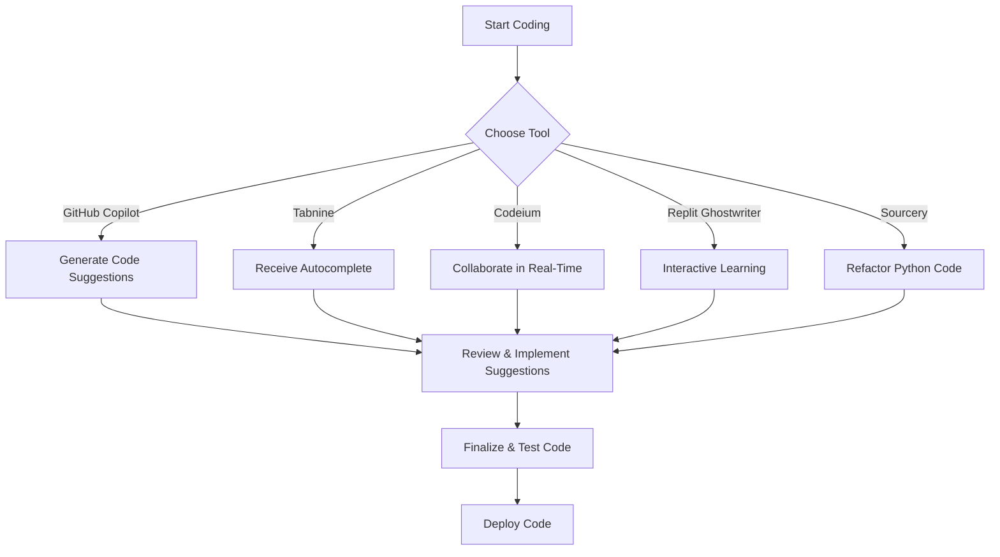

---

# Top AI Coding Tools Revolutionizing Software Development

In recent years, artificial intelligence (AI) has made significant strides in various sectors, and software development is no exception. AI coding tools are changing the way developers write, test, and deploy code, making the entire process more efficient and less error-prone. From automated code generation to sophisticated debugging, these tools are becoming essential in modern software development. In this article, we’ll delve into the top AI coding tools available today, their features, pros and cons, and practical use cases that demonstrate their impact on productivity.

## What Are AI Coding Tools?

AI coding tools leverage machine learning algorithms to assist developers in various aspects of coding. They can suggest code snippets, identify bugs, and even write entire functions based on the context provided by developers. These tools help streamline workflows, reduce manual errors, and speed up the development process, making them invaluable for teams of all sizes.

## Why Use AI Coding Tools?

Before we dive into the specifics, let's discuss why you should consider incorporating AI coding tools into your development process. Here are a few compelling reasons:

1. **Increased Efficiency**: Automating repetitive tasks allows developers to focus on more complex problems.
2. **Enhanced Code Quality**: AI can help identify potential bugs and suggest fixes before code goes into production.
3. **Knowledge Sharing**: AI coding tools can assist less experienced developers by providing suggestions and best practices.
4. **Continuous Learning**: Many of these tools learn from your coding style, improving their suggestions over time.

## Top AI Coding Tools to Consider

Let’s explore some of the most popular AI coding tools currently available.

### 1. GitHub Copilot

**Overview**: [GitHub Copilot](https://github.com/features/copilot?ref=AFFILIATE_ID), developed by GitHub and OpenAI, is one of the most popular AI coding assistants. It suggests entire lines or blocks of code as you type, based on the context and comments you provide.

**Pros**:
- Integrates seamlessly with popular IDEs like Visual Studio Code.
- Supports multiple programming languages.
- Learns from your coding patterns to provide personalized suggestions.

**Cons**:
- May produce suggestions that are not always optimal or secure.
- Requires an internet connection to access its features.

**Use Case**: Imagine you’re developing a web application and need to implement a new feature. By simply typing a comment about the functionality you want, GitHub [Copilot](https://github.com/features/copilot?ref=AFFILIATE_ID) can generate the necessary code, saving you time and effort.

### 2. Tabnine

**Overview**: [Tabnine](https://www.tabnine.com/?ref=AFFILIATE_ID) is an AI-powered code completion tool that works with a wide range of IDEs. It provides predictions and suggestions based on your previous code and common coding patterns.

**Pros**:
- Supports numerous programming languages.
- Offers a local model for offline use.
- Can be customized to adhere to your coding style.

**Cons**:
- The free version has limited features.
- Predictions may not always be contextually accurate.

**Use Case**: If you're working on a large project with multiple contributors, Tabnine can help maintain consistency in coding style while speeding up the development process.

### 3. Codeium

**Overview**: [Codeium](https://codeium.com/?ref=AFFILIATE_ID) is an emerging AI coding tool that focuses on improving developer productivity through advanced code suggestions, refactoring, and documentation generation.

**Pros**:
- Provides extensive documentation support.
- Features an intuitive interface.
- Supports real-time collaboration for teams.

**Cons**:
- Still in development, meaning features may be limited compared to competitors.
- May not support all programming languages yet.

**Use Case**: In a team setting, Codeium can facilitate discussion and collaboration by providing documentation and code suggestions in real time, making it easier to onboard new developers.

### 4. Replit Ghostwriter

**Overview**: [Replit](https://replit.com/?ref=AFFILIATE_ID) Ghostwriter is an AI tool integrated into the Replit platform, which is popular for online coding environments. It offers code suggestions, completion, and debugging assistance.

**Pros**:
- Great for beginners who want an interactive coding experience.
- Supports various programming languages.
- Offers educational resources for learners.

**Cons**:
- Limited to the Replit platform.
- May not be suitable for larger, more complex projects.

**Use Case**: If you’re teaching coding to beginners, Replit Ghostwriter can provide instant feedback and suggestions, helping students learn best practices as they write code.

### 5. Sourcery

**Overview**: Sourcery focuses on improving Python code quality through automated refactoring suggestions. It analyzes your code in real-time, suggesting improvements and optimizations.

**Pros**:
- Specifically designed for Python, making it highly effective for Python developers.
- Offers actionable insights to improve code quality.
- Can be integrated into CI/CD pipelines.

**Cons**:
- Limited to Python, which may not be suitable for developers working in other languages.
- The free version has limited functionality.

**Use Case**: If you’re maintaining a large Python codebase, Sourcery can help keep your code clean and efficient, reducing the time spent on manual refactoring.

## AI Coding Tools Comparison

Here’s a quick comparison of the tools discussed:

<table>
  <tr>
    <th>Tool</th>
    <th>Best For</th>
    <th>Pros</th>
    <th>Cons</th>
  </tr>
  <tr>
    <td>GitHub Copilot</td>
    <td>General coding assistance</td>
    <td>Seamless IDE integration, multi-language support</td>
    <td>Requires internet, not always optimal suggestions</td>
  </tr>
  <tr>
    <td>Tabnine</td>
    <td>Code completion</td>
    <td>Wide IDE support, local model for offline use</td>
    <td>Limited free version, context accuracy issues</td>
  </tr>
  <tr>
    <td>Codeium</td>
    <td>Documentation generation</td>
    <td>Intuitive interface, real-time collaboration</td>
    <td>Limited features, language support</td>
  </tr>
  <tr>
    <td>Replit Ghostwriter</td>
    <td>Beginner coding</td>
    <td>Interactive experience, educational resources</td>
    <td>Limited to Replit, not for large projects</td>
  </tr>
  <tr>
    <td>Sourcery</td>
    <td>Python refactoring</td>
    <td>Actionable insights, CI/CD integration</td>
    <td>Python only, limited free functionality</td>
  </tr>
</table>

## Workflow of Using AI Coding Tools

Understanding how to integrate AI coding tools into your workflow can maximize their benefits. Below is a simplified workflow that illustrates how developers can leverage these tools in their daily tasks.

## Conclusion

AI coding tools are reshaping the landscape of software development by enhancing productivity, improving code quality, and facilitating collaboration among teams. Whether you’re a seasoned developer or just starting, leveraging these tools can significantly streamline your workflow and help you focus on what truly matters—building great software.

Are you ready to revolutionize your coding experience? Explore these AI coding tools today and find the perfect fit for your development needs!

### Call to Action

Have you tried any of these AI coding tools? Share your experiences in the comments below, and let’s discuss how these tools have impacted your development process! If you’re interested in trying out some of these tools, visit their official websites to get started. Happy coding!

## 関連記事

- [AI Coding Tools: Boosting Developer Efficiency in 2026](/posts/ai-coding-tools-boosting-developer-efficiency-in-2026/)
- [How AI Coding Tools are Revolutionizing Software Development](/posts/how-ai-coding-tools-are-revolutionizing-software-development/)
- [How AI Coding Tools Boost Developer Efficiency in 2026](/posts/how-ai-coding-tools-boost-developer-efficiency-in-2026/)
